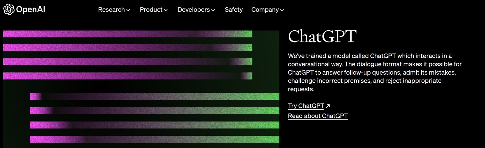
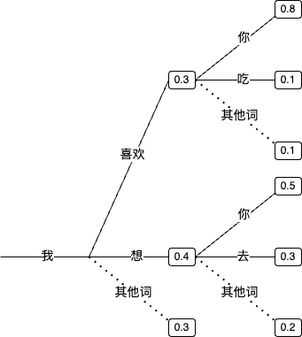
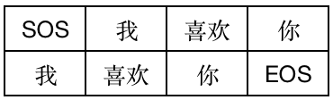
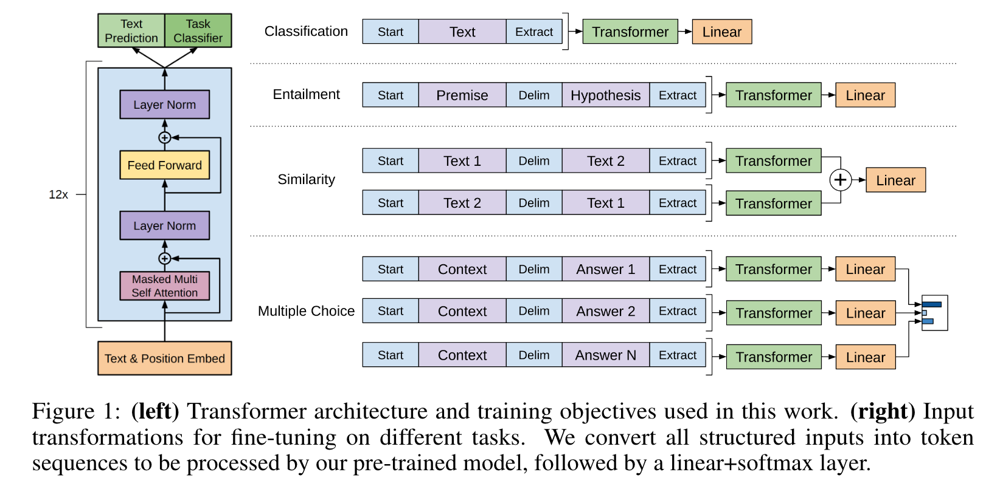
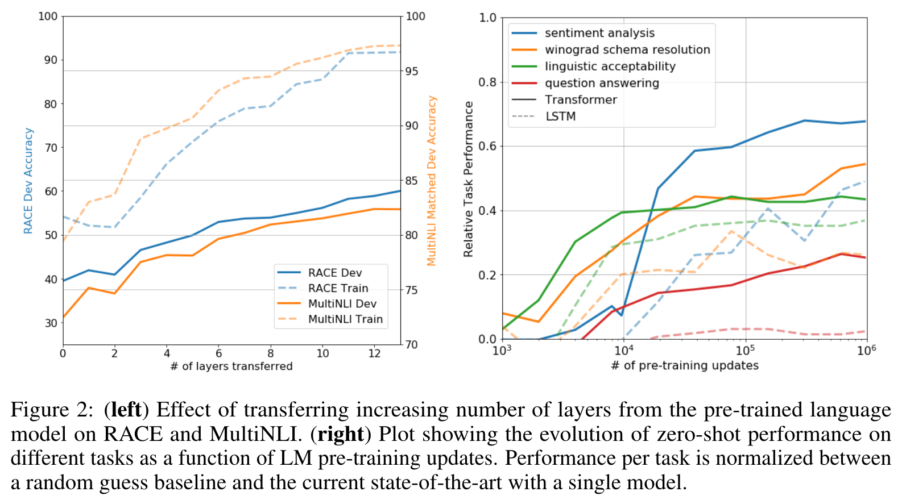
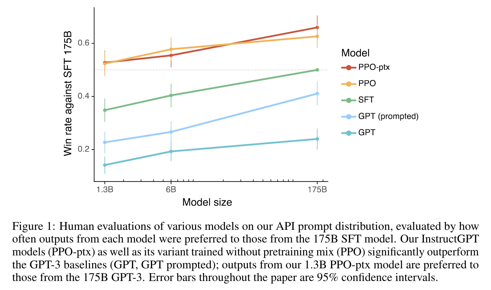
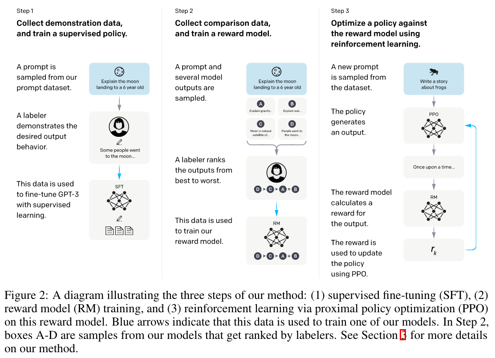

# ChatGPT基础科普——知其一点所以然

## 语言的本质
&emsp;&emsp;很久以前，有一个神奇的星球，居住着各种各样的生物。这些生物虽然各自拥有不同的能力，但却没有办法与其他种类的生物进行有效沟通。因为在这个星球上，每个生物都有自己独特的交流方式，无法理解其他生物的语言。

&emsp;&emsp;有一天，这个星球来了一个神秘的外星人。他告诉这些生物，他们可以通过学习一种全新的、独特的沟通方式来实现相互之间的交流。这种沟通方式就是“语言”。外星人决定将这种神奇的沟通能力赋予其中一种生物，让它们成为这个星球上唯一掌握语言能力的生物。为了公平起见，他决定举办一场比赛，看哪种生物能够最先学会这种神奇的语言。比赛开始了，各种生物都开始努力尝试学习这种全新的沟通方式。然而，他们发现这并非易事，因为语言需要高度的智慧和灵活性。在众多生物中，只有人类表现出了惊人的潜力。他们不仅迅速掌握了语言的基本知识，还能够不断地创造新的词汇和表达方式。其他生物们为之震惊，纷纷认为人类是这场比赛的赢家。
&emsp;&emsp;最终，神秘的外星人宣布人类获得了这场比赛的胜利，并将语言能力赋予了他们。自此，人类成为了星球上唯一掌握语言能力的生物。他们开始利用语言建立起复杂的社会体系，发展科学技术，创作美丽的艺术作品。语言成为了人类独特的本能，让他们在这个星球上独树一帜。

&emsp;&emsp;当然这个故事并非真实发生的，但是客观来说语言的确是人类独有的。在大自然亿万年的进化过程中，每个特定的物种都拥有一些独特、精妙的技能。有些蝙蝠能用声呐来锁定飞行的昆虫，有些候鸟则能在星座的导航下飞行数千千米。在这场的“选秀比赛”中，人类成为了唯一的可以对呼气时发出的声音进行各种调控，以达到交流信息、描述事件目的的灵长类动物。正是因为掌握了语言这一强大的工具，人类得以在漫长的历史进程中不断发展和创新。无论是在社会交往、科学探索还是艺术创作方面，语言都发挥着至关重要的作用，成为人类独特的精神象征。而语言也自然而然成为了人类区别与其他物种的标志性特征，换句话说如果哪个物种掌握了语言，也就意味着这个物种诞生了智能。因此从人工智能的概念建立伊始，机器能否具备使用自然语言同人类沟通交流的能力，就成为了机器是否具有类人智能的一条重要标准。
&emsp;&emsp;

## 从图灵测试到ChatGPT
&emsp;&emsp;1950年，艾伦•图灵(Alan Turing)发表论文《计算机器与智能》（ Computing Machinery and Intelligence），提出并尝试回答“机器能否思考”这一关键问题。在论文中，图灵提出了“模仿游戏”（即图灵测试）的概念，用来检测机器智能水平。图灵测试的核心思想是，如果一个人（代号C）使用测试对象皆理解的语言去询问两个他不能看见的对象任意一串问题，其中一个是正常思维的人（代号B），另一个是机器（代号A）。如果经过若干询问以后，C不能得出实质的区别来分辨A与B的不同，则此机器A通过图灵测试。


&emsp;&emsp;1956年，人工智能正式成为了一个科学上的概念，而后涌现了很多新的研究目标与方向。虽然，图灵测试只是一个启发性的思想实验，而非可以具体执行的判断方法，但他却通过这个假设，阐明了“智能”判断的模糊性与主观性。从此图灵测试成为了 **自然语言处理（Natural Language Processing，NLP）** 任务的一个重要评测标准。图灵测试提供了一个客观和直观的方式来评估机器是否具有智能，即通过让机器与人类进行对话来判断其智能水平。这种方式可以避免对智能本质的哲学争论，也可以避免对智能具体表现形式的技术细节。因此，很多自然语言处理任务都可以用图灵测试来进行评测，例如对话系统、问答系统、文本生成等。

&emsp;&emsp;*自然语言处理（Natural Language Processing，NLP）是计算机科学，人工智能，语言学关注计算机和人类（自然）语言之间的相互作用的领域。它研究能实现人与计算机之间用自然语言进行有效通信的各种理论和方法。自然语言处理包括很多不同的任务，如分词、词性标注、句法分析、语义分析、信息抽取、文本分类、文本摘要、机器翻译、问答系统、对话系统等。*

&emsp;&emsp;图灵测试与自然语言处理任务有着密切而复杂的关系，可以从以下两个方面来概括：

- 一方面，图灵测试是自然语言处理任务的一个重要驱动力。图灵测试提出了一个具有挑战性和吸引力的目标，即让机器能够用自然语言与人类进行流畅、智能、多样化的对话。为了达到这个目标，自然语言处理领域不断地发展和创新各种技术和方法，以提高机器对自然语言的理解和生成能力。例如，为了让机器能够回答用户提出的问题，就需要研究问答系统这一自然语言处理任务；为了让机器能够根据用户提供的信息生成合适的文本，就需要研究文本生成这一自然语言处理任务；为了让机器能够适应不同领域和场景的对话，就需要研究领域适应和情境感知这一自然语言处理任务等等。
- 另一方面，图灵测试是自然语言处理任务的一个重要目标。图灵测试提出了一个具有前瞻性和理想性的愿景，即让机器能够达到与人类相同或者超越人类的智能水平。这个愿景激发了很多自然语言处理领域的研究者和开发者，使他们不断地探索和创新，以期实现真正意义上的自然语言理解和生成。例如，为了让机器能够理解用户提出的问题，就需要研究语义分析、知识表示、逻辑推理；为了让机器能够生成符合用户需求的文本，就需要研究文本规划、文本风格、文本评价；为了让机器能够与用户建立信任和情感的联系，就需要研究情感分析、情感生成、情感对话等等。

&emsp;&emsp;自然语言处理与人工智能发展历史有着密切而复杂的关系。它们相互促进、相互影响、相互依存、相互目标。自然语言处理在人工智能发展历史上有很多里程碑式的成果，比如：

- 1954年，IBM实现了世界上第一个机器翻译系统，将俄语翻译成英语。
- 1966年，约瑟夫·韦伊岑鲍姆开发了ELIZA，一种模拟心理治疗师的对话系统。
- 1972年，特里·温诺格拉德开发了SHRDLU，一种能够理解和生成自然语言的程序，用于控制一个虚拟的机器人在一个虚拟的世界中进行操作。
- 1988年，杰拉尔德·萨斯曼和詹姆斯·马丁创建了Text Retrieval Conference（TREC），一个旨在推动信息检索和自然语言处理技术发展的国际评测活动。
- 2011年，苹果公司推出了Siri，一种基于自然语言处理技术的智能个人助理。同年，IBM的Watson战胜了《危险边缘》节目的冠军选手，展示了自然语言处理技术在问答领域的强大能力。
- 2013年，谷歌公司推出了Word2Vec，一种基于神经网络的词向量表示方法，开启了自然语言处理领域的深度学习时代。
- 2016年，Facebook发布了FastText的文本分类算法，它可以在处理大规模文本分类任务时取得很好的效果。
- 2017年，Google发布了一篇很可能是AI历史上最重要的一篇论文《Attention is all you need》，在论文中作者提出了Transformer——一个具有多头注意力机制的模型，在文本特征提取方面取得了优异的效果。
- 2018年，Google发布了BERT预训练模型，它在多项NLP任务上取得了最佳效果，引领自然语言处理进入了预训练时代。
- 2020年，OpenAI发布的GPT-3模型有多达1750亿的参数，可以在提供少量样本或不提供样本的前提下完成大多数NLP任务。

&emsp;&emsp;以上这些能力成果依赖于自然语言处理技术（NLP）的不断发展。NLP领域涉及到的技术非常广泛，但其中最基础的就是——***词嵌入（也叫词向量，Word Embedding），以及与此相关的文本表征技术。它本质上是找到一种编码方式，实现从自然语言中到数学空间的映射。***

&emsp;&emsp;我们为什么需要词向量呢？当我对计算机说出“我爱你。”的时候，计算机无法真正理解我说了什么。要想让计算机理解我说的话，必须要对“我爱你。”这句话进行编码（Encoding）——比如：我们可以让数字“1”代表“我”，数字“2”代表“爱”，数字“3”代表“你”，数字“0”代表“句号”。经过编码之后，计算机才能理解这句话然后再进行计算和处理。词向量就是以单词为为单位进行编码，那么如何进行编码才是最优的方式呢？从1940年代开始，人们就希望寻找解决这个问题的模型和方法，下面选择最经典的词袋模型和神经网络概率模型，做一些简单一点的介绍。

- **词袋模型（Bag of Words,BOW）**：从名字来看，词袋模型就像是一个大袋子，把所有的词都装进来。文本中的每个单词都看作是独立的，忽略单词之间的顺序和语法，只关注单词出现的次数。在词袋模型中，每个文本可以表示为一个向量，向量的每个维度对应一个单词，维度的值表示该单词在文本中出现的次数。
- **神经概率语言模型（Neural Probabilistic Language Model，NPLM）**：它可以通过学习大量的文本数据来预测下一个单词或字符的概率。其中，最早的神经网络语言模型是由Yoshua Bengio等人于2003年发表的《A Neural Probabilistic Language Model》提出的，它在得到语言模型的同时也产生了副产品词向量。

&emsp;&emsp;早期的词向量都是静态的，一旦训练完就固定不变了。随着NLP技术的不断发展，词向量技术逐渐演变成基于语言模型的动态表征。语言模型不仅可以表征词，还可以表征任意文本。

&emsp;&emsp;时间来到了2022年，终于轮到我们的主角要隆重登场了。2022年11月30日OpenAI发布了一款真正的智能聊天机器人ChatGPT，一经发布立刻就点燃了AI圈。仅仅五天就达到了100万用户。OpenAI不得不紧急扩容，用户发现ChatGPT不仅仅只会插科打诨和人类聊天，它还能写论文，讲笑话，编段子，生成演讲稿，写请假条，模仿导师写推荐信，甚至帮你写代码，写营销策划案等等。拥有了ChatGPT，就像你身边配备了一个功能强大的秘书。到了2023年1月，大量用户开始涌入，仅仅两个月的时间ChatGPT成为了史上最快达到1亿用户的应用。




&emsp;&emsp;无论是ChatGPT，还是其他后来的模仿者，它们其实都是语言模型，准确来说——大语言模型。使用时，无论是调用API还是开源项目，总有一些参数可能需要调整。对大部分内行人士来说应该都不成问题，但对外行就有点玄乎了。基于此，本文将简要介绍ChatGPT相关技术基本原理，行文将站在外行人角度，尝试将内容尽量平民化。虽然不能深入细节，但知晓原理足以很好使用了。

本文共分为四个部分：

- LM：这是ChatGPT的基石的基石，是一个最基本的概念，绕不开，逃不过，没办法。
- Transformer：这是ChatGPT的基石，准确来说它的一部分是基石。
- GPT：本体，从GPT-1，一直到现在的GPT-4，按OpenAI自己的说法，模型还是那个模型，只是它长大了，变胖了，不过更好看了。关于这点，大家基本都没想到。现在好了，攀不上了。
- RLHF：ChatGPT神兵利器，有此利刃，ChatGPT才是那个ChatGPT，不然就只能是GPT-3。

## 1. LM

&emsp;&emsp;LM，Language Model，语言模型，简单来说就是利用自然语言构建的模型。这个自然语言就是人常说的话，或者记录的文字等等，只要是人生产出来的文字，都可以看做语言。你现在看到的文字也是。模型就是根据特定输入，通过一定计算输出相应结果的一个东西，可以把它当做人的大脑，输入就是你的耳、眼听或看到的文字，输出就是嘴巴说出来或手写出来的文字。总结一下，语言模型就是利用自然语言文本构建的，根据输入的文字，输出相应文字的模型。

&emsp;&emsp;具体是怎么做的呢，方法有很多种，比如我写好一个模板：「XX喜欢YY」，如果XX=我，YY=你，那就是我喜欢你，反过来就是你喜欢我。我们这里重点要说的是概率语言模型，它的核心是概率，准确来说是下一个词的概率。这种语言模型的过程是通过已经有的词预测接下来的词。我们举个简单的例子，比如你只告诉模型：「我喜欢你」这句话，当你输入「我」的时候，它就知道你接下来要说「喜欢」了。为什么？因为它脑子里就只有这四个字，你没告诉它其他的呀。

&emsp;&emsp;好，接下来，我们要升级了。假设你给了模型很多很多句话，多到现在网上能找到的资料都给了它。这时候你再输入「我」，我敢打赌它大概不会说「喜欢」了。为什么？简单，见多了世面，眼里怎么可能只有喜欢你三个字。但因为我们考虑的是最大概率，很有可能它每次都会输出同样的话。对，没错，如果每次都只选择下个最大概率的词，你就是会得到同样的话。这种方法叫做Greedy Search（中文叫贪心搜索），很贪，很短视！所以，语言模型都会在这个地方做一些策略，让模型每一步多看几个可能的词，而不是就看那最高的一个，这样继续往下找的时候，你会发现到下一步时，刚刚最大概率的词，如果加上这一步的词，它的路径（两步概率乘积）概率可能没有刚刚小一点概率的词的路径概率大。举个例子，请看下面这幅图：



<p align="center">（图1：如何预测下一个词）<p>

&emsp;&emsp;先看第一步，如果只选概率最大的那个词，那就变成「我想」了，但是别急，我们给「喜欢」一点机会，同时考虑它们两个。再往下看一步，最大概率的都是你，我们也选两个，最后有这么几句（以及我们附上它们的概率）：

- 「我喜欢你」概率：0.3×0.8=0.24
- 「我喜欢吃」概率：0.3×0.1=0.03
- 「我想你」概率：0.4×0.5=0.2
- 「我想去」概率：0.4×0.3=0.12

&emsp;&emsp;多看一步大不一样！看看概率最大的成谁了，久违了，再说一句「我喜欢你」。上面这种方法叫做Beam Search（中文叫集束搜索），简单来说就是一步多看几个词，看最终句子（比如生成到句号、感叹号或其他停止符号）的概率。刚刚我们的例子中，num_beams=2（只看了2个），看的越多，越不容易生成固定的文本。

&emsp;&emsp;好了，其实在最开始的语言模型中，大家基本就到这里，上面介绍这两种也叫解码策略。当时更多被研究的还是模型本身，我们经历了从简单模型到复杂模型到巨复杂模型的变迁过程。简单模型就是把一句话切成一个个词，然后统计概率，这类模型叫做Ngram语言模型，是最简单的语言模型，这里的N表示每次用到的上下文长度。还是举个例子，看下面这句话：「我喜欢在深夜的星空下伴随着月亮轻轻地想你」。常用的N=2或3，等于2的叫Bi-Gram，等于3的叫Tri-Gram：

- Bi-Gram：我/喜欢 喜欢/在 在/深夜 深夜/的 的/星空 星空/下……
- Tri-Gram：我/喜欢/在 喜欢/在/深夜 在/深夜/的 深夜/的/星空 的/星空/下……

&emsp;&emsp;前者下一个词是根据上一个词来的，后者是根据上两个词来的，就是这个区别。这里有个小知识需要说明一下，实际中我们往往不叫一个词为「词」，而是「Token」，你可以将其理解为一小块，可以是一个字，也可以是两个字的词，或三个字的词，取决于你怎么Token化。也就是说，给定一个句子时，我有多种Token化方式，可以分词，也可以分字，英文现在都是分子词。比如单词Elvégezhetitek，Token化后变成了：

```python
['El', '##vé', '##ge', '##zhet', '##ite', '##k']
```

&emsp;&emsp;中文现在基本都是字+词的方式。我们不直接解释为啥这么做，但是可以想一下完全的字或词的效果，拿英文举例更直观。如果只是用26个英文字母，虽然词表很小（加上各种符号可能就100来个），但粒度太细，每个Token几乎完全没法表示语义；如果用词，这个粒度又有点太大，尤其英文还有不同时态，其实它们意思差不多，只是后面不一样。所以子词就应运而生——它把一个词拆成一定大小的语义单位，每个单位既可以表示一定含义，又能灵活组合。中文稍微简单一些，就是字+词，字就是一个字能独立表示意义，比如「是」、「有」、「爱」；词是这个词拆开就不太对劲了，比如「长城」、「情比金坚」。当然，中文你非要搞成一个一个字也不是不可以。我们主要还是从效果上来看。

&emsp;&emsp;Ngram模型有个致命缺陷——它的表示是离散的，稍微解释一下，在计算机中，只能用1和0表示某个词。假设词表大小为50000，刚刚在Bi-Gram中，「我喜欢」这个Gram就是49999个0和1个1组成的稀疏向量。这种表示方法使用起来有很多缺点，关于这部分内容，后面的《相似匹配Embedding》部分会展开讲解。对，Embedding就是一种稠密表示方法，简单来说，一个Token（后面就都说Token了）是很多个小数（一般可以是任意多个，专业称呼为Embedding的维度，根据所用的模型和设定的参数来确定），一般数字越多，模型越大，表示能力越强。你说我就喜欢用一个小模型，搞一个很大的维度，那我只能说效果可能要让你失望了，911在乡村土路上可能跑不过拖拉机。

&emsp;&emsp;接下来，我们就假设每个词是一个一维向量，简单解释一下在这种设定下怎么预测下一个Token。其实还是算概率，但这次和刚刚有点不一样了，刚刚离散的那个就是统计出来有多少次除以总词数就是出现概率。但是稠密向量要稍微换个方式，也就是说，给你一个d维的向量，你最后要输出一个长度为N的向量，N是词表大小，N中每一个值都是一个概率值，表示Token的概率，加起来为1。写成简单的计算表达式如下：

```python
X = [0.001, 0.002, 0.0052, ..., 0.0341] # d维，加起来和1没关系，大小是1×d
Y = [0.1, 0.5, ..., 0.005, 0.3] # N个，加起来=1，大小是1×N
W·X = Y  # W自然可以是 d×N 维的矩阵
```

上面的W就是模型的参数，其实X也可以看作是参数自动学习到。因为我们知道了输入和输出的大小，所以中间其实可以经过任意随意的计算，总之就是各种张量（三维以上数组）运算，只要保证最后的形式不变就行。这中间的各种计算就意味着各种不同的模型。

&emsp;&emsp;在深度学习的初期，最著名的语言模型是RNN，Recurrent Neural Network，中文叫循环神经网络。RNN 模型与其他神经网络不同的地方在于，它的节点之间存在循环连接，这使得它能够记住之前的信息，并将它们应用于当前的输入。这种记忆能力使得 RNN 在处理时间序列数据时特别有用，例如预测未来的时间序列数据、自然语言处理等。通俗地说，RNN 就像一个具有记忆功能的人，可以根据之前的经验和知识对当前的情况做出反应，并预测未来的发展趋势。如下图所示：


<p align="center">（图2：RNN，来自：https://colah.github.io/posts/2015-08-Understanding-LSTMs/）<p>

&emsp;&emsp;右边是左边的展开，A就是参数，X是输入，h就是输出，由于自然语言是Token by Token的，所以就组成了一个序列。那这个参数怎么学习呢？这就要稍微解释一下学习过程，请看下面的图：



<p align="center">（图3：语言模型输入输出）<p>

&emsp;&emsp;第一行就是X，第二行就是Y，SOS表示Start of Sentence，EOS就不多解释了。注意，上面的h并不是那个输出的概率，而是hidden state，如果需要概率，可以将h再做一个张量运算，归一化到整个词表即可。简单的演示一下代码：

```python
import torch.nn as nn

rnn = nn.RNN(32, 64)
input = torch.randn(4, 32)
h0 = torch.randn(1, 64)
output, hn  = rnn(input, h0)
output.shape, hn.shape
# (torch.Size([4, 64]), torch.Size([1, 64]))
```

&emsp;&emsp;上面`nn.RNN`就是RNN模型，输入是一个4×32的向量，换句话说，4个Token，维度d=32，h0就是初始化的输出，也就是`output`4个里面的第一个，这里`output`的四个64维的向量就分别表示4个输出，`hn`就是最后一个Token的输出，也可以看成是整个句子的表示。如果要输出词的概率，需要先扩充到词表大小，再进行归一化：

```python
wo = torch.randn(64, 1000) # 假设词表大小N=1000
logits = output @ wo  # 4×1000
probs = nn.Softmax(dim=1)(logits) # 4×1000，每一行概率和为1
```

&emsp;&emsp;这里的`probs`每一行就是词表大小的概率分布，和为1，意思是这个Token到词表每个Token的概率。

&emsp;&emsp;因为我们知道接下来的Token是啥（就是上面图里的第二行Y），那我这里得到最大概率的那个Token如果正好是这个Token，说明预测对了，参数就不用怎么调整；反之，模型就会调整前面的参数（上面`RNN`、`h0`、`input`的参数和下面的`wo`）。你可能会疑惑为啥`input`也是参数，其实上面的`input`我们偷了懒，本来的参数是1000×32的大向量，4个是那四个Token对应位置的那一行向量。这个1000×32的向量其实就是词向量（每个词一行），开始时随机初始化，然后通过训练调整参数。

&emsp;&emsp;训练完成后，这些参数就不变了，然后就可以用和上面同样的步骤来预测了，也就是给定一个Token预测下一个Token。如果是Greedy Search，每次你给定同样Token时，生成的就一样。其余的就和前面讲的接上了。

&emsp;&emsp;好了，语言模型就介绍到这里，上面的代码看不懂没关系，能get到意思就行，这里面细节非常多，但大概意思已经到位了。你只需要大概了解每个Token是怎么表示、怎么训练和预测出来的就行。

## 2. Transformer

&emsp;&emsp;接下来出场的是Transformer，一个刚开始在NLP领域，后来横跨到语音和图像领域，并最终统一几乎所有模态的架构。这是Google2017年发的一篇论文，标题叫《Attention Is All You Need》，其最重要的核心就是提出来的Self-Attention机制，中文也叫自注意力。简单来说，就是在语言模型建模过程中，把注意力放在那些重要的Token上。想来，Google在发表论文之初也没有料想到今天吧。

&emsp;&emsp;Transformer是一种Encoder-Decoder架构，简单来说就是先把输入映射到Encoder，这里大家可以把Encoder先想象成上面介绍的RNN，Decoder也可以想象成RNN。这样，左边负责编码，右边则负责解码。这里面不同的是，左边因为我们是知道数据的，所以建模时可以同时利用当前Token的历史Token和未来（前面的）Token；但解码时，因为是一个Token一个Token输出来的，所以只能根据历史Token以及Encoder的Token表示进行建模，而不能利用未来的Token。

&emsp;&emsp;Transformer的这种架构从更普遍的角度来看，其实是Seq2Seq架构，大家别慌，这简单来说就是序列到序列模型，也就是输入是一个文本序列，输出是另一个文本序列。翻译就是个很好的例子，我们看下面这个来自Google的GNMT（Google Neutral Machine Translation）的经典图片：


<p align="center">（图4：GNMT图示，来自GNMT GitHub：https://github.com/belvo/Google-Neural-Machine-Translation-GNMT-）<p>

&emsp;&emsp;刚刚已经说了，Encoder和Decoder可以采用RNN，最终就是Encoder所有Token最终输出一个向量，作为整句话的表示。说到这里，整句话又怎么表示呢？刚刚上面我们也提到过，如果RNN这种结构，可以把最后一个Token的输出作为整个句子的表示。当然了，很符合直觉地，你也可以取每个Token向量的平均值，或第一个和最后一个的平均值，或后面N个的平均值。这些都可以，问题不大，不过一般取平均的情况比较多，效果要好一些。除了平均值，也可以求和、取最大值等，我们就不多深入讨论了。现在重点来了，看Decoder的过程，仔细看，其实它在生成每一个Token时都用到了Encoder每一个Token的信息，以及它已经生成的Token的信息。前面这种关注Encoder中Token的信息的机制就是Attention（注意力机制）。直观点解释，当生成Knowledge时，「知识」两个字会被赋予更多权重，其他也是类似。

&emsp;&emsp;让我们带着上面的记忆，看一下Transformer的结构，如下图所示：


<p align="center">（图5：Transformer，来自Transformer论文）<p>

&emsp;&emsp;这个图更多的是体现了内部结构。左边是Encoder的一个Block（一共N个），右边是Decoder的一个Block（一共N个），简单起见，我们可以假设N=1，那左边这个结构就是一个Encoder，右边的就是Decoder。也可以把它们就想象成一个RNN，这样有助于从宏观上把握。现在，想象完了，我们回到现实，Transformer 用到的东西和RNN并没有关系，通过上图也可以看出来，它主要用了两个模块：Multi-Head Attention和Feed Forward。对于前者，我们不妨回顾一下GNMT的Attention，它是Decoder中的Token和Encoder中每一个Token的重要性权重。Multi-Head Attention中用到一个东西叫SelfAttention，和刚刚说的Attention非常类似，只不过它是自己的每一个Token和自己的每一个Token的重要性权重。简单来说，就是“一句话到底哪里重要”。这玩意儿可以说是非常精髓了，无论是ChatGPT，还是其他非文本的模型，几乎都用到了它，可以说是真正的一统江湖。Multi-Head是啥意思呢，简单来说，就是把刚刚的这种自己注意自己重复Multi次（Multi个Head），每个注意到的信息不一样，这样就可以捕获到更多信息。比如我们前面提过的这句话：「我喜欢在深夜的星空下伴随着月亮轻轻地想你」，有的Head「我」注意到「喜欢」，有的Head「我」注意到「深夜」，有的Head「我」注意到「想你」……这样看起来是不是更加Make Sense。对于Feed Forward，大家可以把它当做「记忆层」，大模型的大部分知识都存在这里面，Multi-Head Attention则根据不同权重的注意提取知识。

&emsp;&emsp;实际中，大多数NLP任务其实并不是Seq2Seq的，最常见的主要包括这么几种：句子级别分类、Token级别分类（也叫序列标注）、相似度匹配和生成；而前三种应用最为广泛。这时候Encoder和Decoder就可以拆开用了。左边的Encoder在把句子表示成一个向量时，可以利用上下文信息，也就是说，可以把它看作是双向的；右边的Decoder不能看到未来的Token，一般只利用上文，是单向的。虽然它们都可以用来完成刚刚提到的几个任务，但从效果上来说，Encoder更加适合非生成类任务，Decoder更加适合生成类任务。在NLP领域，一般也会把它们分别叫做NLU（Natural Language Understanding，自然语言理解）任务和NLG（Natural Language Generation，自然语言生成）任务。

&emsp;&emsp;首先介绍NLU任务。句子级别分类是给定一个句子，输出一个类别。因为句子可以表示为一个向量，经过张量运算，自然可以映射到每个类的概率分布。这和前面语言模型提到过的搞法没有本质上的区别，只不过语言模型的类别是整个词表大小，而分类的类别是看具体任务的，有二分类、多分类、多标签分类等等。Token级别的分类是给定一个句子，要给其中每个Token输出一个类别。这个和语言模型就更像了，只不过把下一个Token换成是对应的类别，比如命名实体识别就是把句子中的实体（人名、地名、作品等你关注的词，一般是名词）给提取出来。它们的类别一般是类似，如果以人名（PER）举例的话，类似这样：B-PER表示开始、I-PER表示中间。举个例子：「刘亦菲好看」，此时，Token是字，对应的类别为「B-PER、I-PER、I-PER、O、O」，O表示Other。注意，对于分类任务，类别我们一般也叫它标签。相似匹配任务一般是给定两个句子，输出是否相似，其实也可以看作是特殊的分类问题。

&emsp;&emsp;接下来介绍NLG任务。除了生成外，常见的任务还有文本摘要、机器翻译、改写纠错等。这里Seq2Seq的结构就比较常见了，体现了一种先理解再输出的感觉。而纯生成类任务，比如写诗、写歌词、写小说几乎都是Decoder结构。这一类任务稍微麻烦一些的是自动评测，除生成的其他任务还好，一般都会提供参考答案（reference），可以看模型输出的和参考之间重叠程度或相似程度。但纯生成任务就有点麻烦，这个好不好有时候其实很难衡量。不过针对有具体目标的（如任务机器人对话生成），还是可以设计一些是否完成任务、达到目标之类的评测方法。但对于没有具体目标的（比如闲聊），这评测起来就见仁见智了，很多时候还是靠人工过一遍。

&emsp;&emsp;Transformer这个架构基于Seq2Seq，可以同时处理NLU和NLG任务，而且这种Self Attention机制的特征提取能力很强。这就使得NLP取得了阶段性的突破，深度学习开始进入了微调模型时代。大概的做法就是拿着一个开源的预训练模型，然后在自己的数据上微调一下，让它能够搞定特定的任务。这个开源的预训练模型往往就是个语言模型，从大量数据语料上，使用我们前面讲的语言模型的训练方法训练而来。NLU领域的第一个工作是Google的BERT，相信不少人即便不是这个行业的也大概听过。BERT就是用了Transformer的Encoder架构，有12个Block（看上面那个图，这每一个Block也可以叫一层），1亿多参数，它不预测下一个Token，而是随机把15%的Token盖住，然后利用其他没盖住的Token来预测盖住的Token。其实和根据上文预测下一个Token是类似的，不同的是可以利用下文信息。NLG领域的第一个工作是OpenAI的GPT，用的是Transformer的Decoder架构，参数和BERT差不多。它们都发表于2018年，然后分别走上了两条不同的路。

## 3. GPT

&emsp;&emsp;GPT，Generative Pre-trained Transformer，没错了，就是ChatGPT的那个GPT，中文叫「生成式预训练Transformer」。生成式的意思就是类似语言模型那样，Token by Token生成文本，也就是上面提到的Decoder。预训练刚刚也提过了，就是在大量语料上训练的语言模型。GPT模型从1到4，一共经历了5个版本，中间有个ChatGPT是3.5版，接下来我们分别介绍它们的基本思想。

&emsp;&emsp;GPT-1和BERT一样，走的是下游任务微调套路，也就是固定住预训练模型不动，然后在不同下游任务上微调一个模型，如下图所示：



<p align="center">（图6：GPT基本结构，来自GPT论文）<p>

&emsp;&emsp;关于左边，我们上面已经介绍过了，用的就是Transformer的架构（GPT中是Decoder），具体里面的子模块可以不用关注。重点看看右边，这里有一个值得注意的地方，就是针对不同的任务输入，都拼接成文本序列，然后丢给Transformer Decoder再通过一个Linear+SoftMax输出结果。Linear是一种最基础的网络结构，SoftMax我们前面介绍过，主要用来把输出映射到概率分布（和为1）。这种拼接输入的方法在当时那个大模型时代非常流行的，紧跟其后的BERT也是类似的方式。这样统一的处理方法能够减少不同任务对模型的改动。反正不管什么任务，都想方设法搞成一个序列就行。

&emsp;&emsp;GPT这篇文章还有几个点在当时看起来可能没啥感觉，但现在回看却有点意思（就像乔布斯说的dot）。第一个是预训练层数和任务表现的关系，如左下图所示；第二个是训练参数数量和模型性能关系。



<p align="center">（图7：左图是GPT参数量与效果图，右图是Zero-Shot能力，来自GPT论文）<p>

&emsp;&emsp;上图可以得出两个基本结论：第一，预训练模型中的每一层都包含用于解决目标任务的有用功能，说明多层有更多能力；第二，随着参数的增加，Zero-Shot获得更好的性能。简单总结来看就是，模型大了不仅能学到更多知识，有助于解决下游任务，还表现出了Zero-Shot能力。

> Zero-Shot是指直接给模型任务输入让它输出任务结果；Few-Shot是给模型提供一些示例，然后再给出任务，让它给出输出结果。

&emsp;&emsp;好了，有了上面的结论，很自然会怎么样？是不是想看看更多层（更多参数）的表现如何？于是半年多后GPT-2来了，参数量从GPT的110M增加到了1.5B，十倍于前者。更有意思的是，在GPT论文的[博客](https://openai.com/research/language-unsupervised)中有一个「未来工作」，位于第一个的就是扩大规模，还有两个分别是提升微调和更好地理解为什么生成式预训练能提升理解（NLU）能力。

&emsp;&emsp;GPT发表于2018年6月，GPT-2发表于2019年2月，就是前者的升级版：一个是扩大规模，再就是Zero-Shot。如果说前者是观察到了这个现象，那后者就是进一步研究这个现象。请看下面这张图：


<p align="center">（图8：参数量和Zero-Shot表现，来自GPT-2论文）<p>

&emsp;&emsp;纵坐标是不同任务的评估指标，横坐标是参数量，效果一目了然。进一步验证了前面的想法，那下一步要做的就是继续扩大规模……不过且慢，在此之前我们不妨看一下GPT-2中的Token生成策略，也就是生成下一个Token时的方法。前面第一部分我们提到过比较优秀的Beam Search，不过它有两个比较明显的问题，第一是生成的内容容易重复；第二是高质量的文本和高概率并不一定相关，人更加喜欢有「不一样」的内容，而不是完全可预测的，比如张爱玲说过「孤独的人有他们自己的泥沼」，这种独一无二的文字用高概率的词大概率是得不到的。简单来看，这两个问题其实可以归结为一个点：生成的内容确定性太大。

&emsp;&emsp;现在，我们介绍一种基于采样的方法，简单点来说，就是基于已有的上下文随机选择下一个Token。不过随机也有问题，那就是可能生成不连贯的文本（很容易理解对吧）。这里有个Trick可以缓解这个问题——进一步增加高概率词的可能性，降低低概率词的可能性。这样就不太容易随机到很低概率（很可能不连贯）的生成。具体的做法是用过一个`temperature`的参数调整输出的概率分布，这个参数值越大，分布就看起来越平滑，也就是高概率和低概率的差距拉小了（对输出不那么确定）；当然越小的话，高概率和低概率的差距更明显了（对输出比较确定）。如果趋近于0，那就和Greedy Search一样了。这在深度学习中是一种比较常见的方法，感兴趣的读者可以进一步读一下这个StackOverflow的[解释](https://stackoverflow.com/questions/58764619/why-should-we-use-temperature-in-softmax/63471046#63471046)。

&emsp;&emsp;除了刚刚的Trick，这篇[论文](https://arxiv.org/pdf/1805.04833.pdf)在2018年介绍了一种新的采样方案，很简单但实际很有效果，就是GPT-2里使用到的Top-K采样。简单来说，就是在选择下一个Token时，在Top-K个里面选（Top-K=0时就是所有词表范围）。这个方法不错，不过还有个小问题，就是Top-K个其实是一种硬截断，根本不管第K个概率是高还是低。极端情况下，如果某个词的概率到了0.99，K稍微大一点就必然会囊括进来一些很低概率的词。这会导致不连贯。

于是，2020年的这篇[论文](https://arxiv.org/pdf/1904.09751.pdf)提出了另外一种采样方案：Top-P，GPT-2里也有这个策略。这种策略是在累计概率超过P的词里进行选择。这样，对于概率分布比较均匀的情况，可选的词就会多一些（可能要几十个词的概率和才会超过P）；对于概率分布不均匀的情况，可选的词就少一些（可能2-3个词的概率就超过了P）。

&emsp;&emsp;Top-P看起来更加优雅一些，两者也可以结合使用，不过大部分时候当我们需要调的时候，调一个就好，包括前面的tempreture参数。如果要调多个，请确保理解每个参数的作用。最后，需要说明的是，任何一种采样策略都不能100%保证每一次生成的效果都很好，也没办法避免生成重复的话（可以考虑使用类似后处理的方法缓解）。也没有一种策略是在任何场景下都适用的，需要根据实际情况灵活选择。

&emsp;&emsp;GPT-3是2020年7月发表的，在当时也是个大新闻，因为它的参数量已经达到了其他任何模型在当时望尘莫及的量级：175B，是GPT-2的100多倍。而且，没有开源。伸手党有点尴尬。GPT-3是觉得既然有Zero-Shot能力，那能不能不微调呢，碰到一个任务就微调这多麻烦。你看看人类，只要几个例子（Few-Shot）和一些简单的说明就可以处理任务了是不是。怎么办？GPT-2不是进一步确认了Zero-Shot能力了吗，上，继续上，加大参数量，于是就有了175B的GPT-3。也就是说，各种任务来吧，我不调参数，顶多就要几个例子（下一步连这个也不要了），我就能给你搞定它。其实现在回头看，这篇论文是具有里程碑意义的，因为它从根本上触动了原有的范式，而且是革命式地触动。关于这点，我之前写过一篇文章：[GPT-3 和它的 In-Context Learning | Yam](https://yam.gift/2023/01/20/NLP/2023-01-20-GPT3/)，感兴趣的读者可以进一步阅读。可惜当时没读出来，现在回忆，还是因为175B在当时看起来太大了，而且也太贵了（几百万美元呢），效果再好又能咋样，玩儿不起啊。这不光是小部分人没意识到，可能是除了OpenAI团队之外的整个世界都没意识到。先看下面这个图：


<p align="center">（图9：X-Shot在不同参数量级的表现，来自GPT-3论文）<p>

这张图可以提供几个信息：

- X-Shot在不同量级差别巨大，大模型就是有超能力。
- 大模型下，One-Shot效果明显大幅度提升；增加Prompt会进一步大幅度提升。
- Few-Shot的边际收益在递减。大概8-Shot以下时，Prompt作用明显，但从One-Shot到8-Shot，Prompt的作用也在递减。超过10-Shot时，Prompt基本没作用了。

&emsp;&emsp;总而言之，大模型具有In-Context能力，这种能力使得它不需要针对不同任务再进行适应性训练（微调），它用的就是它自己本身的理解力。这本来应该很让人震惊（甚至有一丢丢惊恐），不过大家可能都先被它的价格和规模震惊到了。接下来，我们再直观感受一下利用这种In-Context能力完成任务的方式，如下图所示：


<p align="center">（图10：如何使用In-Context能力完成任务，来自GPT-3论文）<p>

&emsp;&emsp;看起来一点都不复杂，你只要按照它的格式把输入构建好放进去就可以了。这也是本项目之所以存在的一个很重要的原因——AI已经平民化了，现在你只要有手（可能以后没手也行），通过使用LLM（Large Language Model）就可以做出AI应用了。

&emsp;&emsp;最后值得一提的是GPT-3中的展望（他们真的是沿着「展望」在往前推进，而不是写一下就完事了）。在论文的“局限”小节中，他们提出了GPT-3目前的一些问题，其中有两点要特别指出，因为它们是下一代InstructGPT（也是ChatGPT的姐妹版）以及更高级版本的方向。

- 自监督训练（就是开始语言模型的方法）范式已到极限，新的方法迫在眉睫。未来的方向包括：从人类中学习目标函数、强化学习微调或多模态。
- 不确定Few-Shot是不是在推理时学习到新的任务，还是识别出来了在训练时学到的任务。最终，甚至不清楚人类从零开始学习与从之前的样本中学习分别学到什么。准确理解Few-Shot的工作原理是一个未来的方向。

&emsp;&emsp;第一点在下一节就会提到，主要说说第二点。这里说的意思是，当我们给出一些示例时（Few-Shot），我们还无法精准确定是在推理时「学习」到新任务的处理方法（这种情况下，如果没有示例就没有能力；这里的「学习」要打引号，因为它不调整参数），还是在训练时已经具备了这个能力，示例只是让它「回想」起之前学的。这里有点绕，拿人来举例（可能不太恰当，希望能说明问题），比如说你在读到一首诗时，自己也诗兴大发写了一句。你说这句诗是因为你读到这首诗时「领悟」到的，还是你本来就有这个积累（记忆），现在只是因为读这首诗而被勾了出来？你看，这涉及到大脑、思维、意识等领域知识，而人类至今还没有搞清楚它们的原理，所以我们现在还不知道答案。

## 4. RLHF

&emsp;&emsp;RLHF，Reinforcement Learning from Human Feedback，从人类反馈中学习，听起来怎么平平无奇。确实，它的思想非常朴素简单，但却有着不可忽视的效果。刚刚我们已经提到了，GPT-3说未来要找新的方法，这其中就包括从人类中学习、强化学习微调、多模态等。时至今日，从InstructGPT到ChatGPT，再到GPT-4，它一步一步在实现这些新的方法。这里有一点需要提醒，这些方向并不是一开始就清晰地摆在那里的，中间还是有非常多的探索和阶段性成果（既有他们自己的研究，也有其他从业人员的研究）。千万不要看到结果觉得平平无奇，尤其是作为非行业人士（特别是有些媒体），这中间的艰难探索永远值得尊敬。另外，有时候即便知道了方法，要做出来，还做出效果来，这也是非常有难度的。而且本文由于科普性质，只能介绍一丢丢内容，虽然整体结构比较完整，但总体还是比较浅显（所以标题是「一点所以然」）。总的来说，要做出来很有难度，不过我们只是用的话，如前面所言，有手就行。

&emsp;&emsp;好了，言归正传，RLHF被人熟知应该主要是源自OpenAI的InstructGPT这篇论文，当然更大范围的熟知就是ChatGPT的发布。因为后者没有论文，也没有开源，所以我们也只能拿InstructGPT的管窥一窥ChatGPT的豹。当然，如果按照ChatGPT[官方页面](https://openai.com/blog/chatgpt)的说法，这个「管」可能还比较粗。如果用简单的语言来描述InstructGPT，其实就是用强化学习的算法微调一个根据人类反馈改进的语言模型。重要的是，它调出了效果——1.3B的InstructGPT堪比175B的GPT-3，如下图所示：



<p align="center">（图11：不同策略不同模型效果对比，来自InstructGPT论文）<p>

&emsp;&emsp;上面一共五根线，我们稍微解释一下，上面两根（PPO）的，就是InstructGPT设置下的结果；中间那根SFT可以理解成GPT-3+微调，理论上来说（实际也是这样）微调后的效果要好于Few-Shot，更好于Zero-Shot；下面两根是GPT-3的结果。当然，这个评测方式可能有一点值得商酌。

&emsp;&emsp;好了，现在咱们看看它是如何做的，RLHF在其中又是起了什么作用，如何起作用的。还是那张被到处张贴的图，如果要统计引用率，我感觉这张图绝对不低。



<p align="center">（图12：InstructGPT工作流程，来自InstructGPT论文）<p>

&emsp;&emsp;这张图比较直观的展示了InstructGPT的整个流程。共三个步骤：

- Step1：SFT，Supervised Fine-Tuning，有监督微调。顾名思义，它是在有监督（有标注）数据上微调训练得到的。这里的监督数据其实就是输入Prompt，输出相应的回复，只不过这里的回复是人工编写的。这个工作要求比一般标注要高，其实算是一种创作了。
- Step2：RM，Reward Model，奖励模型。具体来说，一个Prompt丢给前一步的SFT，输出若干个（4-9个）回复，由标注人员对这些回复进行排序。然后从4-9个中每次取2个，因为是有序的，就可以用来训练这个奖励模型，让模型学习到这个好坏评价。这一步非常关键，它就是所谓的Human Feedback，引导下一步模型的进化方向。
- Step3：RL，Reinforcement Learning，强化学习，使用PPO策略进行训练。PPO，Proximal Policy Optimization，近端策略优化，是一种强化学习优化方法，它背后的主要思想是避免每次太大的更新，提高训练的稳定性。具体过程如下：首先需要初始化一个语言模型，然后丢给它一个Prompt，它生成一个回复，上一步的RM给这个回复一个打分，这个打分回传给模型更新参数。这里的这个模型在强化学习视角下就是一个策略。这一步有个很重要的动作，就是更新模型时会考虑模型每一个Token的输出和第一步SFT输出之间的差异性，要让它俩尽量相似。这是为了缓解强化学习可能的过度优化。

&emsp;&emsp;就这样？对，就这样，RLHF都表现在上面了，效果大家都知道了。虽然ChatGPT没有发表相关论文，但我们基本都相信它也是基于类似的思路实现的。当然，这里面细节非常多，即便知道了这个思路，也不一定能复现出来。这在深度学习时代很正常，里面的各种小设计、小细节实在是太多了。当它们堆积到一定量时，造成的差别是很难一下子弥补的，如果别人不告诉你，那你只能自己慢慢做实验去验证。

&emsp;&emsp;下面，我们强行解释一波RLHF是如何起作用的，为什么它现在能成为一个基本的范式。其实，强化学习用在NLP领域一直以来都有研究，正好笔者本人也由于一些原因一直关注在关注文本生成，以及强化学习在文本生成方面的研究。这里可能有两个难点：一个是训练的稳定性；另一个就是奖励函数的设计。前者，有PPO策略和与SFT的差异衡量，得到不小的改进。后者，如果从客观角度考虑设计一个规则就不那么容易了。我也曾设想过很多类似的方法，比如加入一些语法规则限制，甚至是类似最省力法则这样的规则。

> 最省力法则：齐夫在《Human Behavior and the Principle of Least Effort： an introduction to human ecology》一书中提出的，简单来说就是语言具有惰性，会朝着使用较少的词语表达尽可能多的语义这个方向进行演化。

&emsp;&emsp;InstructGPT使用了人类反馈直接作为「规则」，也就是把这种「规则」给隐式化，当做黑盒。我们只管结果好坏，至于中间有什么规则，有多少种规则，怎么起作用，统统不关心。这是和深度学习类似的思路，相比而言，自己之前的想法可能有些Naive了，毕竟语言学本身也是有不少争议没有搞清楚，比如语言能力是不是人生来具有的能力？InstructGPT的做法更加简单、直接，而且有效。

&emsp;&emsp;剩下要解决的就是怎么衡量「好坏」，毕竟最终总是要个结果的，既然要结果就要有标准。读者不妨思考一下，如果换做你，会如何设计一些指标来衡量两段输出内容的好坏。这一步看似容易，其实特别不容易，因为指标的设计会影响到模型的学习方向，最终就会影响到效果。因为这个输出的好坏衡量标准就太多了，虽然看起来是对给出的几个结果进行排序（上面的第二步），但其实这个过程中间隐藏了大量人类的认知，**模型训练过程其实就是和第二步这个衡量过程对齐的过程**。所以，如果第二步指标没设计好，第三步就是白费力气。尤其是对于InstructGPT这样针对几乎所有任务的设计，衡量就更加不容易。试举一例，比如一个摘要任务，我们可能最关注的是能否准确概括原文信息，而一个生成任务可能就关注流畅性和前后逻辑一致性。InstructGPT里面有10种任务，要分别针对每种任务去搞指标那就比较麻烦了，而且效果还不一定好，因为这些指标并不一定都是一个方向。还有就是，万一又有了一个新任务，难道要再去设计一套指标，全部重新训练一遍模型？

&emsp;&emsp;我们看看InstructGPT是怎么设计衡量指标的，我觉得这是InstructGPT这篇论文最宝贵的地方，也是最值得我们思考和实践的地方。为此，笔者早早就专门花时间仔细研读了相关的资料，并写了一篇专门介绍其标注的文章：[ChatGPT 标注指南：任务、数据与规范 | Yam](https://yam.gift/2023/02/19/NLP/2023-02-19-ChatGPT-Labeling/)，感兴趣的读者可以进一步阅读。不过这方面的报道和研究好像比较少。

&emsp;&emsp;不多说了，我们继续。首先，InstructGPT用了三个大的通用指标：有帮助、真实性和无害性，有点类似阿西莫夫的机器人三定律。也就是说，我不管你是什么任务，你都得朝着这三个方向靠。这个想法真值得点赞。现在我们看到这个结果了，自然感觉好像没什么，但要是事先不知道要去设计出来，大部分人还是很容易陷入被任务影响的境地。其实OpenAI团队在In-Context Learning上的坚持也是一样，这个我们前面在讲GPT一节时已经提到过了。别人告诉你那个结果时，你可能觉得好像不觉得有什么，甚至很多研究机构、研究人员都有想过。但在有效果之前，笃信一条罕有人走的路，且一直坚定不移地走下去，这是很不容易的。

&emsp;&emsp;有了刚刚的三大指导方针，接下来就是细化，使其具有可操作性。比如，对于第一条有帮助性，InstructGPT给了下面一些属于「有帮助」行为的示例：

- 用清晰的语言写作。
- 回答他们想问的问题，即使问错了。
- 对国际性敏感（比如 “football” 不应该指美式足球，“总统” 不一定指美国总统）。
- 如果指令（Instruction）太困惑，要求澄清并解释指令为什么困惑。
- 不给出过长或冗长的答案，或重复问题中的信息。
- 不要在给定的内容之外假设无关的额外上下文（除非是关于世界的事实），除非这是任务的隐含部分。比如，要求 “礼貌地回复这封电子邮件：{email body}”，输出不应该假设 “我这次不能来，但下周末有空”。但如果被要求 “给苏格拉底写一封电子邮件”，那么可以放心地使用该假设。

&emsp;&emsp;我相信实际上这个列表可能很长，有很多项会在实际标注过程中被依次添加进去，直到能覆盖绝大多数情况为止，即对于大部分要标注的数据，根据提供的细则很容易就判断出来是否「有帮助」。现在不妨停下来再思考一下，如果一开始就奔着这些细则设计奖励规则——只是想想就觉得不太现实。其他两个指标也有一些示例，我们这里不再赘述，感兴趣的读者可以阅读这段前面的那篇文章，以及它后面的参考资料（有些文档在论文里并没有被提及）。

&emsp;&emsp;有了细则还没完，接下来要解决的是前面提到的，指标之间的冲突权衡问题。因为这是个比较任务（比较哪个输出好），当涉及多个指标时，一定会出现一个结果A指标好于另一个结果，但B指标却可能相反的情况。指标越多这个就越复杂（好在只有三个）。对此，InstructGPT也给出了指导方针：

- 对大部分任务，无害和真实比有帮助更加重要。
- 然而，如果（a）一个输出比另一个有帮助很多；（b）该输出只是稍微不那么真实 / 无害；（c）该任务似乎不属于「高风险领域」（如贷款申请、医疗、法律咨询等）。这时候更有帮助的得分更高。
- 当选择同样有帮助但以不同方式不真实 / 有害时，问自己：哪个输出更可能对用户（在现实世界中受任务影响最大的人）造成伤害？这个输出应该排名较低。如果任务中不清楚这点，则将这些输出标记为并列。

&emsp;&emsp;对于边界Case的总体指导原则是：**你更愿意从试图帮助你完成此任务的客户助理那里收到哪种输出**？这是一种设身处地的原则，把自己假想为任务提出者，然后问自己期望得到哪种输出。

&emsp;&emsp;现在看看这些是不是也觉得这一步没那么容易了，它们虽然看起来没那么「技术性」，但要很好地完成却需要优秀的设计能力、宏观把控能力和细节感知力。我更加相信这些细则是自底向上逐步构建起来的，而不是一开始就设想好的。它一定是在实践中不断遇到疑惑，然后经过仔细分析权衡后逐步加入一条条规则，最终逐步构建起来的一整套系统方案。个人觉得这一套东西可能是比数据还要珍贵的财产，它所产生的壁垒只能用时间不断实践来堆积。

&emsp;&emsp;InstructGPT/ChatGPT相比GPT-3有更强的Zero-Shot能力，Few-Shot很多时候已经不太用的着了，但是Prompt还是需要的，由此还催生了一个新的行当——Prompt工程。不过据OpenAI的CEO[所言](https://www.youtube.com/watch?v=WHoWGNQRXb0)，过几年Prompt工程也不需要了（可能生成图片时还要一点点），我们要做的就是直接通过自然语言和AI进行交互。我们无法判断他说的会不会真的实现，但有一点可以肯定，AI的门槛必定会进一步降低，过几年可能一个初中生都能通过已有的一些服务创造出不错的AI应用。

## 5. LLM

&emsp;&emsp;我们正在经历并进入一个新的时代，LLM作为一个外部「最强大脑」未来一定会非常容易被每个人获取，至于用来做什么，Depends Your Imagination。无论哪个行业，相信这都是一个令人振奋的信号，笔者本人就经常激动到夜不能寐。对于这种大变革，我们能做什么呢，我不知道，未来太多可能，但我相信最好的办法就是拥抱它。让我们HuggingLLM，一起创造时代、创造未来。我们相信世界必将会因此而变得更美好。
