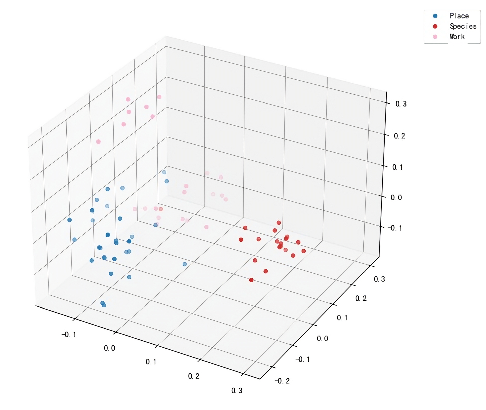

# 第2章 相似匹配——万物皆可Embedding

&emsp;&emsp;第一章我们简单介绍了Embedding的概念，我们知道Embedding可以用来表示一个词或一句话。读者可能会有困惑，这和ChatGPT或者大模型有什么关系，为什么需要Embedding？在哪里需要Embedding？这两个问题可以简单用一句话概括：因为需要获取“相关”上下文。具体来说，NLP不少任务以及大模型的应用都需要一定的“上下文”知识，而Embedding技术就用来获取这些上下文。这一过程在NLP处理中也叫“相似匹配”——把相关内容转成Embedding表示，然后通过Embedding相似度来获取最相关内容作为上下文。

&emsp;&emsp;本章我们首先将进一步了解相似匹配的相关基础，尤其是如何更好地表示一段自然语言文本，以及如何衡量Embedding的相似程度。接下来我们将介绍ChatGPT相关接口使用，其他厂商提供的类似接口用法也差不多。最后，我们将介绍与Embedding相关的几个任务和应用，这里面有些可以用大模型解决，但也可以不用大模型。无论是ChatGPT还是大模型，都只是我们工具箱中的一个工具，我们将侧重任务和应用，重点介绍如何解决此类问题。也期望读者能在阅读的过程中能感受到目的和方法的区别，方法无论如何总归是为目的服务的。

## 2.1 相似匹配基础

### 2.1.1 更好的Embedding表示

#### 1.Embedding表示回顾

&emsp;&emsp;首先我们简单回顾一下上一章介绍的Embedding表示。对于自然语言，因为它的输入是一段文本，在中文里就是一个一个字，或一个一个词，行业内把这个字或词叫Token。如果要使用模型，拿到一段文本的第一件事就是把它Token化，当然，可以按字、也可以按词，或按你想要的其他方式，比如每两个字（Bi-Gram）一组、每三个字（Tri-Gram）一组。我们看下面这个例子。

- 给定文本：人工智能让世界变得更美好。
- 按字Token化：人  工  智  能  让  世  界  变  得  更  美  好 。
- 按词Token化：人工智能  让  世界  变  得  更  美好 。
- 按字Bi-Gram Token化：人/工  工/智  智/能  能/让  让/世  世/界  界/变  变/得  得/更  更/美  美/好 好/。
- 按词Tri-Gram Token化：人工智能/让  让/世界  世界/变得  变得/更  更/美好 美好/。

&emsp;&emsp;那自然就有一个新的问题：我们应该怎么选择Token化方式？其实每种不同的方法都有自己的优点和不足，英文一般用子词表示，中文以前常见的是字或词的方式。大模型时代，中文为主的大模型基本都是以字+词的方式。如第一章所述，这种方式一方面能够更好地表示语义，另一方面对于没见过的词又可以用字的方式表示，避免了遇到不在词表中的词时导致的无法识别和处理的情况。

&emsp;&emsp;Token化后，第二件事就是要怎么表示这些Token，我们知道计算机只能处理数字，所以要想办法把这些Token给变成计算机能识别的数字才行。这里需要一个词表，将每个词映射成词表对应位置的序号。以上面的句子为例，假设以字为粒度，那么词表就可以用一个txt文件存储，内容如下：

```text
人
工
智
能
让
世
界
变
得
更
美
好
```

一行一个字，每个字作为一个Token，此时，0=我，1=们，……，以此类推，我们假设词表大小为*N*。这里有一点需要注意，就是词表的顺序是无关紧要的，不过一旦确定下来训练好模型后就不能再随便调整了。这里说的调整包括调整顺序、增加词、删除词、修改词等。如果只是调整顺序或删除词，则不需要重新训练模型，但需要手动将Embedding参数也相应地调整顺序或删除对应行。如果是增改词表，则需要重新训练模型，获取增改部分的Embedding参数。接下来就是将这些序号（Token ID）表示成稠密向量（Embedding）。它的主要思想如下。

- 把特征固定在某一个维度*D*，比如256、300、768等等，这个不重要，总之不再是词表那么大的数字。
- 利用自然语言文本的上下文关系学习一个由*D*个浮点数组成的稠密表示。

&emsp;&emsp;接下来是Embedding的学习过程。首先，随机初始化这个数组。就像下面这样：


```python
import numpy as np
rng = np.random.default_rng(42)
# 词表大小N=16，维度D=256
table = rng.uniform(size=(16, 256))
table.shape == (16, 256)
```

假设词表大小为16，维度为256，初始化后，我们就获得了一个16×256大小的二维数组，每一行浮点数就表示对应位置的Token。接下来就是通过一定算法和策略来调整（训练）这里面的数字（更新参数）。当训练结束时，最终得到的数组就是词表的Embedding表示，也就是词向量。这种表示方法在深度学习早期（2014年左右）比较流行，不过由于这个矩阵训练好后就固定不变了，这在有些时候就不合适。比如“我喜欢苹果”这句话在不同的情况下可能完全是不同的意思，因为“苹果”可以指一种水果，也可以指苹果手机。

&emsp;&emsp;我们知道，句子才是语义的最小单位，相比Token，我们其实更加关注和需要句子的表示。而且，如果我们能够很好地表示句子，词也可以看作是一个很短的句子，表示起来自然也不在话下。我们还期望可以根据不同上下文动态地获得句子表示。这中间经历了比较多的探索，但最终走向了模型架构上做设计——当输入任意一段文本，模型经过一定计算后就可以直接获得对应的向量表示。

#### 2.如何更好地表示

&emsp;&emsp;前面的介绍我们都将模型当作黑盒，默认输入一段文本就会给出一个表示。但这中间其实也有不少细节，具体来说，就是如何给出这个表示。下面，我们介绍几种常见的方法，并探讨其中机理。

&emsp;&emsp;直观来看，我们可以借鉴词向量的思想，把这里的“词”换成“句”，当模型训练完后，就可以得到句子向量了。不过，稍微思考一下就会发现，其实它本质上只是粒度更大的一种Token化方式，粒度太大有的问题它更加突出。而且，这样得到的句子向量还有个问题：无法通过句子向量获取其中的词向量，而有些场景下又需要词向量。看来，此路难行。

&emsp;&emsp;还有一种操作起来更简单的方式，我们在第一章中也提到过：直接对词向量取平均。无论一句话或一篇文档有多少个词，找到每个词的词向量，平均就好了，得到的向量大小和词向量一样。事实上，在深度学习NLP刚开始的几年，这种方式一直是主流，也出现了不少关于如何平均的工作，比如使用加权求和，权重可以根据词性、句法结构等设定一个固定值。

&emsp;&emsp;2014年，也就是Google发布Word2Vec后一年，差不多是同一批人提出了一种表示文档的方法——Doc2Vec，其思想是在每句话前面增加一个额外的“段落”Token作为段落的向量表征 ，我们可以将它视为该段落的主题。训练模型可以采用和词向量类似的方式，但每次更新词向量参数时，需要额外更新这个“段落Token”向量。直观看来，就是把文档的语义都融入到这个特殊的Token向量里。不过这个方法有个很严重的问题，那就是推理时，如果遇到训练集里没有的文档，需要将这个文档的参数更新到模型里。这不仅不方便，而且效率也低。

&emsp;&emsp;随后，随着深度学习进一步发展，涌现出一批模型，最经典的就是TextCNN和RNN。RNN我们在第一章有过介绍，TextCNN的想法来自图像领域的卷积神经网络（convolutional neural network，CNN）。它以若干个固定大小的窗口在文本上滑动，每个窗口从头滑到尾就会得到一组浮点数特征，若干个不同大小窗口（一般取2、3、4）就会得到若干个不同的特征。将它们拼接起来就可以表示这段文本了。TextCNN的表示能力其实不错，一直以来都是作为基准模型使用，很多线上模型也用它。它的主要问题是只利用了文本的局部特征，没有考虑全局语义。RNN和它的几个变种都是时序模型，从前到后一个Token接着一个Token处理。它也有不错的表示能力，但有两个比较明显的不足：一个是比较慢，没法并行；另一个问题是文本太长时效果不好。总的来说，这一阶段词向量用的比较少了，文本的表示主要通过模型架构体现，Token化的方式以词为主。

&emsp;&emsp;2017年，Transformer横空出世，带来了迄今最强特征表示方式：自注意力机制。模型开始慢慢变大，从原来的十万、百万级别逐渐增加到了亿级别。文档表示方法并没有太多创新，但由于模型变大，表示效果有了明显提升。自此，NLP进入了预训练时代——基于Transformer架构训练一个大模型，做任务时都以该模型为起点，在对应数据上进行微调训练。代表性的工作是BERT和GPT，前者用了Transformer的编码器，后者用了解码器。BERT在每个文档前面添加一个`[CLS]`Token用来表示整句话的语义，但与Doc2Vec不同的是，它在推理时不需要额外训练，模型会根据当前输入通过计算自动获得表示。也就是说，同样的输入，相比Doc2Vec，BERT因为其强大的表示能力，可以通过模型计算，不额外训练就能获得不错的文本表示。GPT在第一章中有相关介绍，这里不再赘述。无论是哪个预训练模型，底层其实都是对每个Token进行计算（计算时一般都会利用到其他Token信息）。所以，预训练模型一般都可以获得每个Token位置的向量表示。于是，文档表示依然可以使用那种最常见的方式——取平均。当然，由于模型架构变得复杂，取平均的方式也更加灵活多样，比如用自注意力作为权重加权平均。

#### 3.进一步思考

&emsp;&emsp;ChatGPT的出现其实是语言模型的突破，并没有涉及到Embedding，但是由于模型在处理超长文本上的限制（主要是资源限制和超长距离的上下文依赖问题），Embedding成了一个重要组件。我们先不讨论大模型，依然把关注点放在Embedding上。

&emsp;&emsp;接下来主要是笔者本人的一些思考，期望能与读者共同探讨。如前所述，如今Embedding已经转变成了模型架构的副产物，架构变强——Token表示变强——文档表示变强。这中间第一步目前没什么问题，Token表示通过架构充分利用了各种信息，而且还可以得到不同层级的抽象。但第二步却有点单薄，要么是`[CLS]`Token，要么就是变着法子的取平均。这些方法在句子上可能问题不大，因为句子一般比较短，但在段落、篇章，甚至更长文本下却不一定了。

&emsp;&emsp;还是以人类阅读进行类比（很多模型都是从人类获得启发，比如CNN、自注意力等）。我们在看一句话时，会重点关注其中一些关键词，整体语义可能通过这些关键词就能表达一二。看一段话时可能依然是关键词、包含关键词的关键句等。但当我们在看一篇文章时，其中的关键词和关键句可能就不那么突出了，我们可能会更加关注整体在表达什么，描述这样的表达可能并不会用到文本中的词或句。

&emsp;&emsp;也就是说，我们人类在处理句子和篇章的方式是不一样的。但是现在模型却把它们当成同样的东西进行处理，没有考虑这中间量变引起的质变。通俗点来说，这是几粒沙子和沙堆的区别。我们的模型设计是否可以考虑这样的不同？

&emsp;&emsp;最后我们简单总结一下，Embedding本质就是一组稠密向量（不用过度关注它怎么来的），用来表示一段文本（可以是字、词、句、段等）。获取到这个表示后，我们就可以进一步做一些任务。读者不妨先思考一下，当给定任意句子并获得到它的固定长度的语义表示时，我们可以干什么？

### 2.1.2 如何度量Embedding相似度

&emsp;&emsp;提起相似度，读者可能首先会想到编辑距离相似度，它可以用来衡量字面量的相似度，也就是文本本身的相似程度。但如果是语义层面，我们一般会使用余弦（cosine）相似度，它可以评估两个向量在语义空间上的分布情况，如式（2.1）所示。

$$
\text{cosine}(v,w) = \frac {v·w}{|v||w|} = \frac {\displaystyle \sum_{i=1}^N v_iw_i} {\displaystyle \sqrt{\sum_{i=1}^N v_i^2} \sqrt{\sum_{i=1}^N w_i^2}} \qquad (2.1)
$$

其中，$v$和$w$分别表示两个文本向量，$i$表示向量中第$i$个元素的值。

&emsp;&emsp;我们举个例子：


```python
import numpy as np

a = [0.1, 0.2, 0.3]
b = [0.2, 0.3, 0.4]
cosine_ab = (0.1*0.2+0.2*0.3+0.3*0.4)/(np.sqrt(0.1**2+0.2**2+0.3**2) * np.sqrt(0.2**2+0.3**2+0.4**2))
cosine_ab == 0.9925833339709301
```

在这个例子中，我们给定两个向量表示`a`和`b`，然后用式（1）计算相似度，得到它们的相似度为0.9926。

&emsp;&emsp;上一小节我们得到了一段文本的向量表示，这一小节我们可以计算两个向量的相似程度。换句话说，我们现在可以知道两段给定文本的相似程度，或者说给定一段文本可以从库里找到与它语义最相似的若干段文本。这个逻辑会用在很多NLP应用上，我们一般也会把这个过程叫作“语义匹配”。不过在正式介绍任务和应用之前，先来了解下ChatGPT的相关接口。

## 2.2 ChatGPT接口使用

&emsp;&emsp;这部分我们主要为读者介绍两个接口，一个是ChatGPT提供的Embedding接口，另一个是ChatGPT接口。前者可以获取给定文本的向量表示；后者可以直接完成语义匹配任务。

### 2.1 Embedding接口

&emsp;&emsp;首先是一些准备工作，主要是设置`OPENAI_API_KEY`，这里建议读者通过环境变量获取，不要明文将自己的密钥写在任何代码文件里。当然，更加不要上传到开源代码仓库。


```python
import os
import openai

# 用环境变量获取
OPENAI_API_KEY = os.environ.get("OPENAI_API_KEY")
# 或直接填上自己的API key，不建议正式场景下使用
OPENAI_API_KEY = "填入专属的API key"

openai.api_key = OPENAI_API_KEY
```

&emsp;&emsp;接下来，我们输入文本，指定相应模型，获取文本对应的Embedding。


```python
text = "我喜欢你"
model = "text-embedding-ada-002"
emb_req = openai.Embedding.create(input=[text], model=model)
```

&emsp;&emsp;接口会返回输入文本的向量表示，结果如下。


```python
emb = emb_req.data[0].embedding
len(emb) == 1536
type(emb) == list
```

&emsp;&emsp;我们看到，Embedding表示是一个列表，里面包含1536个浮点数。


&emsp;&emsp;OpenAI官方还提供了一个集成接口，既包括获取Embedding，也包括计算相似度，使用起来更加简单（读者也可以尝试自己写一个），如下所示。


```python
from openai.embeddings_utils import get_embedding, cosine_similarity

text1 = "我喜欢你"
text2 = "我钟意你"
text3 = "我不喜欢你"
# 注意它默认的模型是text-similarity-davinci-001，我们也可以换成text-embedding-ada-002
emb1 = get_embedding(text1)
emb2 = get_embedding(text2)
emb3 = get_embedding(text3)
```

&emsp;&emsp;接口直接返回向量表示，结果如下。


```python
len(emb1) == 12288
type(emb1) == list
```

&emsp;&emsp;和上面不同的是Embedding的长度变了，从1536变成了12288。这个主要是因为`get_embedding`接口默认的模型和上面我们指定的模型不一样。模型不同时，Embedding的长度（维度）也可能不同。一般情况下，Embedding维度越大，表示效果越佳，但同时计算速度越慢（从调用API的角度可能感知不明显）。当然，它们的价格也可能不一样。

&emsp;&emsp;现在来计算一下几个文本的相似度，直观感受一下。


```python
cosine_similarity(emb1, emb2) == 0.9246855139297101
cosine_similarity(emb1, emb3) == 0.8578009661644189
cosine_similarity(emb2, emb3) == 0.8205299527695261
```

&emsp;&emsp;前两句是一个意思，相似度高一些。第一句和第三句，第二句和第三句是相反的，所以相似度低一些。下面，我们换维度为1536的模型试一下效果，如下所示。


```python
text1 = "我喜欢你"
text2 = "我钟意你"
text3 = "我不喜欢你"
emb1 = get_embedding(text1, "text-embedding-ada-002")
emb2 = get_embedding(text2, "text-embedding-ada-002")
emb3 = get_embedding(text3, "text-embedding-ada-002")
```

&emsp;&emsp;使用方法类似，只是第二个参数我们改成了1536维的模型，结果如下。


```python
cosine_similarity(emb1, emb2) == 0.8931105629213952
cosine_similarity(emb1, emb3) == 0.9262074073566393
cosine_similarity(emb2, emb3) == 0.845821877417193
```

&emsp;&emsp;这个结果不太令人满意。不过，我们正好可以用来探讨关于“相似度”的一个有意思的观点。为什么很多语义匹配模型都会认为“我喜欢你”和“我不喜欢你”的相似度比较高？其实，从客观角度来看，这两句话是就是相似的，它们结构一样，都是表达一种情感倾向，句式结构也相同，之所以我们觉得不相似只是因为我们只关注了一个（我们想要的）角度^[4]^。所以，如果想要模型的输出和我们想要的一致，就需要重新设计和训练模型。我们需要明确地告诉模型，“我喜欢你”与”我钟意你“比”我喜欢你“和”我不喜欢你“更相似。

&emsp;&emsp;因此，在实际使用时，我们最好能够在自己的数据集上进行测试，明确各项指标的表现。如果不满足需要，还需要考虑是否需要在自己的数据集上专门训练一个Embedding模型。同时，应综合考虑性能、价格等因素。

### 2.2 ChatGPT+提示词

&emsp;&emsp;接下来我们用万能的ChatGPT尝试一下，注意它不会返回Embedding，而是尝试直接告诉我们答案，如下所示。


```python
content = "请告诉我下面三句话的相似程度：\n1. 我喜欢你。\n2. 我钟意你。\n3.我不喜欢你。\n"

response = openai.ChatCompletion.create(
    model="gpt-3.5-turbo", 
    messages=[{"role": "user", "content": content}]
)

response.get("choices")[0].get("message").get("content")
```

&emsp;&emsp;这里，我们直接调用GPT-3.5（也就是ChatGPT）的API，返回结果如下所示。


    1和2相似，都表达了对某人的好感或喜欢之情。而3则与前两句截然相反，表示对某人的反感或不喜欢。

&emsp;&emsp;效果看起来不错，不过这个格式不太好，我们调整一下，让它格式化输出，如下所示。


```python
content += "第一句话用a表示，第二句话用b表示，第三句话用c表示，请以json格式输出两两相似度，类似下面这样：\n{"ab": a和b的相似度}"

response = openai.ChatCompletion.create(
    model="gpt-3.5-turbo", 
    messages=[{"role": "user", "content": content}]
)

response.get("choices")[0].get("message").get("content")
```

&emsp;&emsp;注意这里我们直接在原`content`基础上增加格式要求，结果如下所示。


    {"ab": 0.8, "ac": -1, "bc": 0.7}\n\n解释：a和b的相似度为0.8，因为两句话表达了相同的情感；a和c的相似度为-1，因为两句话表达了相反的情感；b和c的相似度为0.7，因为两句话都是表达情感，但一个是积极情感，一个是消极情感，相似度略低。

&emsp;&emsp;可以看到，ChatGPT输出了我们想要的格式，但后两句`b`和`c`的结果并不是我们想要的。不过我们看它给出的解释：“两句话都是表达情感，但一个是积极情感，一个是消极情感，相似度略低。”这点和我们上一小节讨论的关于“相似度”的观点是类似的。不过，类似ChatGPT这样的大模型接口要在自己的数据上进行训练就不那么方便了。这时候可以在提示词里先给一些类似的示例，让它知道我们想要的是语义上的相似。读者不妨自己尝试一下。

## 2.3 相关任务与应用

&emsp;&emsp;有读者可能会疑惑，既然ChatGPT已经这么强大了，为什么还要介绍Embedding这种看起来好像有点“低级”的技术呢？这个我们在本章一开头就简单提到了。这里稍微再扩充一下，其实目前来看主要有两个方面的原因。第一，有些问题使用Embedding解决（或其他非ChatGPT的方式）会更加合理。通俗来说就是“杀鸡焉用牛刀”。第二，ChatGPT性能方面不是特别高效，毕竟是一个Token一个Token吐出来的。

&emsp;&emsp;关于第一点，我们要额外多说几句。选择技术方案就跟找工作一样，合适最重要。只要你的问题（需求）没变，能解决的技术就是好技术。比如任务就是一个二分类，明明一个很简单的模型就能解决，就没必要非得用个很复杂的。除非ChatGPT这样的大语言模型API已经大众到一定程度——任何人都能够非常流畅、自由地使用；而且，我们就是想要简单、低门槛、快捷地实现功能。

&emsp;&emsp;言归正传，使用Embedding的应用大多跟语义相关，我们这里介绍与此相关的几个经典任务和相关的应用。

### 2.3.1 简单问答：以问题找问题

&emsp;&emsp;QA是问答的意思，Q表示Question，A表示Answer，QA是NLP非常基础和常用的任务。简单来说，就是当用户提出一个问题时，我们能从已有的问题库中找到一个最相似的，并把它的答案返回给用户。这里有两个关键点：第一，事先需要有一个QA库。第二，用户提问时，系统要能够在QA库中找到一个最相似的。

&emsp;&emsp;用ChatGPT或其他生成模型做这类任务有点麻烦，尤其是当：QA库非常庞大时；或给用户的答案是固定的、不允许自由发挥时。生成方式做起来是事倍功半。但是Embedding却天然的非常适合，因为该任务的核心就是在一堆文本中找出与给定文本最相似的文本。简单总结，QA问题其实就是相似度计算问题。

&emsp;&emsp;我们使用Kaggle提供的Quora数据集：all-kaggle-questions-on-qoura-dataset，数据集可以在Kaggle官网搜索下载。下载后是一个csv文件，先把它给读进来。


```python
import pandas as pd

df = pd.read_csv("dataset/Kaggle related questions on Qoura - Questions.csv")
df.shape == (1166, 4)
```

&emsp;&emsp;数据集包括1166行，4列。


```python
df.head()
```

&emsp;&emsp;使用`df.head()`可以读取数据集的前5条，如表2-1所示。

<p align="center">表2-1 Quora数据集样例<p>

<table border="1" class="dataframe">
  <thead>
    <tr style="text-align: right;">
      <th></th>
      <th>Questions</th>
      <th>Followers</th>
      <th>Answered</th>
      <th>Link</th>
    </tr>
  </thead>
  <tbody>
    <tr>
      <th>0</th>
      <td>How do I start participating in Kaggle competi...</td>
      <td>1200</td>
      <td>1</td>
      <td>/How-do-I-start-participating-in-Kaggle-compet...</td>
    </tr>
    <tr>
      <th>1</th>
      <td>Is Kaggle dead?</td>
      <td>181</td>
      <td>1</td>
      <td>/Is-Kaggle-dead</td>
    </tr>
    <tr>
      <th>2</th>
      <td>How should a beginner get started on Kaggle?</td>
      <td>388</td>
      <td>1</td>
      <td>/How-should-a-beginner-get-started-on-Kaggle</td>
    </tr>
    <tr>
      <th>3</th>
      <td>What are some alternatives to Kaggle?</td>
      <td>201</td>
      <td>1</td>
      <td>/What-are-some-alternatives-to-Kaggle</td>
    </tr>
    <tr>
      <th>4</th>
      <td>What Kaggle competitions should a beginner sta...</td>
      <td>273</td>
      <td>1</td>
      <td>/What-Kaggle-competitions-should-a-beginner-st...</td>
    </tr>
  </tbody>
</table>

&emsp;&emsp;第一列是问题列表，第二列是关注人数，第三列表示是否被回答，最后一列是对应的链接地址。

&emsp;&emsp;这里，我们就把最后一列链接地址`Link`当作答案构造QA数据对，基本的流程如下。

- 第一步：对每个问题计算Embedding。
- 第二步：存储Embedding，同时存储每个问题对应的答案。
- 第三步：从存储的地方检索最相似的问题。

&emsp;&emsp;第一步我们将借助OpenAI的Embedding接口，但是后两步得看实际情况了。如果问题的数量比较少，比如只有几万条甚至几千条，那我们可以把计算好的Embedding直接存储成文件，每次服务启动时直接加载到内存或缓存里就好了。使用时，挨个计算输入问题和存储的所有问题的相似度，然后给出最相似的问题的答案。演示代码如下。


```python
from openai.embeddings_utils import get_embedding, cosine_similarity
import openai
import numpy as np

OPENAI_API_KEY = os.environ.get("OPENAI_API_KEY")
openai.api_key = OPENAI_API_KEY
```

&emsp;&emsp;首先依然是导入需要的工具包，并配置好`OPENAI_API_KEY`。然后遍历DataFrame计算Embedding并存储，如下所示。


```python
vec_base = []
for v in df.itertuples():
    emb = get_embedding(v.Questions)
    im = {
        "question": v.Questions,
        "embedding": emb,
        "answer": v.Link
    }
    vec_base.append(im)
```

&emsp;&emsp;然后直接使用。比如给定输入："is kaggle alive?"，我们先获取它的Embedding，然后逐个遍历`vec_base`计算相似度，并取相似度最高的一个或若干个作为响应。


```python
query = "is kaggle alive?"
q_emb = get_embedding(query)

sims = [cosine_similarity(q_emb, v["embedding"]) for v in vec_base] 
```

&emsp;&emsp;为了方便展示，我们假设只有5条，如下所示。


    sims == [
    	0.665769204766594,
    	0.8711775410642538,
     	0.7489853201153621,
     	0.7384357684745508,
     	0.7287129153982224
    ]

&emsp;&emsp;此时，第二个相似度最高，我们返回第二个（索引为1）文档即可。


```python
vec_base[1]["question"], vec_base[1]["answer"] == ('Is Kaggle dead?', '/Is-Kaggle-dead')
```

&emsp;&emsp;如果要返回多个，则返回前面若干个相似度高的文档即可。

&emsp;&emsp;当然，在实际中，我们不建议使用循环，那样效率比较低。我们可以使用NumPy进行批量计算。


```python
arr = np.array(
    [v["embedding"] for v in vec_base]
)
```

&emsp;&emsp;这里先将所有问题的Embedding构建成一个NumPy数组。


```python
q_arr = np.expand_dims(q_emb, 0)
q_arr.shape == (1, 12288)
```

&emsp;&emsp;对给定输入的Embedding也将它变成NumPy的数组。需要注意的是，我们要给给它扩展一个维度，便于后面的计算。


```python
from sklearn.metrics.pairwise import cosine_similarity

sims = cosine_similarity(arr, q_arr)
```

&emsp;&emsp;使用`sklearn`包里的`cosine_similarity`可以批量计算两个数组的相似度。这里的批量主要利用的NumPy的向量化计算，可以极大地提升效率，建议读者亲自尝试两种方案的效率差异。还是假设只有5条数据，结果如下所示。


    sims == array([
    	[0.6657692 ],
        [0.87117754],
    	[0.74898532],
    	[0.73843577],
    	[0.72871292]
    ])

&emsp;&emsp;不过，当问题非常多时，比如上百万甚至上亿，这种方式就不合适了。一方面是内存里可能放不下，另一方面是算起来也很慢。这时候就必须借助一些专门用来做语义检索的工具了。比较常用的工具有下面几个。

- FaceBook的faiss：高效的相似性搜索和稠密向量聚类库。
- milvus-io的milvus：可扩展的相似性搜索和面向人工智能应用的向量数据库。
- Redis：是的，Redis也支持向量搜索。

此处，我们以Redis为例，其他工具用法类似。

&emsp;&emsp;首先，我们需要一个Redis服务，建议使用Docker直接运行：

```shell
$ docker run -p 6379:6379 -it redis/redis-stack:latest
```

执行后，Docker会自动从hub把镜像拉到本地，默认是6379端口，我们将其映射出来。

&emsp;&emsp;然后安装redis-py，也就是Redis的Python客户端：

```shell
$ pip install redis
```

这样我们就可以用Python和Redis进行交互了。

&emsp;&emsp;先来个最简单的例子：


```python
import redis

r = redis.Redis()
r.set("key", "value")
```

&emsp;&emsp;我们初始化了一个Redis实例，然后设置了一个key-value对，其中key就是字符串`key`，value是字符串`value`。现在就可以通过key获取相应的value，如下所示。


```python
r.get("key") == b'value'
```

&emsp;&emsp;接下来的内容和刚刚放在内存的步骤差不多，但是这里我们需要先建索引，然后生成Embedding并把它存储到Redis，再进行使用（从索引中搜索）。由于我们使用了向量工具，具体步骤会略微不同。

&emsp;&emsp;索引的概念和数据库中的索引有点类似，需要定义一组Schema，告诉Redis每个字段是什么，有哪些属性。还是先导入需要的依赖。


```python
from redis.commands.search.query import Query
from redis.commands.search.field import TextField, VectorField
from redis.commands.search.indexDefinition import IndexDefinition
```

&emsp;&emsp;接下来就是定义字段和Schema。


```python
# 向量维度
VECTOR_DIM = 12288
# 索引名称
INDEX_NAME = "faq"
# 建好要存字段的索引，针对不同属性字段，使用不同Field
question = TextField(name="question")
answer = TextField(name="answer")
embedding = VectorField(
    name="embedding", 
    algorithm="HNSW", 
    attributes={
        "TYPE": "FLOAT32",
        "DIM": VECTOR_DIM,
        "DISTANCE_METRIC": "COSINE"
    }
)
schema = (question, embedding, answer)
```

&emsp;&emsp;上面`embedding`字段里的`HNSW`是层级可导航小世界算法（hierarchical navigable small worlds，HNSW）。它是一种用于高效相似性搜索的算法，主要思想是将高维空间中的数据点组织成一个多层级的图结构，使得相似的数据点在图上彼此靠近。搜索时可以先通过粗略的层级找到一组候选数据点，然后逐渐细化搜索，直到找到最近似的邻居。

&emsp;&emsp;然后尝试创建索引，如下所示。

```python
index = r.ft(INDEX_NAME) # ft表示full text search
try:
    info = index.info()
except:
    index.create_index(schema, definition=IndexDefinition(prefix=[INDEX_NAME + "-"]))
```

&emsp;&emsp;建好索引后，就可以往里面导入数据了。有时候我们可能需要删除已有的文档，可以使用下面的命令实现。


```python
index.dropindex(delete_documents=True)
```

&emsp;&emsp;再然后就是把数据导入Redis，整体逻辑和之前类似，不同的是需要将Embedding的浮点数存为字节。


```python
for v in df.itertuples():
    emb = get_embedding(v.Questions)
    # 注意，redis要存储bytes或string
    emb = np.array(emb, dtype=np.float32).tobytes()
    im = {
        "question": v.Questions,
        "embedding": emb,
        "answer": v.Link
    }
    # 重点是这句set操作
    r.hset(name=f"{INDEX_NAME}-{v.Index}", mapping=im)
```

&emsp;&emsp;然后我们就可以进行搜索查询了，这一步构造查询输入稍微有一点麻烦，需要写一点查询语言。


```python
# 构造查询输入
query = "kaggle alive?"
embed_query = get_embedding(query)
params_dict = {"query_embedding": np.array(embed_query).astype(dtype=np.float32).tobytes()}
```

 &emsp;&emsp;获取给定输入的Embedding和之前一样，构造参数字典就是将其转为字节。接下来是编写并构造查询，如下所示。


```python
k = 3
base_query = f"* => [KNN {k} @embedding $query_embedding AS score]"
return_fields = ["question", "answer", "score"]
query = (
    Query(base_query)
     .return_fields(*return_fields)
     .sort_by("score")
     .paging(0, k)
     .dialect(2)
)
```

&emsp;&emsp;query的语法为：`{some filter query}=>[ KNN {num|$num} @vector_field $query_vec]`，包括以下几项。

- `{some filter query}`：字段过滤条件，可以使用多个条件。`*`表示任意。
- `[ KNN {num|$num} @vector_field $query_vec]`：K最近邻算法（K Nearest Neighbors，KNN）的主要思想是对未知点分别和已有的点算距离，挑距离最近的K个点。`num`表示K。`vector_field`是索引里的向量字段，这里是`embedding`。`query_embedding`是参数字典中表示给定输入Embedding的名称，这里是`query_embedding`。
- `AS score`：表示K最近邻算法计算结果的数据名称为`score`。注意，这里的`score`其实是距离，不是相似度。换句话说，`score`越小，相似度越大。

&emsp;&emsp;`paging`表示分页，参数为：`offset`和`num`，默认值为0和10。 `dialect`表示查询语法的版本，不同版本之间会有细微差别。

&emsp;&emsp;此时，我们就可以通过`search`API直接查询了，查询过程和结果如下。


```python
# 查询
res = index.search(query, params_dict)
for i,doc in enumerate(res.docs):
    # 注意这里相似度和分数正好相反
    similarity = 1 - float(doc.score)
    print(f"{doc.id}, {doc.question}, {doc.answer} (Similarity: {round(similarity, 3) })")
```

&emsp;&emsp;最终输出内容如下。

    faq-1, Is Kaggle dead?, /Is-Kaggle-dead (Score: 0.831)
    faq-2, How should a beginner get started on Kaggle?, /How-should-a-beginner-get-started-on-Kaggle (Score: 0.735)
    faq-3, What are some alternatives to Kaggle?, /What-are-some-alternatives-to-Kaggle (Score: 0.73)


&emsp;&emsp;上面我们通过几种不同的方法为大家介绍了如何使用Embedding进行QA任务。简单回顾一下，要做QA任务首先咱们得有一个QA库，这些QA就是我们的仓库，每当一个新的问题过来时，我们就用这个问题去和咱们仓库里的每一个问题去匹配，然后找到最相似的那个，接下来就把该问题的答案当作新问题的答案交给用户。

&emsp;&emsp;这个任务的核心就是如何找到这个最相似的，涉及两个知识点：如何表示一个问题，以及如何查找到相似的问题。对于第一点，我们用API提供的Embedding表示，我们可以把它当作一个黑盒子，输入任意长度的文本，输出一个向量。查找相似问题则主是用到相似度算法，语义相似度一般用余弦距离来衡量。

&emsp;&emsp;当然实际中可能会更加复杂一些，比如我们可能除了使用语义匹配，还会使用字词匹配（经典的做法）。而且，一般都会找到前若干个最相似的，然后对这些结果进行排序，选出最可能的那个。不过，这个我们前面在讲“ChatGPT提示词”一节时举过例子了，现在完全可以通过ChatGPT这样的大模型API来解决，让它帮你选出最好的那个。

### 2.3.2 聚类任务：物以类聚也以群分

&emsp;&emsp;聚类的意思是把彼此相近的样本聚集在一起，本质也是在使用一种表示和相似度衡量来处理文本。比如我们有大量的未分类文本，如果事先能知道有几种类别，就可以用聚类的方法先将样本大致分一下。

&emsp;&emsp;这个例子我们使用Kaggle的DBPedia数据集：DBPedia Classes，数据集可以在Kaggle官网搜索下载。该数据集会对一段文本会给出三个不同层次级别的分类标签，我们用第一层的类别作为示例。和上个任务一样，依然是先读取并查看数据。


```python
import pandas as pd

df = pd.read_csv("./dataset/DBPEDIA_val.csv")
df.shape == (36003, 4)
df.head()
```

&emsp;&emsp;数据如表2-2所示，第一列是文本，后面三列分别是三个层级的标签。

<p align="center">表2-2 DBPedia数据集样例<p>

<table border="1" class="dataframe">
  <thead>
    <tr style="text-align: right;">
      <th></th>
      <th>text</th>
      <th>l1</th>
      <th>l2</th>
      <th>l3</th>
    </tr>
  </thead>
  <tbody>
    <tr>
      <th>0</th>
      <td>Li Curt is a station on the Bernina Railway li...</td>
      <td>Place</td>
      <td>Station</td>
      <td>RailwayStation</td>
    </tr>
    <tr>
      <th>1</th>
      <td>Grafton State Hospital was a psychiatric hospi...</td>
      <td>Place</td>
      <td>Building</td>
      <td>Hospital</td>
    </tr>
    <tr>
      <th>2</th>
      <td>The Democratic Patriotic Alliance of Kurdistan...</td>
      <td>Agent</td>
      <td>Organisation</td>
      <td>PoliticalParty</td>
    </tr>
    <tr>
      <th>3</th>
      <td>Ira Rakatansky (October 3, 1919 – March 4, 201...</td>
      <td>Agent</td>
      <td>Person</td>
      <td>Architect</td>
    </tr>
    <tr>
      <th>4</th>
      <td>Universitatea Reșița is a women handball club ...</td>
      <td>Agent</td>
      <td>SportsTeam</td>
      <td>HandballTeam</td>
    </tr>
  </tbody>
</table>

&emsp;&emsp;接下来可以查看一下类别数量，`value_counts`可以统计出每个值的频次，这里我们只看第一层的标签。


```python
df.l1.value_counts()
```

&emsp;&emsp;结果如下所示，可以看到，Agent数量最多，Device数量最少。


    Agent             18647
    Place              6855
    Species            3210
    Work               3141
    Event              2854
    SportsSeason        879
    UnitOfWork          263
    TopicalConcept      117
    Device               37
    Name: l1, dtype: int64

&emsp;&emsp;由于整个数据比较多，展示起来不太方便，我们随机采样200条。


```python
sdf = df.sample(200)
sdf.l1.value_counts()
```

&emsp;&emsp;随机采样使用`sample`接口，采样数据的分布和采样源是接近的。


    Agent             102
    Place              31
    Work               22
    Species            19
    Event              12
    SportsSeason       10
    UnitOfWork          3
    TopicalConcept      1
    Name: l1, dtype: int64

&emsp;&emsp;为了便于观察，我们只保留3个数量差不多的类别：`Place`、`Work`和`Species`（类型太多时，样本点会混在一块难以观察，读者不妨自己尝试一下）。


```python
cdf = sdf[
    (sdf.l1 == "Place") | (sdf.l1 == "Work") | (sdf.l1 == "Species")
]
cdf.shape == (72, 6)
```

&emsp;&emsp;我们过滤了其他标签，只保留了选定的3个，最终数据量是72条，相信观察起来会非常直观。

&emsp;&emsp;由于需要把文本表示成向量，所以和上小节一样，先把工具准备好。


```python
from openai.embeddings_utils import get_embedding, cosine_similarity
import openai
import numpy as np

OPENAI_API_KEY = os.environ.get("OPENAI_API_KEY")
openai.api_key = OPENAI_API_KEY
```

&emsp;&emsp;我们前面提到过，这个`get_embedding`API可以支持多种模型（`engine`参数），它默认的是：`text-similarity-davinci-001`，我们这里用另一个：`text-embedding-ada-002`，它稍微快一些（维度比前面的少很多）。


```python
cdf["embedding"] = cdf.text.apply(lambda x: get_embedding(x, engine="text-embedding-ada-002"))
```


&emsp;&emsp;接下来用主成分分析算法（principal component analysis，PCA）进行特征降维，将原来的向量从1536维降到3维，便于显示（超过3维就不好画了）。


```python
from sklearn.decomposition import PCA

arr = np.array(cdf.embedding.to_list())
pca = PCA(n_components=3)
vis_dims = pca.fit_transform(arr)
cdf["embed_vis"] = vis_dims.tolist()
arr.shape == (72, 1536), vis_dims.shape == (72, 3)
```

&emsp;&emsp;可以看到，得到的`vis_dims`只有3维，这3个维度就是最主要的特征，我们可以说这3个特征能够“大致上”代表所有的1536个特征。然后就是将所有数据可视化，也就是把三种类型的点（每个点3个维度）在三维空间中绘制出来。


```python
%matplotlib inline
import matplotlib.pyplot as plt
import numpy as np

fig, ax = plt.subplots(subplot_kw={"projection": "3d"}, figsize=(8, 8))
cmap = plt.get_cmap("tab20")
categories = sorted(cdf.l1.unique())

# 分别绘制每个类别
for i, cat in enumerate(categories):
    sub_matrix = np.array(cdf[cdf.l1 == cat]["embed_vis"].to_list())
    x = sub_matrix[:, 0]
    y = sub_matrix[:, 1]
    z = sub_matrix[:, 2]
    colors = [cmap(i/len(categories))] * len(sub_matrix)
    ax.scatter(x, y, z, c=colors, label=cat)

ax.legend(bbox_to_anchor=(1.2, 1))
plt.show();
```

&emsp;&emsp;结果如图2-1所示。



<p align="center">图2-1 聚类示意图<p>

&emsp;&emsp;可以比较明显地看出，3个不同类型的数据分别在空间的不同位置。如果我们事先不知道每个样本是哪种标签（但我们知道有3个标签），这时候还可以通过KMeans算法将数据划分为不同的族群，同族内相似度较高，不同族之间相似度较低。KMeans算法的基本思路如下。

- 随机选择K（此处为3）个点作为初始聚类中心。
- 将每个点分配到距离最近的那个中心。
- 计算每个族群的平均值，将其作为新的聚类中心。
- 重复上述步骤，直到聚类中心不再明显变化为止。

&emsp;&emsp;示例代码如下：

```python
from sklearn.cluster import KMeans

kmeans = KMeans(n_clusters=3).fit(vis_dims)
```

&emsp;&emsp;然后就可以通过`kmeans.labels_`得到每个数据的标签了。

&emsp;&emsp;聚类任务在实际中直接用作最终方案的情况不是特别多（主要是因为无监督方法精度有限），一般都会作为辅助手段对数据进行预划分，用于下一步的分析。但有一些特定场景却比较适合使用，比如异常点分析、客户分群、社交网络分析等。

### 2.3.3 推荐应用：一切都是Embedding

&emsp;&emsp;我们在很多APP或网站上都能看到推荐功能。比如购物网站，每当你登陆或者选购一件商品后，系统就会给你推荐一些相关的产品。在这一小节中，我们就来做一个类似的应用，不过我们推荐的不是商品，而是文本，比如帖子、文章、新闻等。我们以新闻为例，基本逻辑如下。

- 首先要有一个基础的文章库，可能包括标题、内容、标签等。
- 计算已有文章的Embedding并存储。
- 根据用户浏览记录，推荐和浏览记录最相似的文章。

&emsp;&emsp;这次我们使用Kaggle的AG News数据集。上面的逻辑看起来好像和前面的QA差不多，事实也的确如此，因为它们本质上都是相似匹配问题。只不过QA使用的是用户的问题去匹配已有QA库，而推荐是使用用户的浏览记录去匹配。实际上推荐相比QA要更复杂一些，主要包括以下几个方面。

- 刚开始用户没有记录时如何推荐（一般被业界称为冷启动问题）。
- 除了相似还有其他要考虑的因素：比如热门内容、新内容、内容多样性、随时间变化的兴趣变化等等。
- 编码问题（Embedding的输入）：我们应该取标题呢，还是文章，还是简要描述或者摘要，或者考虑全部。
- 规模问题：推荐面临的量级一般会远超QA，除了横向扩展机器，是否能从流程和算法设计上提升效率。
- 用户反馈对推荐系统的影响问题：用户反感或喜欢与文章本身并没有直接关系，比如用户喜欢体育新闻但讨厌中国足球。
- 线上实时更新问题。

&emsp;&emsp;当然，一个完整的线上系统要考虑的因素可能更多。列出这些只是希望读者在设计一个方案时能够充分调研和考虑，同时结合实际情况进行。反过来说，可能也并不需要考虑上面的每个因素。所以我们要活学活用，实际操作时充分理解需求后再动手实施。

&emsp;&emsp;我们综合考虑上面的因素给读者一个比较简单的方案，但务必注意，其中每个模块的方案都不是唯一的。简要设计方案如下。

- 用户注册登录时，让其选择感兴趣的类型（如体育、音乐、时尚等），我们通过这一步将用户限定在几个类别的范围内（推荐时可以只考虑这几个类别，提升效率），同时也可以用来解决冷启动问题。
- 给用户推荐内容时，根据用户注册时选择的类别或浏览记录对应的类别确认推荐类别后，接下来应依次考虑时效性、热门程度、多样性等。
- 考虑到性能问题，可以只编码标题和摘要。
- 对大类别进一步细分，只在细分类别里进行相似度计算。
- 记录用户实时行为，如浏览、评论、收藏、点赞、转发等。
- 动态更新内容库，更新用户行为库。

&emsp;&emsp;现实场景中最常用的是流水线方案：召回+排序。召回就是通过各种不同属性或特征（如用户偏好、热点、行为等）先找到一批要推荐的列表。排序则是根据多样性、时效性、用户反馈、热门程度等属性对召回结果进行排序，将排在前面的优先推荐给用户。我们这里只简单展示召回。

&emsp;&emsp;这个例子我们使用Kaggle的AG_News数据集：AG News Classification Dataset，数据集可以在Kaggle官网搜索下载。还是老样子，先读取并查看数据。


```python
from dataclasses import dataclass
import pandas as pd

df = pd.read_csv("./dataset/AG_News.csv")
df.shape == (120000, 3)
df.head()
```

&emsp;&emsp;数据如表2-3所示，共包含三列：类型、标题和描述。

<p align="center">表2-3 AG_News数据集样例<p>

<table border="1" class="dataframe">
  <thead>
    <tr style="text-align: right;">
      <th></th>
      <th>Class Index</th>
      <th>Title</th>
      <th>Description</th>
    </tr>
  </thead>
  <tbody>
    <tr>
      <th>0</th>
      <td>3</td>
      <td>Wall St. Bears Claw Back Into the Black (Reuters)</td>
      <td>Reuters - Short-sellers, Wall Street's dwindli...</td>
    </tr>
    <tr>
      <th>1</th>
      <td>3</td>
      <td>Carlyle Looks Toward Commercial Aerospace (Reu...</td>
      <td>Reuters - Private investment firm Carlyle Grou...</td>
    </tr>
    <tr>
      <th>2</th>
      <td>3</td>
      <td>Oil and Economy Cloud Stocks' Outlook (Reuters)</td>
      <td>Reuters - Soaring crude prices plus worries\ab...</td>
    </tr>
    <tr>
      <th>3</th>
      <td>3</td>
      <td>Iraq Halts Oil Exports from Main Southern Pipe...</td>
      <td>Reuters - Authorities have halted oil export\f...</td>
    </tr>
    <tr>
      <th>4</th>
      <td>3</td>
      <td>Oil prices soar to all-time record, posing new...</td>
      <td>AFP - Tearaway world oil prices, toppling reco...</td>
    </tr>
  </tbody>
</table>

&emsp;&emsp;用`value_counts`查看类型统计。


```python
df["Class Index"].value_counts()
```

&emsp;&emsp;一共4种类型，每个类型3万条数据。


    3    30000
    4    30000
    2    30000
    1    30000
    Name: Class Index, dtype: int64

&emsp;&emsp;根据数据集介绍，四个类型分别是：1-World、2-Sports、3-Business、4-Sci/Tech。接下来，我们将使用上面介绍的知识来做一个简单的流水线系统。为了便于展示，依然取100条样本作为示例。


```python
sdf = df.sample(100)
sdf["Class Index"].value_counts()
```

&emsp;&emsp;样本分布如下。


    2    28
    4    26
    1    24
    3    22
    Name: Class Index, dtype: int64

&emsp;&emsp;首先需要维护一个用户偏好和行为记录，我们将相关的数据结构创建为`dataclass`类。


```python
from typing import List


@dataclass
class User:
    
    user_name: str


@dataclass
class UserPrefer:
    
    user_name: str
    prefers: List[int]


@dataclass
class Item:
    
    item_id: str
    item_props: dict


@dataclass
class Action:
    
    action_type: str
    action_props: dict


@dataclass
class UserAction:
    
    user: User
    item: Item
    action: Action
    action_time: str
```

&emsp;&emsp;创建几条数据示例以便后面演示。


```python
u1 = User("u1")
up1 = UserPrefer("u1", [1, 2])
i1 = Item("i1", {
    "id": 1, 
    "catetory": "sport",
    "title": "Swimming: Shibata Joins Japanese Gold Rush", 
    "description": "\
    ATHENS (Reuters) - Ai Shibata wore down French teen-ager  Laure Manaudou to win the women's 800 meters \
    freestyle gold  medal at the Athens Olympics Friday and provide Japan with  their first female swimming \
    champion in 12 years.", 
    "content": "content"
})
a1 = Action("浏览", {
    "open_time": "2023-04-01 12:00:00", 
    "leave_time": "2023-04-01 14:00:00",
    "type": "close",
    "duration": "2hour"
})
ua1 = UserAction(u1, i1, a1, "2023-04-01 12:00:00")
```

&emsp;&emsp;接下来计算所有文本的Embedding，这一步和之前一样。


```python
from openai.embeddings_utils import get_embedding, cosine_similarity
from sklearn.metrics.pairwise import cosine_similarity
import openai
import numpy as np

OPENAI_API_KEY = os.environ.get("OPENAI_API_KEY")
openai.api_key = OPENAI_API_KEY

sdf["embedding"] = sdf.apply(
    lambda x: get_embedding(x.Title + x.Description, engine="text-embedding-ada-002"), axis=1)
```

&emsp;&emsp;这里简单起见，我们直接把标题`Title`和描述`Description`拼接。

&emsp;&emsp;召回模块涉及下面几种不同的召回方式。

- 根据用户行为记录召回。首先获取用户行为记录，一般在数据库中查表可获得。我们忽略数据库操作，直接固定输出。然后获取用户最感兴趣的条目，可以选近一段时间内用户浏览时间长、次数多，收藏、评论过的条目。最后根据用户感兴趣的条目进行推荐，这里和之前QA一样——根据感兴趣的条目，在同类别下找到相似度最高的条目。
- 根据用户偏好召回。这一步比较简单，我们在用户偏好的类别下随机选择一些条目，这个往往会用在冷启动上。
- 热门召回。真实场景下这个肯定有一个动态列表的，我们这里就随机选择了。


```python
import random


class Recall:
    """
    召回模块，代码比较简单，只是为了展示流程
    """
    
    def __init__(self, df: pd.DataFrame):
        self.data = df
    
    def user_prefer_recall(self, user, n):
        up = self.get_user_prefers(user)
        idx = random.randrange(0, len(up.prefers))
        return self.pick_by_idx(idx, n)
    
    def hot_recall(self, n):
        # 随机选择示例
        df = self.data.sample(n)
        return df
    
    def user_action_recall(self, user, n):
        actions = self.get_user_actions(user)
        interest = self.get_most_interested_item(actions)
        recoms = self.recommend_by_interest(interest, n)
        return recoms
    
    def get_most_interested_item(self, user_action):
        idx = user_action.item.item_props["id"]
        im = self.data.iloc[idx]
        return im
    
    def recommend_by_interest(self, interest, n):
        cate_id = interest["Class Index"]
        q_emb = interest["embedding"]
        # 确定类别
        base = self.data[self.data["Class Index"] == cate_id]
        # 此处可以复用QA那一段代码，用给定embedding计算base中embedding的相似度
        base_arr = np.array(
            [v.embedding for v in base.itertuples()]
        )
        q_arr = np.expand_dims(q_emb, 0)
        sims = cosine_similarity(base_arr, q_arr)
        # 排除掉自己
        idxes = sims.argsort(0).squeeze()[-(n+1): -1]
        return base.iloc[reversed(idxes.tolist())]
    
    def pick_by_idx(self, category, n):
        df = self.data[self.data["Class Index"] == category]
        return df.sample(n)
    
    def get_user_actions(self, user):
        dct = {"u1": ua1}
        return dct[user.user_name]
    
    def get_user_prefers(self, user):
        dct = {"u1": up1}
        return dct[user.user_name]
    
    def run(self, user):
        ur = self.user_action_recall(user, 5)
        if len(ur) == 0:
            ur = self.user_prefer_recall(user, 5)
        hr = self.hot_recall(3)
        return pd.concat([ur, hr], axis=0)
```

&emsp;&emsp;执行一下看看效果。


```python
r = Recall(sdf)
rd = r.run(u1)
```

&emsp;&emsp;我们得到8个条目，其中5个根据用户行为推荐、3个热门推荐，如表2-4所示。

<p align="center">表2-4 推荐结果列表<p>

<table border="1" class="dataframe">
  <thead>
    <tr style="text-align: right;">
      <th></th>
      <th>Class Index</th>
      <th>Title</th>
      <th>Description</th>
    </tr>
  </thead>
  <tbody>
    <tr>
      <th>12120</th>
      <td>2</td>
      <td>Olympics Wrap: Another Doping Controversy Surf...</td>
      <td>ATHENS (Reuters) - Olympic chiefs ordered Hun...</td>
    </tr>
    <tr>
      <th>5905</th>
      <td>2</td>
      <td>Saturday Night #39;s Alright for Blighty</td>
      <td>Matthew Pinsents coxless four team, sailor Ben...</td>
    </tr>
    <tr>
      <th>29729</th>
      <td>2</td>
      <td>Beijing Paralympic Games to be fabulous: IPC P...</td>
      <td>The 13th Summer Paralympic Games in 2008 in Be...</td>
    </tr>
    <tr>
      <th>27215</th>
      <td>2</td>
      <td>Dent tops Luczak to win at China Open</td>
      <td>Taylor Dent defeated Australian qualifier Pete...</td>
    </tr>
    <tr>
      <th>72985</th>
      <td>2</td>
      <td>Rusedski through in St Petersburg</td>
      <td>Greg Rusedski eased into the second round of t...</td>
    </tr>
    <tr>
      <th>28344</th>
      <td>3</td>
      <td>Delta pilots wary of retirements</td>
      <td>Union says pilots may retire en masse to get p...</td>
    </tr>
    <tr>
      <th>80374</th>
      <td>2</td>
      <td>Everett powerless in loss to Prince George</td>
      <td>Besides the final score, there is only one sta...</td>
    </tr>
    <tr>
      <th>64648</th>
      <td>4</td>
      <td>New Screening Technology Is Nigh</td>
      <td>Machines built to find weapons hidden in cloth...</td>
    </tr>
  </tbody>
</table>

&emsp;&emsp;一个简陋的推荐系统就做好了。需要再次说明的是，这只是一个大致的流程，而且只有召回。即便如此，实际场景中，上面的每个地方都需要优化。我们简单罗列一些优化点供读者参考。

- 建数据库表（上面代码中`get_`开头的方法实际上都是在查表），并处理增删改逻辑。
- 将用户、行为记录等也Embedding化。这与文本无关，但确实是真实场景中的方案。
- 对“感兴趣”模块更多的优化，考虑更多行为和反馈，召回更多不同类型条目。
- 性能和自动更新数据的考虑。
- 线上评测，A/B测试等。

&emsp;&emsp;可以发现，我们虽然只做了召回一步，但其中涉及到的内容已经远远不止之前QA那一点内容了，QA用到的知识在这里可能只是其中的一小部分。不过事无绝对，即便是QA任务也可能根据实际情况需要做很多优化。但总体来说，类似推荐这样比较综合的系统相对来说会更加复杂一些。

&emsp;&emsp;后面的排序模块需要区分不同的应用场景，可以做或不做。做也可以简单或复杂做，比如简单点就按发布时间，复杂点就综合考虑多样性、时效性、用户反馈、热门程度等多种因素。具体操作时，可以直接按相关属性排序，也可以用模型排序。限于主题和篇幅，我们就不再探讨了。

## 2.4 本章小结

&emsp;&emsp;相似匹配是整个AI算法领域非常基础和重要的任务，NLP、搜索、图像、推荐等方向都涉及到此内容，而Embedding就是其中最重要的一项技术。通俗点来说，它就是把数据表示成空间中的一个点，通过稠密向量表示复杂语义信息。Embedding后，不同类型的数据就可以彼此进行交互、融合，从而得到更好的效果。即便强大如ChatGPT这样的大模型，也依然需要Embedding技术来更好地获取上下文。随着多模态技术的不断发展，Embedding在未来可能会变得更加重要。
