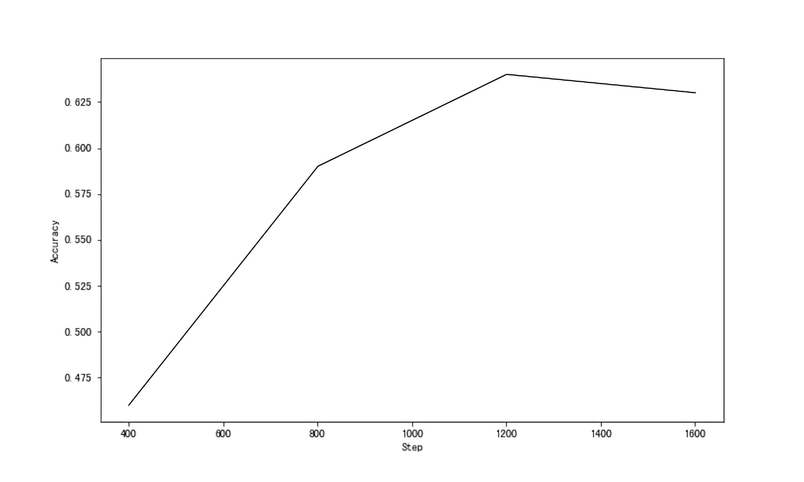

# 第3章 句词分类——句子Token都是类别

&emsp;&emsp;上一章我们介绍了相似匹配相关的基础，以及使用相似匹配技术能够实现的任务和应用。相似匹配以Embedding为核心，关注的是如何更好地表示文本。基于Embedding的表示往往是语义层面的，一般使用余弦相似度来衡量。我们也提到了，其实不光文本可以Embedding，其实任意对象都可以Embedding，这一技术广泛应用在深度学习算法各个领域。

&emsp;&emsp;本章我们关注NLP领域最常见的两类任务：句子分类和Token分类，由于中文的字也是词，所以也会叫作句词分类。我们将首先介绍句子分类的基础，包括相关的一些常见任务，以及如何对句子和Token进行分类。接下来就是ChatGPT相关接口的使用，其他厂商提供的类似接口用法也类似。我们会发现通过类似ChatGPT这样的大模型接口其实可以做很多任务，句词分类只是其中一部分。最后，依然是相关的应用，这些应用传统方法也可以解决，但一般都会更加复杂、更加麻烦。相比较而言，基于大模型就简单多了，而且效果也不错。与上一章一样，我们依然会重点关注最终目的和为达到目的使用的方法与流程。

## 3.1 句词分类基础

&emsp;&emsp;自然语言理解（natural language understanding，NLU）与自然语言生成（natural language generation，NLG）任务并称为NLP两大主流任务。一般意义上的NLU常指与理解给定句子意思相关的情感分析、意图识别、实体抽取、指代关系等任务，在智能对话中应用比较广泛。具体来说，当用户输入一句话时，机器人一般会针对该句话（也可以把历史记录给附加上）进行全方面分析，包括但不限于以下内容。

- 情感分析。简单来说，一般都会包括正向、中性、负向三种类型，也可以设计更多的类别，或更复杂的细粒度情感分析。我们着重说一下细粒度情感分析，它主要是针对其中某个实体或属性的情感。比如电商购物的商品评论中，用户可能会对商品价格、快递、服务等一个或多个方面表达自己的观点。这时候，我们更加需要的是对不同属性的情感倾向，而不是整个评论的情感倾向。
- 意图识别。一般都是分类模型，大部分时候都是多分类，但是也有可能是层级标签分类或多标签分类。多分类是指给定输入文本，输出为一个标签，但标签的总数有多个，比如对话文本的标签可能包括询问地址、询问时间、询问价格、闲聊等等。层级标签分类是指给定输入文本，输出为层级的标签，也就是从根节点到最终细粒度类别的路径，比如询问地址/询问家庭地址、询问地址/询问公司地址等。多标签分类是指给定输入文本，输出不定数量的标签，也就是说每个文本可能有多个标签，标签之间是平级关系，比如投诉、建议（既有投诉同时提出了建议）。
- 实体和关系抽取。实体抽取就是提取出给定文本中的实体。实体一般指具有特定意义的实词，如人名、地名、作品、品牌等等，大部分时候都是业务直接相关或需要重点关注的词。关系抽取是指实体和实体之间的关系判断。实体之间往往有一定的关系，比如“中国四大名著之首《红楼梦》由清代作家曹雪芹编写。”其中“曹雪芹”就是人名，“红楼梦”是作品名，其中的关系就是“编写”，一般会和实体作为三元组来表示：（曹雪芹，编写，红楼梦）。

&emsp;&emsp;一般经过上面这些分析后，机器人就可以对用户的输入有一个比较清晰的理解，便于接下来据此做出响应。另外值得一提的是，上面的过程并不一定只用在对话中，只要涉及到用户输入查询（Query），需要系统给出响应的场景，都需要这个NLU的过程，一般也叫Query解析。

&emsp;&emsp;上面的几个分析，如果从算法的角度看，分为下面两种。

- 句子级别的分类，如情感分析、意图识别、关系抽取等。也就是给一个句子（也可能有其他一些信息），给出一个或多个标签。
- Token级别的分类，如实体抽取、阅读理解（就是给一段文本和一个问题，然后在文本中找出问题的答案）。也就是给一个句子，给出对应实体或答案的索引位置。

&emsp;&emsp;Token级别的分类不太好理解，我们举个例子，比如刚刚提到的这句话：“中国四大名著之首红楼梦由清代作家曹雪芹编写。”它在标注的时候是这样的。

```text
中 O
国 O
四 O
大 O
名 O
著 O
之 O
首 O
《 O
红 B-WORK
楼 I-WORK
梦 I-WORK
《 O
由 O
清 O
代 O
作 O
家 O
曹 B-PERSON
雪 I-PERSON
芹 I-PERSON
编 O
写 O
。 O
```

&emsp;&emsp;在这个例子中，每个Token就是每个字，每个Token会对应一个标签（当然也可以多个），标签中的`B`表示开始（Begin），`I`表示内部（Internal），`O`表示其他（Other），也就是非实体。“红楼梦”是作品，我们标注为`WORK`，”曹雪芹“是人名，我们标注为`PERSON`。当然，也可以根据实际需要决定是否标注”中国“、”清代“等实体。模型要做的就是学习这种对应关系，当给出新的文本时，能够给出每个Token的标签预测。

&emsp;&emsp;可以看到，其实它们本质上都是分类任务，只是分类的位置或标准不一样。当然了，实际应用中会有各种不同的变化和设计，但整个思路是差不多的，我们并不需要掌握其中的细节，只需知道输入、输出和基本的逻辑就好了。

### 3.1.1 如何对一句话进行分类

&emsp;&emsp;接下来，我们简单介绍这些分类具体是怎么做的，先说句子级别的分类。回忆上一章的Embedding，那可以算是整个深度学习NLP的基石，我们这部分的内容也会用到Embedding，具体过程如下。

- 将给定句子或文本表征成Embedding。
- 将Embedding传入一个神经网络，计算得到不同标签的概率分布。
- 将上一步得到的标签概率分布与真实的标签做比较，并将误差回传，修改神经网络的参数，即训练。
- 得到训练好的神经网络，即模型。

&emsp;&emsp;举个例子，简单起见，我们假设Embedding维度为32维（上一章OpenAI返回的维度比较大），如下所示。


```python
import numpy as np
np.random.seed(0)

emd = np.random.normal(0, 1, (1, 32))
```

&emsp;&emsp;这里，我们随机生成一个均值为0、标准差为1的1×32维的高斯分布作为Embedding数组，维度1表示我们词表里只有一个Token。如果我们是三分类，那么最简单的模型参数`W`就是32×3的大小，模型的预测过程如下所示。


```python
W = np.random.random((32, 3))
z = emd @ W
z == array([[6.93930177, 5.96232449, 3.96168115]])
z.shape == (1, 3)
```

&emsp;&emsp;这里得到的`z`一般被称为logits，如果我们想要概率分布，则需要对其归一化，也就是将logits变成0-1之间的概率值，并且每一行加起来为1（即100%），如下所示。


```python
def norm(z):
    exp = np.exp(z)
    return exp / np.sum(exp)

y = norm(z)
y == array([[0.70059356, 0.26373654, 0.0356699 ]])
np.sum(y) == 0.9999999999999999
```

&emsp;&emsp;根据给出的`y`，我们就知道预测的标签是第0个位置的标签，因为那个位置的概率最大（70.06%）。如果真实的标签是第1个位置的标签，那第1个位置的标签实际就是1（100%），但它目前预测的概率只有26.37%，这个误差就会回传来调整`W`参数。下次计算时，第0个位置的概率就会变小，第1个位置的概率则会变大。这样通过标注的数据样本不断循环迭代的过程其实就是模型训练的过程，也就是通过标注数据，让模型`W`尽可能正确预测出标签。

&emsp;&emsp;实际中，`W`往往比较复杂，可以包含任意的数组，只要最后输出变成1×3的大小即可，比如我们写个稍微复杂点的。


```python
w1 = np.random.random((32, 100))
w2 = np.random.random((100, 32))
w3 = np.random.random((32, 3))

y = norm(norm(norm(emd @ w1) @ w2) @ w3)
y == array([[0.32940147, 0.34281657, 0.32778196]])
```

&emsp;&emsp;可以看到，现在有三个数组的模型参数，形式上虽然复杂了些，但结果是一样的，依然是一个1×3大小的数组。接下来的过程就和前面一样了。

&emsp;&emsp;稍微复杂点的是多标签分类和层级标签分类，这俩因为输出的都是多个标签，处理起来要麻烦一些，不过它们的处理方式是类似的。我们以多标签分类来说明，假设有10个标签，给定输入文本，可能是其中任意多个标签。这就意味着我们需要将10个标签的概率分布都表示出来。可以针对每个标签做个二分类，也就是说输出的大小是10×2的，每一行表示”是否是该标签“的概率分布，示例如下。


```python
def norm(z):
    axis = -1
    exp = np.exp(z)
    return exp / np.expand_dims(np.sum(exp, axis=axis), axis)

np.random.seed(42)

emd = np.random.normal(0, 1, (1, 32))
W = np.random.random((10, 32, 2))
y = norm(emd @ W)
y.shape == (10, 1, 2)

y == array([
    [[0.66293305, 0.33706695]],
    [[0.76852603, 0.23147397]],
    [[0.59404023, 0.40595977]],
    [[0.04682992, 0.95317008]],
    [[0.84782999, 0.15217001]],
    [[0.01194495, 0.98805505]],
    [[0.96779413, 0.03220587]],
    [[0.04782398, 0.95217602]],
    [[0.41894957, 0.58105043]],
    [[0.43668264, 0.56331736]]
])
```

&emsp;&emsp;这里的输出每一行有两个值，分别表示”不是该标签“和”是该标签“的概率。比如第一行，预测结果显示，不是该标签的概率为66.29%，是该标签的概率为33.71%。需要注意的是归一化时，我们要指定维度求和，否则就变成所有的概率值加起来为1了，这就不对了（应该是每一行的概率和为1）。

&emsp;&emsp;上面是句子级别分类（sequence classification）的逻辑，我们必须再次说明，实际场景会比这里的例子要复杂得多，但基本思路是这样的。我们在大模型时代也并不需要自己去构建模型了，本章后面会讲到如何使用大模型接口进行各类任务。

### 3.1.2 从句子分类到Token分类

&emsp;&emsp;接下来看Token级别的分类，有了刚刚的基础，这个就比较容易理解了。它最大的特点是：Embedding是针对每个Token的。也就是说，如果给定文本长度为10，假定维度依然是32，那Embedding的大小就为：(1, 10, 32)。比刚刚句子分类用到的（1, 32）多了个10。换句话说，这个文本的每一个Token都是一个32维的向量。

&emsp;&emsp;下面我们假设标签共有5个，和上面的例子对应，分别为：`B-PERSON`、`I-PERSON`、`B-WORK`、`I-WORK`和`O`。基本过程如下。


```python
emd = np.random.normal(0, 1, (1, 10, 32))

W = np.random.random((32, 5))
z = emd @ W
y = norm(z)
y.shape == (1, 10, 5)

y == array([[
    [0.23850186, 0.04651826, 0.12495322, 0.28764271, 0.30238396],
    [0.06401011, 0.3422055 , 0.54911626, 0.01179874, 0.03286939],
    [0.18309536, 0.62132479, 0.09037235, 0.06016401, 0.04504349],
    [0.01570559, 0.0271437 , 0.20159052, 0.12386611, 0.63169408],
    [0.1308541 , 0.06810165, 0.61293236, 0.00692553, 0.18118637],
    [0.08011671, 0.04648297, 0.00200392, 0.02913598, 0.84226041],
    [0.05143706, 0.09635837, 0.00115594, 0.83118412, 0.01986451],
    [0.03721064, 0.14529403, 0.03049475, 0.76177941, 0.02522117],
    [0.24154874, 0.28648044, 0.11024747, 0.35380566, 0.0079177 ],
    [0.10965428, 0.00432547, 0.08823724, 0.00407713, 0.79370588]
]])
```

&emsp;&emsp;注意看，每一行表示一个Token是某个标签的概率分布（每一行加起来为1），比如第一行。


```python
sum([0.23850186, 0.04651826, 0.12495322, 0.28764271, 0.30238396]) == 1.00000001
```

&emsp;&emsp;具体的意思是，第一个Token是第0个位置标签（假设标签按上面给出的顺序，那就是`B-PERSON`）的概率是23.85%，其他类似。根据这里预测的结果，第一个Token的标签是`O`，那真实的标签和这个预测的标签之间就可能有误差，通过误差就可以更新参数，从而使得之后预测时能预测到正确的标签（也就是正确位置的概率最大）。不难看出，这个逻辑和前面的句子分类是类似的，其实就是对每一个Token做了个多分类。

&emsp;&emsp;关于NLU常见问题的基本原理我们就介绍到这里，读者如果对更多细节感兴趣，可以阅读NLP算法相关的书籍，从一个可直接上手的小项目开始一步一步构建自己的知识体系。

## 3.2 ChatGPT接口使用

### 3.2.1 基础版GPT续写

&emsp;&emsp;这一小节我们介绍OpenAI的`Completion`接口，利用大模型的In-Context能力进行零样本或少样本的推理。这里有几个重要概念第一章有过介绍，这里简要回顾一下。

- In-Context：简单来说就是一种上下文能力，也就是模型只要根据输入的文本就可以自动给出对应的结果。这种能力是大模型在学习了非常多的文本后获得的，可以看做是一种内在的理解能力。
- 零样本：直接给模型文本，让它给出我们要的标签或输出。
- 少样本：给模型一些类似的样例（输入+输出），再拼上一个新的没有输出的输入，让模型给出输出。

&emsp;&emsp;接下来，我们就可以用同一个接口，通过构造不同的输入来完成不同的任务。换句话说，通过借助大模型的In-Context能力，我们只需要输入的时候告诉模型我们的任务就行，让我们看看具体的用法。


```python
import openai

OPENAI_API_KEY = os.environ.get("OPENAI_API_KEY")
openai.api_key = OPENAI_API_KEY

def complete(prompt: str) -> str:
    response = openai.Completion.create(
      model="text-davinci-003",
      prompt=prompt,
      temperature=0,
      max_tokens=64,
      top_p=1.0,
      frequency_penalty=0.0,
      presence_penalty=0.0
    )
    ans = response.choices[0].text
    return ans
```

&emsp;&emsp;`Completion`接口不仅能帮助我们完成一段话或一篇文章的续写，而且可以用来做各种各样的任务，比如这章讲到的句子和实体分类任务。相比上一章的`Embedding`接口，它的接口参数要复杂多了，我们对其中比较重要的参数进行说明。

- `model`：指定的模型，`text-davinci-003`就是其中一个模型，我们可以根据自己的需要，参考官方文档进行选择，一般需要综合价格和效果进行权衡。

- `prompt`：提示词，默认为`<|endoftext|>`，它是模型在训练期间看到的文档分隔符，因此如果未指定提示词，模型将像从新文档开始一样。简单来说，就是给模型的提示语。

- `max_tokens`：生成的最大Token数，默认为16。注意这里的Token数不一定是字数。提示词+生成的文本，所有的Token长度不能超过模型的上下文长度。不同模型可支持的最大长度不同，可参考相应文档。

- `temperature`：温度，默认为1。采样温度，介于0和2之间。较高的值（如0.8）将使输出更加随机，而较低的值（如0.2）将使其更加集中和确定。通常建议调整这个参数或下面的`top_p`，但不建议同时更改两者。

- `top_p`：下一个Token在累计概率为`top_p`的Token中采样。默认为1，表示所有Token在采样范围内，0.8则意味着只选择前80%概率的Token进行下一次采样。

- `stop`：停止的Token或序列，默认为`null`，最多4个，如果遇到该Token或序列就停止继续生成。注意生成的结果中不包含`stop`。

- `presence_penalty`：存在惩罚，默认为0，介于-2.0和2.0之间的数字。正值会根据新Token到目前为止是否出现在文本中来惩罚它们，从而增加模型讨论新主题的可能性。太高可能会降低样本质量。

- `frequency_penalty`：频次惩罚，默认为0，介于-2.0和2.0之间的数字。正值会根据新Token到目前为止在文本中的现有频率来惩罚新Token，降低模型重复生成相同内容的可能性。太高可能会降低样本质量。

&emsp;&emsp;在大部分情况下，我们只需考虑上面这几个参数即可，甚至只需要前两个参数，其他的用默认也行。不过熟悉上面的参数将帮助我们更好地使用接口。另外值得说明的是，虽然这里用的是OpenAI的接口，但其他厂商类似接口的参数也差不太多。熟悉这里的参数，到时候切换起来也能更得心应手。

&emsp;&emsp;下面我们先看几个句子分类的例子，我们将分别展示怎么使用零样本和少样本。零样本的例子如下所示。


```python
# 零样本，来自openai官方示例
prompt="""The following is a list of companies and the categories they fall into:

Apple, Facebook, Fedex

Apple
Category:
"""

ans = complete(prompt)
ans == """
Technology 

Facebook
Category:
Social Media 

Fedex
Category:
Logistics and Delivery
"""
```

可以看到，我们只是列出了公司名称，和对应的格式，模型可以返回每个公司所属的类别。下面是少样本的例子。

```python
# 少样本
prompt = """今天真开心。-->正向
心情不太好。-->负向
我们是快乐的年轻人。-->
"""
```


```python
ans = complete(prompt)
ans == """
正向
"""
```

这个例子中，我们先给了两个样例，然后给出一个新的句子，让模型输出其类别。可以看到，模型成功输出”正向“。


&emsp;&emsp;再看看Token分类（实体提取）的例子，依然是先看零样本例子，如下所示。


```python
# 零样本，来自openai官方示例
prompt = """
From the text below, extract the following entities in the following format:
Companies: <comma-separated list of companies mentioned>
People & titles: <comma-separated list of people mentioned (with their titles or roles appended in parentheses)>

Text:
In March 1981, United States v. AT&T came to trial under Assistant Attorney General William Baxter. AT&T chairman Charles L. Brown thought the company would be gutted. He realized that AT&T would lose and, in December 1981, resumed negotiations with the Justice Department. Reaching an agreement less than a month later, Brown agreed to divestiture—the best and only realistic alternative. AT&T's decision allowed it to retain its research and manufacturing arms. The decree, titled the Modification of Final Judgment, was an adjustment of the Consent Decree of 14 January 1956. Judge Harold H. Greene was given the authority over the modified decree....

In 1982, the U.S. government announced that AT&T would cease to exist as a monopolistic entity. On 1 January 1984, it was split into seven smaller regional companies, Bell South, Bell Atlantic, NYNEX, American Information Technologies, Southwestern Bell, US West, and Pacific Telesis, to handle regional phone services in the U.S. AT&T retains control of its long distance services, but was no longer protected from competition.
"""

ans = complete(prompt)
ans == """
Companies: AT&T, Bell South, Bell Atlantic, NYNEX, American Information Technologies, Southwestern Bell, US West, Pacific Telesis
People & titles: William Baxter (Assistant Attorney General), Charles L. Brown (AT&T chairman), Harold H. Greene (Judge)
"""
```

&emsp;&emsp;在官方这个例子中，要求模型从给定的文本中提取实体，并按要求的格式输出。对”公司“实体，输出用逗号分隔的公司列表；对”人物和头衔“实体，输出逗号分隔的人物列表（括号中是他们的头衔或角色）。可以看到，模型很好地完成了任务。下面是少样本的例子，我们把实体设置的稍微特殊一些，不使用常见的人名、公司、地址等，我们用音乐方面的一个关于和弦的小乐理知识。


```python
# 少样本
prompt = """
根据下面的格式抽取给定Text中的实体:
和弦: <实体用逗号分割>

Text:
增三和弦是大三度+大三度的增五度音，减三和弦是小三度+小三度的减五度音。
和弦：增三和弦,减三和弦

Text:
三和弦是由3个按照三度音程关系排列起来的一组音。大三和弦是大三度+小三度的纯五度音，小三和弦是小三度+大三度的纯五度音。
"""
```


```python
ans = complete(prompt)
ans == "和弦：大三和弦,小三和弦"
```


&emsp;&emsp;结果看起来很不错，读者可以尝试如果不给这个例子，它会输出什么。另外，也可以尝试给一些其他例子看看效果如何。值得注意的是，随着OpenAI模型的不断升级，这一接口将逐渐废弃。

### 3.2.2 进阶版ChatGPT指令

&emsp;&emsp;这一小节我们介绍ChatGPT接口，接口名是`ChatCompletions`，可以理解为对话，同时它也几乎可以做任意的NLP任务。参数和`Completion`类似，我们依然介绍一下主要参数。

- `model`：指定的模型，`gpt-3.5-turbo`就是ChatGPT，读者可以根据实际情况参考官方文档选择合适的模型。

- `messages`：会话消息，支持多轮，多轮就是多条。每一条消息为一个字典，包含`role`和`content`两个字段，表示角色和消息内容。如：`[{"role": "user", "content": "Hello!"}]`

- `temperature`：和`Completion`接口含义一样。

- `top_p`：和`Completion`接口含义一样。

- `stop`：和`Completion`接口含义一样。

- `max_tokens`：默认无上限，其他和`Completion`接口含义一样，也受限于模型能支持的最大上下文长度。

- `presence_penalty`：和`Completion`接口含义一样。

- `frequency_penalty`：和`Completion`接口含义一样。

&emsp;&emsp;更多可以参考官方文档，值得再次一提的是，接口支持多轮，而且多轮非常简单，只需要把历史会话加进去就可以了。

&emsp;&emsp;接下来，我们采用ChatGPT方式来做上一小节做过的任务。与前面类似，首先写一个通用的方法，如下所示。


```python
import openai

OPENAI_API_KEY = os.environ.get("OPENAI_API_KEY")
openai.api_key = OPENAI_API_KEY

def ask(content: str) -> str:
    response = openai.ChatCompletion.create(
        model="gpt-3.5-turbo", 
        messages=[{"role": "user", "content": content}]
    )

    ans = response.get("choices")[0].get("message").get("content")
    return ans
```

&emsp;&emsp;我们依次尝试上面的例子，先来看第一个公司分类的例子，如下所示。


```python
prompt="""The following is a list of companies and the categories they fall into:

Apple, Facebook, Fedex

Apple
Category:
"""

ans = ask(prompt)
ans == """
Technology/Electronics

Facebook 
Category:
Technology/Social Media

Fedex
Category:
Logistics/Shipping
"""
```


&emsp;&emsp;可以看到，我们在保持输入和上一小节一样时，最终得到的效果也是一样的。不过，在ChatGPT这里我们的提示词还可以更加灵活、自然一些，如下所示。


```python
prompt="""please output the category of the following companies:
Apple, Facebook, Fedex

The output format should be:
<company>
Category:
<category>
"""

ans = ask(prompt)
ans == """
Apple
Category:
Technology

Facebook
Category:
Technology/Social Media

Fedex
Category:
Delivery/Logistics
"""
```

&emsp;&emsp;不错，依然很好地完成了任务。可以看到，`ChatCompletion`接口比前面的`Completion`接口更加”聪明“一些，交互更加自然。看起来有点像它理解了我们给出的指令，然后完成了任务，而不仅仅是续写。不过，值得说明的是，`Completion`接口其实也能支持一定的指令，它是`ChatCompletion`的早期版本，相关技术是一脉相承的。

&emsp;&emsp;由于提示词可以非常灵活，这就导致了不同的写法可能会得到不一样的效果。于是，很快就催生了一个新的技术方向：提示词工程，我们这里给出一些常见的关于提示词的写法建议。

- 清晰，切忌复杂或歧义，如果有术语，应定义清楚。
- 具体，描述语言应尽量具体，不要抽象或模棱两可。
- 聚焦，问题避免太泛或开放。
- 简洁，避免不必要的描述。
- 相关，主要指主题相关，而且是在整个对话期间。

&emsp;&emsp;新手要特别注意以下容易忽略的地方。

- 没有说明具体的输出目标。特殊场景除外（比如就是漫无目的闲聊）。
- 在一次对话中混合多个主题。
- 让语言模型做数学题。语言模型不太擅长处理数学问题。
- 没有给出想要什么的示例样本。有时候你需要给出一些示例，它才能更加明白你的意图。比如上一小节我们构造的那个关于和弦的实体提取的例子。或者一些更加不通用的例子，更加应该给出几个示例。
- 反向提示。也就是一些反面例子，就是不要让它不做什么。模型对这类任务不太擅长。
- 要求他一次只做一件事。新手很容易走向另一个极端——把一个任务拆的特别碎，一次只问模型一小步。这时候建议的做法是将步骤捆绑在一起一次说清。

&emsp;&emsp;我们继续，来试一下情感分类的例子，如下所示。


```python
prompt = """请给出下面句子的情感倾向，情感倾向包括三种：正向、中性、负向。
句子：我们是快乐的年轻人。
"""

ans = ask(prompt)
ans == "情感倾向：正向"
```

没有问题，结果与预期一致。对于这种比较通用的任务，一般情况下它都可以完成的很好。


&emsp;&emsp;再来做一下实体的例子。


```python
prompt = """
请抽取给定Text中的实体，实体包括Company和People&Title，对于People，请同时给出它们的Title或role，跟在实体后面，用括号括起。

Text:
In March 1981, United States v. AT&T came to trial under Assistant Attorney General William Baxter. AT&T chairman Charles L. Brown thought the company would be gutted. He realized that AT&T would lose and, in December 1981, resumed negotiations with the Justice Department. Reaching an agreement less than a month later, Brown agreed to divestiture—the best and only realistic alternative. AT&T's decision allowed it to retain its research and manufacturing arms. The decree, titled the Modification of Final Judgment, was an adjustment of the Consent Decree of 14 January 1956. Judge Harold H. Greene was given the authority over the modified decree....

In 1982, the U.S. government announced that AT&T would cease to exist as a monopolistic entity. On 1 January 1984, it was split into seven smaller regional companies, Bell South, Bell Atlantic, NYNEX, American Information Technologies, Southwestern Bell, US West, and Pacific Telesis, to handle regional phone services in the U.S. AT&T retains control of its long distance services, but was no longer protected from competition.
"""

ans = ask(prompt)
ans == """
实体抽取结果：
- Company: AT&T, Bell South, Bell Atlantic, NYNEX, American Information Technologies, Southwestern Bell, US West, Pacific Telesis
- People&Title: William Baxter (Assistant Attorney General), Charles L. Brown (AT&T chairman), Judge Harold H. Greene.
"""
```


&emsp;&emsp;看起来还行，而且值得注意的是，我们刚刚使用中英文混合的输入。最后，我们试一下上一小节的另一个实体提取的例子。


```python
prompt = """
根据下面的格式抽取给定Text中的和弦实体，实体必须包括“和弦”两个字。


Desired format:
和弦：<用逗号隔开>

Text:
三和弦是由3个按照三度音程关系排列起来的一组音。大三和弦是大三度+小三度的纯五度音，小三和弦是小三度+大三度的纯五度音。
"""

ans = ask(prompt)
ans == "和弦：大三和弦, 小三和弦"
```


&emsp;&emsp;这里，我们也用了中英文混合，结果完全没问题。读者不妨多多尝试不同的提示词，总的来说，它并没有标准答案，更多的是一种实践经验。

## 3.3 相关任务与应用

### 3.3.1 文档问答：给定文档问问题

&emsp;&emsp;文档问答和上一章的QA有点类似，不过要稍微复杂一点。它会先用QA的方法召回一个相关的文档，然后让模型在这个文档中找出问题的答案。一般的流程还是先召回相关文档，然后做阅读理解任务。阅读理解和实体提取任务有些类似，但它预测的不是具体某个标签，而是答案在原始文档中的位置索引，即开始和结束的位置。

&emsp;&emsp;举个例子，假设我们的问题是：“北京奥运会举办于哪一年？”召回的文档可能是含有北京奥运会举办的新闻，比如在下面这个文档。其中，“2008年”这个答案在文档中的索引就是标注数据时要标注的内容。

```text
第29届夏季奥林匹克运动会（Beijing 2008; Games of the XXIX Olympiad），又称2008年北京奥运会，2008年8月8日晚上8时整在中国首都北京开幕。8月24日闭幕。
```

&emsp;&emsp;当然，一个文档里可能有不止一个问题，比如上面的文档，还可以问：“北京奥运会什么时候开幕？”，“北京奥运会什么时候闭幕”，“北京奥运会是第几届奥运会”等问题。

&emsp;&emsp;根据之前的NLP方法，这个任务实际做起来方案会比较多，也有一定的复杂度，不过总体来说还是语义匹配和Token分类任务。现在我们有了大语言模型，问题就变得简单了。依然是两步，如下所示。

- 召回相关文档：与上一章的QA类似，这次召回的不是问题，而是文档。其实就是给定问题与一批文档计算相似度，从中选出相似度最高的那个文档。
- 基于给定文档回答问题：将召回来的文档和问题以提示词的方式提交给大语言模型接口（比如上节介绍的`Completion`和`ChatCompletion`），直接让大模型帮忙得出答案。

&emsp;&emsp;第一步我们已经比较熟悉了，对于第二步，我们分别用两种不同的接口各举一例。首先看看`Completion`接口，如下所示。


```python
import openai
import os

OPENAI_API_KEY = os.environ.get("OPENAI_API_KEY")
openai.api_key = OPENAI_API_KEY


def complete(prompt: str) -> str:
    response = openai.Completion.create(
        prompt=prompt,
        temperature=0,
        max_tokens=300,
        top_p=1,
        frequency_penalty=0,
        presence_penalty=0,
        model="text-davinci-003"
    )
    ans = response["choices"][0]["text"].strip(" \n")
    return ans
```

&emsp;&emsp;假设第一步已经完成，我们已经获得了一篇文档。注意，这个文档一般都会比较长，所以提示词也会比较长，如下所示。


```python
# 来自官方示例
prompt = """Answer the question as truthfully as possible using the provided text, and if the answer is not contained within the text below, say "I don't know"

Context:
The men's high jump event at the 2020 Summer Olympics took place between 30 July and 1 August 2021 at the Olympic Stadium. 33 athletes from 24 nations competed; the total possible number depended on how many nations would use universality places to enter athletes in addition to the 32 qualifying through mark or ranking (no universality places were used in 2021). Italian athlete Gianmarco Tamberi along with Qatari athlete Mutaz Essa Barshim emerged as joint winners of the event following a tie between both of them as they cleared 2.37m. Both Tamberi and Barshim agreed to share the gold medal in a rare instance where the athletes of different nations had agreed to share the same medal in the history of Olympics. Barshim in particular was heard to ask a competition official "Can we have two golds?" in response to being offered a 'jump off'. Maksim Nedasekau of Belarus took bronze. The medals were the first ever in the men's high jump for Italy and Belarus, the first gold in the men's high jump for Italy and Qatar, and the third consecutive medal in the men's high jump for Qatar (all by Barshim). Barshim became only the second man to earn three medals in high jump, joining Patrik Sjöberg of Sweden (1984 to 1992).

Q: Who won the 2020 Summer Olympics men's high jump?
A:"""

ans = complete(prompt)
ans == "Gianmarco Tamberi and Mutaz Essa Barshim emerged as joint winners of the event."
```

&emsp;&emsp;上面的`Context`就是我们召回的文档。可以看到，接口很好地给出了答案。另外，需要说明的是，我们在构造提示词时其实还给出了一些限制，主要包括两点：第一，要求根据给定的文本尽量真实地回答问题；第二，如果答案未包含在给定文本中，就回复“我不知道”。这些都是为了尽量保证输出结果的准确性，减少模型胡言乱语的可能性。

&emsp;&emsp;接下来再看`ChatCompletion`接口，我们选择一个中文的例子，如下所示。


```python
prompt = """请根据以下Context回答问题，直接输出答案即可，不用附带任何上下文。

Context:
诺曼人（诺曼人：Nourmands；法语：Normands；拉丁语：Normanni）是在10世纪和11世纪将名字命名为法国诺曼底的人。他们是北欧人的后裔（丹麦人，挪威人和挪威人）的海盗和海盗，他们在首相罗洛（Rollo）的领导下向西弗朗西亚国王查理三世宣誓效忠。经过几代人的同化，并与法兰克和罗马高卢人本地居民融合，他们的后代将逐渐与以西卡罗来纳州为基础的加洛林人文化融合。诺曼人独特的文化和种族身份最初出现于10世纪上半叶，并在随后的几个世纪中持续发展。

问题：
诺曼底在哪个国家/地区？
"""

def ask(content: str) -> str:
    response = openai.ChatCompletion.create(
        model="gpt-3.5-turbo", 
        messages=[{"role": "user", "content": content}]
    )

    ans = response.get("choices")[0].get("message").get("content")
    return ans

ans = ask(prompt)
ans == "法国。"
```


&emsp;&emsp;看起来没什么问题。下面就以`Completion`接口为例把两个步骤串起来。

&emsp;&emsp;我们使用OpenAI提供的数据集：来自维基百科的关于2020年东京奥运会的数据。数据集可以参考OpenAI的`openai-cookbook` GitHub仓库`examples/fine-tuned_qa/`获取。下载后是一个csv文件，和上一章一样，先加载并查看数据集。


```python
import pandas as pd
df = pd.read_csv("./dataset/olympics_sections_text.csv")
df.shape == (3964, 4)
df.head()
```

&emsp;&emsp;数据如表3-1所示，第一列是页面标题，第二列是页面内章节标题，第三列是章节内容，最后一列是Token数。

<p align="center">表3-1 2020东京奥运会数据集样例<p>

<table border="1" class="dataframe">
  <thead>
    <tr style="text-align: right;">
      <th></th>
      <th>title</th>
      <th>heading</th>
      <th>content</th>
      <th>tokens</th>
    </tr>
  </thead>
  <tbody>
    <tr>
      <th>0</th>
      <td>2020 Summer Olympics</td>
      <td>Summary</td>
      <td>The 2020 Summer Olympics (Japanese: 2020年夏季オリン...</td>
      <td>726</td>
    </tr>
    <tr>
      <th>1</th>
      <td>2020 Summer Olympics</td>
      <td>Host city selection</td>
      <td>The International Olympic Committee (IOC) vote...</td>
      <td>126</td>
    </tr>
    <tr>
      <th>2</th>
      <td>2020 Summer Olympics</td>
      <td>Impact of the COVID-19 pandemic</td>
      <td>In January 2020, concerns were raised about th...</td>
      <td>374</td>
    </tr>
    <tr>
      <th>3</th>
      <td>2020 Summer Olympics</td>
      <td>Qualifying event cancellation and postponement</td>
      <td>Concerns about the pandemic began to affect qu...</td>
      <td>298</td>
    </tr>
    <tr>
      <th>4</th>
      <td>2020 Summer Olympics</td>
      <td>Effect on doping tests</td>
      <td>Mandatory doping tests were being severely res...</td>
      <td>163</td>
    </tr>
  </tbody>
</table>
&emsp;&emsp;这里，我们把`content`列作为文档，基本流程如下。

- 第一步：对每个文档计算Embedding。
- 第二步：存储Embedding，同时存储内容及其他需要的信息（如`heading`）。
- 第三步：从存储的地方检索最相关的文档。
- 第四步：基于最相关的文档回答给定问题。

&emsp;&emsp;第一步依然是借助OpenAI的Embedding接口，但是第二步我们这次不用Redis，换一个向量搜索工具：Qdrant。Qdrant相比Redis更简单易用、容易扩展。不过，实际中我们还是要根据实际情况选择工具，工具没有好坏，适合的就是最好的。我们真正要做的是将业务逻辑抽象，做到尽量不依赖任何工具，换工具最多只需要换一个适配器。

&emsp;&emsp;和Redis一样，我们依然使用Docker启动服务。

```shell
docker run -p 6333:6333 -v $(pwd)/qdrant_storage:/qdrant/storage qdrant/qdrant`
```

&emsp;&emsp;同样，也需要安装Python客户端。

```shell
$ pip install qdrant-client
```

&emsp;&emsp;安装好后就可以使用Python和`qdrant`进行交互了。首先是第一步，生成Embedding，使用OpenAI的`get_embedding`接口，或者直接使用原生的`Embedding.create`接口，可以支持批量请求。


```python
from openai.embeddings_utils import get_embedding, cosine_similarity

def get_embedding_direct(inputs: list):
    embed_model = "text-embedding-ada-002"

    res = openai.Embedding.create(
        input=inputs, engine=embed_model
    )
    return res
```

&emsp;&emsp;准备好数据后，批量获取Embedding。


```python
texts = [v.content for v in df.itertuples()]
len(texts) == 3964

import pnlp

emds = []
for idx, batch in enumerate(pnlp.generate_batches_by_size(texts, 200)):
    response = get_embedding_direct(batch)
    for v in response.data:
        emds.append(v.embedding)
    print(f"batch: {idx} done")
len(emds), len(emds[0]) == (3964, 1536)
```

&emsp;&emsp;上面`generate_batches_by_size`方法可以将一个可迭代的对象（此处是列表）拆成批大小为200的多个批次。一次接口调用可以获取200个文档的Embedding表示。

&emsp;&emsp;然后就是第二步，创建索引并入库。在此之前先创建客户端，如下所示。


```python
from qdrant_client import QdrantClient

client = QdrantClient(host="localhost", port=6333)
```

&emsp;&emsp;值得一提的是，qdrant还支持内存和文件库，也就是说，可以直接将Embedding放在内存或硬盘里。


```python
# client = QdrantClient(":memory:")
# 或
# client = QdrantClient(path="path/to/db")
```

&emsp;&emsp;创建索引和Redis类似，不过在qdrant中是`collection`，如下所示。


```python
from qdrant_client.models import Distance, VectorParams

client.recreate_collection(
    collection_name="doc_qa",
    vectors_config=VectorParams(size=1536, distance=Distance.COSINE),
)
```

&emsp;&emsp;如果成功会返回`True`。删除一个`collection`可以用下面的命令。


```python
client.delete_collection("doc_qa")
```

&emsp;&emsp;下面是把向量入库代码。


```python
payload=[
    {"content": v.content, "heading": v.heading, "title": v.title, "tokens": v.tokens} for v in df.itertuples()
]
client.upload_collection(
    collection_name="doc_qa",
    vectors=emds,
    payload=payload
)
```

&emsp;&emsp;接下来就是第三步，检索相关文档。这里会比Redis简单很多，不需要构造复杂的查询语句。


```python
query = "Who won the 2020 Summer Olympics men's high jump?"

query_vector = get_embedding(query, engine="text-embedding-ada-002")
hits = client.search(
    collection_name="doc_qa",
    query_vector=query_vector,
    limit=5
)
```

&emsp;&emsp;&emsp;获取到5个最相关的文档，第一个样例如下所示。


    ScoredPoint(id=236, version=3, score=0.90316474, payload={'content': '<CONTENT>', 'heading': 'Summary', 'title': "Athletics at the 2020 Summer Olympics – Men's high jump", 'tokens': 275}, vector=None)

&emsp;&emsp;由于篇幅关系，我们把`content`给省略了，`payload`就是之前存进去的信息，我们可以在里面存储需要的任何信息。`score`是相似度得分，表示给定的`query`和向量库中存储的文档的相似度。

&emsp;&emsp;接下来将这个过程和提示词的构建合并在一起。


```python
# 参考自官方示例

# 上下文的最大长度
MAX_SECTION_LEN = 500
# 召回多个文档时，文档与文档之间的分隔符
SEPARATOR = "\n* "
separator_len = 3

def construct_prompt(question: str) -> str:
    query_vector = get_embedding(question, engine="text-embedding-ada-002")
    hits = client.search(
        collection_name="doc_qa",
        query_vector=query_vector,
        limit=5
    )
    
    choose = []
    length = 0
    indexes = []
     
    for hit in hits:
        doc = hit.payload
        length += doc["tokens"] + separator_len
        if length > MAX_SECTION_LEN:
            break
            
        choose.append(SEPARATOR + doc["content"].replace("\n", " "))
        indexes.append(doc["title"] + doc["heading"])
            
    # 简单的日志
    print(f"Selected {len(choose)} document sections:")
    print("\n".join(indexes))
    
    header = """Answer the question as truthfully as possible using the provided context, and if the answer is not contained within the text below, say "I don't know."\n\nContext:\n"""
    
    return header + "".join(choose) + "\n\n Q: " + question + "\n A:"
```

&emsp;&emsp;来个例子试验一下。


```python
prompt = construct_prompt("Who won the 2020 Summer Olympics men's high jump?")

print("===\n", prompt)
"""
Selected 2 document sections:
Athletics at the 2020 Summer Olympics – Men's high jumpSummary
Athletics at the 2020 Summer Olympics – Men's long jumpSummary
===
 Answer the question as truthfully as possible using the provided context, and if the answer is not contained within the text below, say "I don't know."

Context:

* <CONTENT 1>
* <CONTENT 2>

 Q: Who won the 2020 Summer Olympics men's high jump?
 A:
"""
```

&emsp;&emsp;结果如上所示（考虑到篇幅关系，部分内容省略）。对于找到的5个相关文档，由于有了长度限制（500），这里只使用了前2个。

&emsp;&emsp;构造好提示词后就是最后一步，基于给定文档回答问题。

```python
def complete(prompt: str) -> str:
    response = openai.Completion.create(
        prompt=prompt,
        temperature=0,
        max_tokens=300,
        top_p=1,
        frequency_penalty=0,
        presence_penalty=0,
        model="text-davinci-003"
    )
    ans = response["choices"][0]["text"].strip(" \n")
    return ans

ans = complete(prompt)
ans == "Gianmarco Tamberi and Mutaz Essa Barshim emerged as joint winners of the event following a tie between both of them as they cleared 2.37m. Both Tamberi and Barshim agreed to share the gold medal."
```

&emsp;&emsp;再试试`ChatCompletion`接口。


```python
def ask(content: str) -> str:
    response = openai.ChatCompletion.create(
        model="gpt-3.5-turbo", 
        messages=[{"role": "user", "content": content}]
    )

    ans = response.get("choices")[0].get("message").get("content")
    return ans

ans = ask(prompt)
ans == "Gianmarco Tamberi and Mutaz Essa Barshim shared the gold medal in the men's high jump event at the 2020 Summer Olympics."
```

&emsp;&emsp;可以看到，两个接口都准确地回答了问题。下面我们再多看几个例子。


```python
query = "In the 2020 Summer Olympics, how many gold medals did the country which won the most medals win?"
prompt = construct_prompt(query)

answer = complete(prompt)
print(f"\nQ: {query}\nA: {answer}")
"""
Selected 2 document sections:
2020 Summer Olympics medal tableSummary
List of 2020 Summer Olympics medal winnersSummary

Q: In the 2020 Summer Olympics, how many gold medals did the country which won the most medals win?
A: The United States won the most medals overall, with 113, and the most gold medals, with 39.
"""

answer = ask(prompt)
print(f"\nQ: {query}\nA: {answer}")
"""
Q: In the 2020 Summer Olympics, how many gold medals did the country which won the most medals win?
A: The country that won the most medals at the 2020 Summer Olympics was the United States, with 113 medals, including 39 gold medals.
"""
```

&emsp;&emsp;上面的问题是：”在2020年夏季奥运会上，获得奖牌最多的国家获得了多少枚金牌？“我们分别用两个接口给出答案，结果差不多，但后者更具体一些。

```python
query = "What is the tallest mountain in the world?"
prompt = construct_prompt(query)

answer = complete(prompt)
print(f"\nQ: {query}\nA: {answer}")
"""
Selected 3 document sections:
Sport climbing at the 2020 Summer Olympics – Men's combinedRoute-setting
Ski mountaineering at the 2020 Winter Youth Olympics – Boys' individualSummary
Ski mountaineering at the 2020 Winter Youth Olympics – Girls' individualSummary

Q: What is the tallest mountain in the world?
A: I don't know.
"""

answer = ask(prompt)
print(f"\nQ: {query}\nA: {answer}")
"""
Q: What is the tallest mountain in the world?
A: I don't know.
"""
```

&emsp;&emsp;上面这个问题是“世界上最高的山是什么？”这个问题依然可以召回3个文档，但其中并不包含答案。两个接口都可以很好地按我们预设的要求回复。

&emsp;&emsp;文档问答是一个非常适合大模型的应用，它充分利用了大模型强大的理解能力。同时由于每个问题都有相关的文档作为基础，又最大限度地降低了模型胡乱发挥的可能性。而且，根据笔者实验情况来看，这样的用法即使在零样本、不微调的情况下效果也不错。读者如果恰好有类似场景，不妨试试本方案。

### 3.3.2 模型微调：满足个性化需要

&emsp;&emsp;前面我们已经介绍了各种分类和实体提取的用法。本节将介绍如何在自己的数据上进行微调，我们以主题分类任务为例。主题分类，简单来说就是给定文本，判断其属于哪一类主题。

&emsp;&emsp;我们使用今日头条中文新闻分类数据集，该数据集共15个类别，分别为：科技、金融、娱乐、世界、汽车、运动、文化、军事、旅游、游戏、教育、农业、房产、社会、股票。


```python
import pnlp
lines = pnlp.read_file_to_list_dict("./dataset/tnews.json")
len(lines) == 10000
```

&emsp;&emsp;先读取数据集，其中一条样例数据如下所示。

```python
lines[59] == {
    "label": "101", 
    "label_desc": "news_culture", 
    "sentence": "上联：银笛吹开云天月，下联怎么对？", 
    "keywords": ""
}
```

&emsp;&emsp;其中，`label`和`label_desc`分别是标签ID和标签描述，`sentence`是句子文本，`keywords`是关键词，有可能为空（如上所示）。我们先看下标签的分布情况。


```python
from collections import Counter

ct = Counter([v["label_desc"] for v in lines])
ct.most_common() == [
    ('news_tech', 1089),
    ('news_finance', 956),
    ('news_entertainment', 910),
    ('news_world', 905),
    ('news_car', 791),
    ('news_sports', 767),
    ('news_culture', 736),
    ('news_military', 716),
    ('news_travel', 693),
    ('news_game', 659),
    ('news_edu', 646),
    ('news_agriculture', 494),
    ('news_house', 378),
    ('news_story', 215),
    ('news_stock', 45)
]
```

&emsp;&emsp;根据统计情况，我们发现`stock`这个类别有点少。实际上，真实场景中，大部分时候各个标签都是不均匀的。如果标签很少的类型是我们要关注的，那就尽量再增加一些数据。否则，可以不做额外处理。

&emsp;&emsp;我们用上面介绍过的接口来完成一下任务，先构建提示词，如下所示。


```python
def get_prompt(text: str) -> str:
    prompt = f"""对给定文本进行分类，类别包括：科技、金融、娱乐、世界、汽车、运动、文化、军事、旅游、游戏、教育、农业、房产、社会、股票。

给定文本：
{text}
类别：
"""
    return prompt

prompt = get_prompt(lines[0]["sentence"])
print(prompt)
"""
对给定文本进行分类，类别包括：科技、金融、娱乐、世界、汽车、运动、文化、军事、旅游、游戏、教育、农业、房产、社会、股票。

给定文本：
上联：银笛吹开云天月，下联怎么对？
类别：
"""
```

&emsp;&emsp;这个提示词就是把`sentence`当做给定文本，然后要求模型输出对应的类别。注意，这些类别应该提供给模型。然后就是调用接口完成任务了。


```python
import openai
import os

OPENAI_API_KEY = os.environ.get("OPENAI_API_KEY")
openai.api_key = OPENAI_API_KEY

def complete(prompt: str) -> str:
    response = openai.Completion.create(
        prompt=prompt,
        temperature=0,
        max_tokens=10,
        top_p=1,
        frequency_penalty=0,
        presence_penalty=0,
        model="text-davinci-003"
    )
    ans = response["choices"][0]["text"].strip(" \n")
    return ans

def ask(content: str) -> str:
    response = openai.ChatCompletion.create(
        model="gpt-3.5-turbo", 
        messages=[{"role": "user", "content": content}],
        temperature=0,
        max_tokens=10,
        top_p=1,
        frequency_penalty=0,
        presence_penalty=0,
    )

    ans = response.get("choices")[0].get("message").get("content")
    return ans

ans = complete(prompt)
ans == "文化"

ans = ask(prompt)
ans == "文化"
```

&emsp;&emsp;可以看到，两个接口均很好地完成了我们给的任务。我们再看一个识别不太理想的例子，数据如下所示。


```python
lines[2] == {
    "label": "104",
    "label_desc": "news_finance",
    "sentence": "出栏一头猪亏损300元，究竟谁能笑到最后！",
    "keywords": "商品猪,养猪,猪价,仔猪,饲料"
}

prompt = get_prompt(lines[2]["sentence"])

complete(prompt) == "社会"
ask(prompt) == "农业"
```

&emsp;&emsp;这个有点分歧，如果我们人工分析这句话，感觉“农业”这个类别可能看起来更合适一些。不过，很遗憾，数据给出的标签是“金融”。这种情况在实际场景中也比较常见，我们一般可以用下面的手段来解决。

- 少样本。可以每次随机从训练数据集里抽几条样本（包括句子和标签）出来作为提示词的一部分。
- 微调。把我们自己的数据集按指定格式准备好，提交给微调接口，让它帮我们微调一个在我们给的数据集上学习过的模型。

&emsp;&emsp;少样本最关键的是如何找到这个“样本”，换句话说，我们拿什么样例给模型当做参考样本。对于类别标签比较多的情况（实际工作场景中，成百上千种标签是很常见的），即使每个标签一个例子，这上下文长度也比较难以接受。这时候少样本方案就有点不太方便了。当然，如果我们非要用也不是不行，还是最常用的策略：先召回几个相似句，然后把相似句的内容和标签作为少样本的例子，让接口来预测给定句子的类别。不过这样做的话，和直接用QA方法做差不多了。

&emsp;&emsp;此时，更好的方法就是在我们的数据集上微调模型，简单来说就是让模型“熟悉”我们独特的数据，进而让其具备在类似数据上正确识别出相应标签的能力。

&emsp;&emsp;接下来，就让我们看看具体怎么做，一般包括三个主要步骤。

- 第一步：准备数据。按接口要求的格式把数据准备好，这里的数据就是我们自己的数据集，至少包含一段文本和一个类别。
- 第二步：微调。使用微调接口将处理好的数据传递过去，由服务器自动完成微调，微调完成后可以得到一个新的模型ID。注意，这个模型ID只属于你自己，不要将它公开给其他人。
- 第三步：使用新模型推理。这个很简单，把原来接口里的`model`参数内容换成刚刚得到的模型ID即可。

&emsp;&emsp;注意，本书只介绍通过接口微调。接下来我们就来微调这个主题多分类模型，为了快速验证结果，我们只取后500条数据作为训练集。


```python
import pandas as pd

train_lines = lines[-500:]
train = pd.DataFrame(train_lines)
train.shape == (500, 4)
train.head(3)  # 只看前3条
```

&emsp;&emsp;数据样例如表3-2所示，各列的含义之前已经解释过了，此处不再赘述。需要说明的是，关键词有点类似标签，它们并不一定会出现在原文中。

<p align="center">表3-2 主题分类微调数据集样例<p>

<table border="1" class="dataframe">
  <thead>
    <tr style="text-align: right;">
      <th></th>
      <th>label</th>
      <th>label_desc</th>
      <th>sentence</th>
      <th>keywords</th>
    </tr>
  </thead>
  <tbody>
    <tr>
      <th>0</th>
      <td>103</td>
      <td>news_sports</td>
      <td>为什么斯凯奇与阿迪达斯脚感很相似，价格却差了近一倍？</td>
      <td>达斯勒,阿迪达斯,FOAM,BOOST,斯凯奇</td>
    </tr>
    <tr>
      <th>1</th>
      <td>100</td>
      <td>news_story</td>
      <td>女儿日渐消瘦，父母发现有怪物，每天吃女儿一遍</td>
      <td>大将军,怪物</td>
    </tr>
    <tr>
      <th>2</th>
      <td>104</td>
      <td>news_finance</td>
      <td>另类逼空确认反弹，剑指3200点以上</td>
      <td>股票,另类逼空,金融,创业板,快速放大</td>
    </tr>
  </tbody>
</table>
&emsp;&emsp;统计一下各个类别的频次情况，如下所示。


```python
train.label_desc.value_counts()
"""
news_finance          48
news_tech             47
news_game             46
news_entertainment    46
news_travel           44
news_sports           42
news_military         40
news_world            38
news_car              36
news_culture          35
news_edu              27
news_agriculture      20
news_house            19
news_story            12
Name: label_desc, dtype: int64
"""
```

&emsp;&emsp;需要说明的是，实际运行时，由于股票数据量太少，我们把这个类别去掉了，但是不影响整个流程。

&emsp;&emsp;先是第一步，准备数据。要保证数据有两列，分别是`prompt`和`completion`。当然不同服务商提供的接口可能不完全一样，我们这里以OpenAI的接口为例。


```python
df_train = train[["sentence", "label_desc"]]
df_train.columns = ["prompt", "completion"]
df_train.head()
```

&emsp;&emsp;构造好的训练数据样例如表3-3所示。

<p align="center">表3-3 主题分类微调训练数据样例<p>

<table border="1" class="dataframe">
  <thead>
    <tr style="text-align: right;">
      <th></th>
      <th>prompt</th>
      <th>completion</th>
    </tr>
  </thead>
  <tbody>
    <tr>
      <th>0</th>
      <td>为什么斯凯奇与阿迪达斯脚感很相似，价格却差了近一倍？</td>
      <td>news_sports</td>
    </tr>
    <tr>
      <th>1</th>
      <td>女儿日渐消瘦，父母发现有怪物，每天吃女儿一遍</td>
      <td>news_story</td>
    </tr>
    <tr>
      <th>2</th>
      <td>另类逼空确认反弹，剑指3200点以上</td>
      <td>news_finance</td>
    </tr>
    <tr>
      <th>3</th>
      <td>老公在聚会上让我向他的上司敬酒，现在老公哭了，我笑了</td>
      <td>news_story</td>
    </tr>
    <tr>
      <th>4</th>
      <td>女孩上初中之后成绩下降，如何才能提升成绩？</td>
      <td>news_edu</td>
    </tr>
  </tbody>
</table>
&emsp;&emsp;将数据保存到本地，并使用OpenAI提供的命令行工具进行格式转换，转为要求的格式。


```python
df_train.to_json("dataset/tnews-finetuning.jsonl", orient="records", lines=True)

!openai tools fine_tunes.prepare_data -f dataset/tnews-finetuning.jsonl -q
```

&emsp;&emsp;转换后的数据样例如下所示。


```python
!head dataset/tnews-finetuning_prepared_train.jsonl

"""
{"prompt":"cf生存特训：火箭弹狂野复仇，为兄弟报仇就要不死不休 ->","completion":" game"}
{"prompt":"哈尔滨 东北抗日联军博物馆 ->","completion":" culture"}
{"prompt":"中国股市中，庄家为何如此猖獗？一文告诉你真相 ->","completion":" finance"}
{"prompt":"天府锦绣又重来 ->","completion":" agriculture"}
{"prompt":"生活，游戏，电影中有哪些词汇稍加修改便可以成为一个非常霸气的名字？ ->","completion":" game"}
{"prompt":"法庭上，生父要争夺孩子抚养权，小男孩的发言让生父当场哑口无言 ->","completion":" entertainment"}
{"prompt":"如何才能选到好的深圳大数据培训机构？ ->","completion":" edu"}
{"prompt":"有哪些娱乐圈里面的明星追星？ ->","completion":" entertainment"}
{"prompt":"东坞原生态野生茶 ->","completion":" culture"}
{"prompt":"亚冠：恒大不胜早有预示，全北失利命中注定 ->","completion":" sports"}
"""
```

&emsp;&emsp;可以看到，转换后最明显的是给我们每一个`prompt`后面加了个` ->`标记，除此之外还有下面一些调整。

- 小写：将所有文本小写，这个主要是英文，中文没有这个说法。
- 去除标签`news_`前缀：注意看`completion`的字段值，前缀都不见了，处理后的结果是一个有意义的单词，会更加合理。
- 在`completion`字段值前面加空格：除了去掉前缀，还额外加了个空格。这也是英文下独有的（英文用空格把单词分开）。
- 切分为训练和验证集：训练集用来微调模型，验证集则用来评估模型性能和进行超参数调优。

&emsp;&emsp;这些调整会有相应的日志输出，读者注意阅读转换时的输出日志。另外，它们也都是常见的、推荐的预处理做法。

&emsp;&emsp;数据准备好后就到了第二步：微调。使用接口微调非常简单，一般都是一行命令完成，或者甚至在页面上用鼠标点一下就可以了。


```python
import openai
import os

OPENAI_API_KEY = os.environ.get("OPENAI_API_KEY")
openai.api_key = OPENAI_API_KEY

!openai api fine_tunes.create \
    -t "./dataset/tnews-finetuning_prepared_train.jsonl" \
    -v "./dataset/tnews-finetuning_prepared_valid.jsonl" \
    --compute_classification_metrics --classification_n_classes 14 \
    -m davinci\
    --no_check_if_files_exist
```

&emsp;&emsp;其中，`-t`和`-v`分别指定训练集和验证集。接下来那行用来计算指标。`-m`则用来指定要微调的模型，可以微调的模型和价格可以在官方文档获取。最后一行是检查文件是否存在，如果之前上传过文件的话，这里可以复用。

&emsp;&emsp;另外，值得一提的是目前只能只能微调`Completion`接口，`ChatCompletion`不支持微调。命令执行后会得到一个任务ID，接下来可以用另一个接口和任务ID来获取任务的实时状态，如下所示。


```python
!openai api fine_tunes.get -i ft-QOkrWkHU0aleR6f5IQw1UpVL
```


&emsp;&emsp;或者用下面的接口恢复数据流。


```python
!openai api fine_tunes.follow -i ft-QOkrWkHU0aleR6f5IQw1UpVL
```

&emsp;&emsp;注意，一个是`follow`，另一个是`get`。读者可以通过`openai api --help`查看更多支持的命令。


&emsp;&emsp;建议读者过段时间通过`get`接口查看一下进度即可，不需要一直调用`follow`接口获取数据流。这里可能要等一段时间，等排队完成后进入训练阶段就很快了。查看进度时，主要看`status`是什么状态。微调结束后，会获取到一个新的模型ID，那就是我们此次调整后的模型。另外，我们也可以通过下面的命令查看本次微调的各项指标。


```python
# -i 就是上面微调的任务ID
!openai api fine_tunes.results -i ft-QOkrWkHU0aleR6f5IQw1UpVL > metric.csv

metric = pd.read_csv('metric.csv')
metric[metric['classification/accuracy'].notnull()].tail(1)
```

&emsp;&emsp;这里主要会输出训练后的损失、精度等。我们将精度绘制成图，如图3-1所示。


```python
step_acc = metric[metric['classification/accuracy'].notnull()]['classification/accuracy']

import matplotlib.pyplot as plt
fig, ax = plt.subplots(nrows=1, ncols=1, figsize=(10 ,6))
ax.plot(step_acc.index, step_acc.values, "k-", lw=1, alpha=1.0)
ax.set_xlabel("Step")
ax.set_ylabel("Accuracy");
```



<p align="center">图3-1 微调精度<p>

&emsp;&emsp;这个精度其实是非常一般的，最高值在1200步（Step）左右，精度（Accuracy）达到64%左右。应该是我们给的语料太少的缘故。实际中，往往数据越多、数据质量越好，相应的效果也会越好。

&emsp;&emsp;第三步：使用新模型推理。我们还是用刚刚的例子演示。


```python
lines[2] == {
    "label": "104",
    "label_desc": "news_finance",
    "sentence": "出栏一头猪亏损300元，究竟谁能笑到最后！",
    "keywords": "商品猪,养猪,猪价,仔猪,饲料"
}

prompt = get_prompt(lines[2]["sentence"])
prompt == """
对给定文本进行分类，类别包括：科技、金融、娱乐、世界、汽车、运动、文化、军事、旅游、游戏、教育、农业、房产、社会、股票。

给定文本：
出栏一头猪亏损300元，究竟谁能笑到最后！
类别：
"""
```

&emsp;&emsp;调用接口的代码稍微调整一下，新增一个`model`参数。


```python
def complete(prompt: str, model: str, max_tokens: int) -> str:
    response = openai.Completion.create(
        prompt=prompt,
        temperature=0,
        max_tokens=max_tokens,
        top_p=1,
        frequency_penalty=0,
        presence_penalty=0,
        model=model
    )
    ans = response["choices"][0]["text"].strip(" \n")
    return ans
```

&emsp;&emsp;调用微调前的模型和本节前面一样，但是调用微调后的模型时，需要注意修改提示词，如下所示。


```python
# 原来微调之前的模型
complete(prompt, "text-davinci-003", 5) == "社会"

# 微调后的
prompt = lines[2]["sentence"] + " ->"
complete(prompt, "davinci:ft-personal-2023-04-04-14-51-29", 1) == "agriculture"
```

&emsp;&emsp;微调后的模型返回了一个英文单词，这是正常的，因为我们微调数据中的`completion`就是英文。我们这里是为了方便演示微调有效，读者在实际使用时务必要统一。不过这个结果依然不是标注的“finance”，应该是这个句子本身和“agriculture”这个类别的训练文本更加接近。对于这类比较特殊的样例，务必要给模型提供一定数量类似的训练样本。

&emsp;&emsp;上面我们介绍了主题分类的微调。实体抽取的微调也是类似的，它推荐的输入格式如下。


```python
{
    "prompt":"<any text, for example news article>\n\n###\n\n", 
    "completion":" <list of entities, separated by a newline> END"
}
```

&emsp;&emsp;示例如下所示。


```python
{
    "prompt":"Portugal will be removed from the UK's green travel list from Tuesday, amid rising coronavirus cases and concern over a \"Nepal mutation of the so-called Indian variant\". It will join the amber list, meaning holidaymakers should not visit and returnees must isolate for 10 days...\n\n###\n\n", 
    "completion":" Portugal\nUK\nNepal mutation\nIndian variant END"
}
```

&emsp;&emsp;相信读者应该很容易理解，不妨对一些专业领域的实体进行微调，对比一下微调前后的效果。

### 3.3.3 智能对话：大语言模型=自主控制的机器人

&emsp;&emsp;智能对话，有时候也叫智能客服、对话机器人、聊天机器人等等。总之就是和用户通过聊天方式进行交互的一种技术。传统的对话机器人一般包括三个大的模块。

- 自然语言理解模块（NLU）：负责对用户输入进行理解。我们在本章一开始已经提到了，主要就是意图分类+实体识别这两种技术。实际中可能还有实体关系抽取、情感识别等组件。
- 对话管理模块（dialogue management，DM）：就是在获得NLU的结果后，如何确定机器人的回复。也就是对话方向的控制。
- 回复生成模块（natural language generation，NLG）：就是生成最终要回复给用户的输出文本。

&emsp;&emsp;对话机器人一般包括三种，不同类型的技术方案侧重有所不同。

- 任务型机器人。主要用来完成特定的任务，比如订机票、订餐等，这一类机器人最关键的是要获取完成任务所需的各种信息（专业术语叫：槽位）。整个对话过程其实可以看做是一个填槽过程，通过与用户不断对话获取到需要的槽位信息。比如订餐这个任务，就餐人数、就餐时间、联系人电话等就是基本信息，机器人就要想办法获取到这些信息。这里NLU就是重头，DM一般使用两种方法：模型控制或流程图控制。前者通过模型自动学习来实现流转，后者则根据意图类型进行流转控制。
- 问答型机器人。主要用来回复用户问题，和上一章介绍的QA有点类似，平时我们常见的客服机器人往往是这种类型。它们更重要的是问题匹配，DM相对弱一些。
- 闲聊型机器人。闲聊机器人一般没什么实际作用。当然，也有一种情感陪伴型机器人，不在我们讨论范围内。

&emsp;&emsp;以上是大致的分类，但真实场景中的对话机器人往往是多种功能的结合体。更加适合从主动发起/被动接受这个角度来划分。

- 主动发起对话的机器人。一般是以外呼的方式进行，营销、催款、通知等都是常见的场景。这种对话机器人一般不闲聊，电话费不允许。它们基本都是带着特定任务或目的走流程，流程走完就挂断结束。与用户的互动更多是以QA的形式完成，因为主动权在机器人手里，所以流程一般都是固定控制的，甚至QA的数量、回答次数也会控制。
- 被动接受对话的机器人。一般是以网页或客户端的形式存在，绝大部分时候都是用户找过来了，比如大部分公司网站或应用首页的“智能客服”就是类似功能。它们以QA为主，辅以闲聊。稍微复杂点的是上面提到的任务型机器人，需要不断收集槽位信息。

&emsp;&emsp;大模型时代，智能对话机器人会有什么新变化吗？接下来，我们探讨一下这方面内容。

&emsp;&emsp;首先，可以肯定的是类似ChatGPT这样的大模型极大的扩展了对话机器人的边界，大模型强大的In-Context能力不仅让使用更加简单（我们只需把历史对话分角色放进去就好了），而且效果也更好。除了闲聊，问答型和任务型机器人它也可以很擅长，交互更加人性化。

&emsp;&emsp;我们具体来展开说说它可以做什么以及怎么做，随便举几个例子。

- 作为问答类产品，比如知识问答、情感咨询、心理咨询等等，完全称得上诸事不决ChatGPT。比如问它编程概念，问它如何追求心仪的女孩子，问它怎么避免焦虑等等。它的大部分回答都能让人眼前一亮。
- 作为智能客服，通过与企业知识库结合胜任客服工作。相比之前的QA类的客服，它回答会更加个性化，效果也更好。
- 作为智能营销机器人。智能客服更加偏向被动、为用户答疑解惑的方向。营销机器人则更加主动一些，它会根据已存储的用户信息，主动向用户推荐相关产品，根据预设的目标向用户发起对话。还可以同时负责维护客户关系。
- 作为游戏中非玩家角色（non-player character，NPC）、陪聊机器人等休闲娱乐类产品。
- 作为教育、培训的导师，可以进行一对一教学，尤其适合语言、编程类学习。

&emsp;&emsp;这些都是它确定可以做的，市面上也有很多相关的应用了。为什么大模型能做这些？归根结底还是其大规模参数所学到的知识和具备的理解力。尤其是强大的理解力，应该是决定性的（只有知识就是Google搜索引擎）。

&emsp;&emsp;当然，并不是什么都要ChatGPT，我们要避免”手里有锤子，到处找钉子“的思维方式。某位哲人说过，一项新技术的出现，短期内总是被高估，长期内总是被低估。ChatGPT引领的大模型是划时代的，但也不意味着什么都要ChatGPT一下。比如，某些分类和实体抽取任务，之前的方法已经能达到非常好的效果，这时候就完全不需要替换。我们知道很多实际任务它并不会随着技术发展有太多变化，比如分类任务，难道出来个新技术，分类任务就不是分类任务了吗。技术的更新会让我们的效率得到提升，也就是说做同样的任务更加简单和高效了，可以做更难的任务了，但不等于任务也会发生变化。所以，一定要理清楚这里面的关键，明白手段和目的的区别。

&emsp;&emsp;不过如果是新开发一个服务，或者不了解这方面的专业知识，那使用大模型接口反而可能是更好的策略。不过，实际上线前还是应该考虑清楚各种细节，比如服务不可用怎么办，并发大概多少，时延要求多少，用户规模大概多少等等。我们技术方案的选型是和公司或自己的需求息息相关的，没有绝对好的方案，只有当下是否适合的方案。

&emsp;&emsp;同时，要尽可能多考虑几步，但也不用太多（过度优化是原罪）。比如日活只有不到几百，上来就写个分布式的设计方案就有点不合适。不过这并不妨碍我们在代码和架构设计时考虑扩展性，比如数据库，我们可能用SQLite，但代码里并不直接和它耦合死，而是使用能同时支持其他数据库、甚至分布式数据库的ORM工具。这样虽然写起来稍微麻烦了一点点，但代码会更加清晰，而且和可能会变化的东西解耦了。这样即便日后规模增加了，数据库可以随便换，代码基本不用更改。

&emsp;&emsp;最后，我们也应该了解ChatGPT的一些局限，除了它本身的局限（后面有专门章节介绍），在工程上至少应该始终关注下面几个话题：响应时间和稳定性、并发和横向可扩展性、可维护性和迭代、成本。只有当这些都能满足我们的期望时，才应该选择该方案。

&emsp;&emsp;下面，我们使用ChatGPT来实现一个简单的任务型对话机器人。设计阶段需要考虑以下一些因素。

- 使用目的。首先，我们需要明确使用目的是什么，如上所言，不同的用途要考虑的因素也不一样。简单（但很实际）起见，我们以一个”订餐机器人“为例。功能就是简单的开场白，然后获取用户联系方式、订餐人数、用餐时间三个信息。
- 如何使用。使用也比较简单，主要利用ChatGPT的多轮对话能力，这里的重点是控制上下文。不过由于任务简单，我们不用对历史记录做召回再进行对话，直接在每一轮时把已经获取的信息告诉它，同时让它继续获取其他信息，直到所有信息获取完毕为止。另外，我们可以限制一下输出Token的数量（控制输出文本的长度）。
- 消息查询、存储。对于用户的消息（以及机器人的回复），实际中往往需要存储起来，用来做每一轮回复的历史消息召回。而且这个日后还可能有其他用途，比如使用对话记录对用户进行画像，或者当做训练数据等等。存储可以直接放到数据库，或传到类似ElasticSearch这样的内部搜索引擎中。
- 消息解析。消息的解析可以实时进行（并不一定要用ChatGPT）或离线进行，本案例我们需要实时在线解析。这个过程我们可以让ChatGPT在生成回复时顺便一起完成。
- 实时干预。实时干预是应该要关注的，或者需要设计这样的模块。一方面是有时候即便做了限制，依然有可能被某些问法问到不太合适的答复；另一方面也不能排除部分恶意用户对机器人进行攻击。因此最好有干预机制的设计。这里，我们设计一个简单策略：检测用户是否提问敏感类问题，如果发现此类问题直接返回预先设定好的文本，不再调用ChatGPT进行对话回复。
- 更新策略。更新策略主要是对企业知识库的更新，这里由于我们使用的是In-Context能力，所以并不需要调整ChatGPT，可能需要调整Embedding接口。此案例暂不涉及。

&emsp;&emsp;综上，我们需要先对用户输入进行敏感性检查，确认没问题后开始对话。同时应存储用户消息，并在每轮对话时将用户历史消息传递给接口。


&emsp;&emsp;先看一下敏感性检查，这个接口比较多，国内很多厂商都有提供，OpenAI提供了一个相关的接口。这个接口本身是和对话无关的，我们以OpenAI的接口为例。


```python
import openai
import os

OPENAI_API_KEY = os.environ.get("OPENAI_API_KEY")
openai.api_key = OPENAI_API_KEY

import requests

def check_risk(inp: str) -> bool:
    safe_api = "https://api.openai.com/v1/moderations"
    resp = requests.post(safe_api, json={"input": inp}, headers={"Authorization": f"Bearer {OPENAI_API_KEY}"})
    data = resp.json()
    return data["results"][0]["flagged"]

check_risk("good") == False
```

&emsp;&emsp;接下来我们考虑如何构造接口的输入，这里有两个事情要做。第一，查询历史对话记录作为上下文，简单起见我们可以只考虑上一轮或把所有记录都给它。由于对话轮次较少，我们采用后者。第二，计算输入的Token数，根据模型能接受最大Token长度和想输出的最大长度，反推上下文的最大长度，并对历史对话进行处理（如截断）。确定好这个策略后，我们来设计数据结构，如下所示。


```python
from dataclasses import dataclass, asdict
from typing import List, Dict
from datetime import datetime
import uuid
import json
import re
from sqlalchemy import insert


@dataclass
class User:
    
    user_id: str
    user_name: str

@dataclass
class ChatSession:
    
    user_id: str
    session_id: str
    cellphone: str
    people_number: int
    meal_time: str
    chat_at: datetime

@dataclass
class ChatRecord:
    
    user_id: str
    session_id: str
    user_input: str
    bot_output: str
    chat_at: datetime
```

&emsp;&emsp;上面除了用户外，我们设计了两个简单的数据结构，一个是聊天信息，一个是聊天记录，前者记录聊天基本信息，后者记录聊天记录。其中，`session_id`主要用来区分每一次对话，当用户点击产品页面的”开始对话“之类的按钮后，就生成一个`session_id`；在下次对话时再生成一个新的。

&emsp;&emsp;接下来，我们处理核心对话逻辑，这一块主要是利用ChatGPT的能力，明确要求，把每一轮对话都喂给它。给出响应。


```python
def ask(msg):
    response = openai.ChatCompletion.create(
        model="gpt-3.5-turbo", 
        temperature=0.2,
        max_tokens=100,
        top_p=1,
        frequency_penalty=0,
        presence_penalty=0,
        messages=msg
    )
    ans = response.get("choices")[0].get("message").get("content")
    return ans
```

&emsp;&emsp;然后就是把整个流程串起来。


```python
class Chatbot:
    
    def __init__(self):
        self.system_inp = """现在你是一个订餐机器人（角色是assistant），你的目的是向用户获取手机号码、用餐人数量和用餐时间三个信息。你可以自由回复用户消息，但牢记你的目的。每一轮你需要输出给用户的回复，以及获取到的信息，信息应该以JSON方式存储，包括三个key：cellphone表示手机号码，people_number表示用餐人数，meal_time表示用餐时间储。

回复格式：
给用户的回复：{回复给用户的话}
获取到的信息：{"cellphone": null, "people_number": null, "meal_time": null}
"""
        self.max_round = 10
        self.slot_labels = ["meal_time", "people_number", "cellphone"]
        self.reg_msg = re.compile(r"\n+")


    def check_over(self, slot_dict: dict):
        for label in self.slot_labels:
            if slot_dict.get(label) is None:
                return False
        return True
    
    def send_msg(self, msg: str):
        print(f"机器人：{msg}")
    
    def chat(self, user_id: str):
        sess_id = uuid.uuid4().hex
        chat_at = datetime.now()
        msg = [
            {"role": "system", "content": self.system_inp},
        ]
        n_round = 0
        
        history = []
        while True:
            if n_round > self.max_round:
                bot_msg = "非常感谢您对我们的支持，再见。"
                self.send_msg(bot_msg)
                break
            
            try:
                bot_inp = ask(msg)
            except Exception as e:
                bot_msg = "机器人出错，稍后将由人工与您联系，谢谢。"
                self.send_msg(bot_msg)
                break
            
            tmp = self.reg_msg.split(bot_inp)
            bot_msg = tmp[0].strip("给用户的回复：")
            self.send_msg(bot_msg)
            if len(tmp) > 1:
                slot_str = tmp[1].strip("获取到的信息：")
                slot = json.loads(slot_str)
                print(f"\tslot: {slot}")
            n_round += 1
            
            if self.check_over(slot):
                break

            user_inp = input()
            
            msg += [
                {"role": "assistant", "content": bot_inp},
                {"role": "user", "content": user_inp},
            ]
            
            record = ChatRecord(user_id, sess_id, bot_inp, user_inp, datetime.now())
            history.append(record)
            
            if check_risk(user_inp):
                break
        
        chat_sess = ChatSession(user_id, sess_id, **slot, chat_at=chat_at)
        self.store(history, chat_sess)
    
    
    def store(self, history: List[ChatRecord], chat: ChatSession):
        with SessionLocal.begin() as sess:
            q = insert(
                chat_record_table
            ).values(
                [asdict(v) for v in history]
            )
            sess.execute(q)
        with SessionLocal.begin() as sess:
            q = insert(
                chat_session_table
            ).values(
                [asdict(chat)]
            )
            sess.execute(q)
```

&emsp;&emsp;启动前，需要把相关的数据库表建好，这里略过。现在我们进行简单的尝试。


```python
import pnlp

nick = "张三"
user = User(pnlp.generate_uuid(nick), nick)
chatbot = Chatbot()
chatbot.chat(user.user_id)
```

互动过程如下所示。

    机器人：请问您的手机号码是多少呢？
    	slot: {'cellphone': None, 'people_number': None, 'meal_time': None}
    用户：我的手机是13788889999
    
    机器人：好的，您的手机号码是13788889999，请问用餐人数是几位呢？
    	slot: {'cellphone': '13788889999', 'people_number': None, 'meal_time': None}
    用户：我们一共五个人
    
    机器人：好的，您们一共五个人，最后，请问您们的用餐时间是什么时候呢？
    	slot: {'cellphone': '13788889999', 'people_number': 5, 'meal_time': None}
    用户：稍等我问一下啊
    
    机器人：好的，没问题，我等您的消息。
    用户：好了，明天下午7点，谢谢
    
    机器人：好的，您们的用餐时间是明天下午7点，我们已经为您记录好了，请问还有其他需要帮助的吗？
    	slot: {'cellphone': '13788889999', 'people_number': 5, 'meal_time': '明天下午7点'}


&emsp;&emsp;查表可以看到刚刚的记录。


```Python
# chat_session_table 表
[(1,
  'dc3be3b3516555d3b0b6a77a1d9c7e82',
  '05a88a8e3db8490eacf14b8bb9800fcc',
  '13788889999',
  5,
  '明天下午7点',
  '2023-04-08 00:00:34.618232')]

# chat_record_table表
[(1,
  'dc3be3b3516555d3b0b6a77a1d9c7e82',
  '05a88a8e3db8490eacf14b8bb9800fcc',
  '给用户的回复：请问您的手机号码是多少呢？\n获取到的信息：{"cellphone": null, "people_number": null, "meal_time": null}',
  '我的手机是13788889999',
  '2023-04-08 00:00:47.498172'),
 (2,
  'dc3be3b3516555d3b0b6a77a1d9c7e82',
  '05a88a8e3db8490eacf14b8bb9800fcc',
  '给用户的回复：好的，您的手机号码是13788889999，请问用餐人数是几位呢？\n获取到的信息：{"cellphone": "13788889999", "people_number": null, "meal_time": null}',
  '我们一共五个人',
  '2023-04-08 00:01:18.694161'),
 (3,
  'dc3be3b3516555d3b0b6a77a1d9c7e82',
  '05a88a8e3db8490eacf14b8bb9800fcc',
  '给用户的回复：好的，您们一共五个人，最后，请问您们的用餐时间是什么时候呢？\n获取到的信息：{"cellphone": "13788889999", "people_number": 5, "meal_time": null}',
  '稍等我问一下啊',
  '2023-04-08 00:01:40.296970'),
 (4,
  'dc3be3b3516555d3b0b6a77a1d9c7e82',
  '05a88a8e3db8490eacf14b8bb9800fcc',
  '好的，没问题，我等您的消息。',
  '好了，明天下午7点，谢谢',
  '2023-04-08 00:02:15.839735')]
```

&emsp;&emsp;上面我们实现了一个非常简陋的任务机器人，虽然没有传统机器人的NLU、DM和NLG三个模块，但已经可以工作了。唯一的不足可能是接口反应有点慢，不过这是另一个问题了。

&emsp;&emsp;为了便于读者更好地构建应用，我们需要对几个地方进行重点强调。

&emsp;&emsp;第一点，当要支持的对话轮次非常多时（比如培训、面试这样的场景），则需要实时将每一轮的对话索引起来，每一轮先召回所有历史对话中相关的$N$轮作为上下文（正如我们在文档问答中那样）。然后让ChatGPT根据这些上下文对用户进行回复。这样理论上我们是可以支持无限轮的。召回的过程其实就是一个回忆的过程，这里可以优化的点或者说想象的空间很大。

&emsp;&emsp;第二点，在传递`message`参数给ChatGPT时，由于有长度限制，有时候上下文中遇到特别长回复那种轮次，可能会导致只能传几轮（甚至一轮就耗光长度了）。根据ChatGPT自己的说法：当历史记录非常长时，我们确实可能只能利用其中的一小部分来生成回答。为了应对这种情况，通常会使用一些技术来选择最相关的历史记录，以便在生成回答时使用。例如，可能会使用一些关键词提取技术，识别出历史记录中最相关的信息，并将其与当前的输入一起使用。还可能会使用一些摘要技术来对历史记录进行压缩和精简，以便在生成回答时只使用最重要的信息。此外，还可以使用一些记忆机制，如注意力机制，以便在历史记录中选择最相关的信息。另外，根据ChatGPT的说法，在生成回复时，它也会使用一些技术来限制输出长度，例如截断输出或者使用一些策略来生成更加简洁的回答。当然，用户也可以使用特定的输入限制或规则来帮助缩短回答。总之，尽可能地在输出长度和回答质量之间平衡。

&emsp;&emsp;第三点，充分考虑安全性，根据实际情况合理设计架构。

&emsp;&emsp;最后，值得一提的是，上面只是利用了ChatGPT的一小部分功能，读者可以结合自己的业务，或者打开脑洞，开发更多有用、有趣的产品和应用。

## 3.4 本章小结

&emsp;&emsp;句子和Token分类是NLP领域最基础和常用的任务，本章我们首先简单介绍了这两种不同的任务，然后介绍了如何使用ChatGPT完成这些任务，最后介绍了几个相关的应用。文档问答基于给定上下文回答问题，相比传统方法，基于大模型做起来非常容易且能获得还不错的效果。模型微调主要用于在垂直领域数据上适配，再好的大模型也有不擅长或学习不充分的地方，微调就是让模型”进一步学习“。大模型背景下各类新型应用层出不穷，之前的应用也可以借力大模型提升效率。我们以一个任务机器人为例为读者展示了如何利用大模型通过几十行代码完成一个简单的应用。希望读者可以打开脑洞，亲自动手实现自己的想法，这也是本书的初衷之一。
