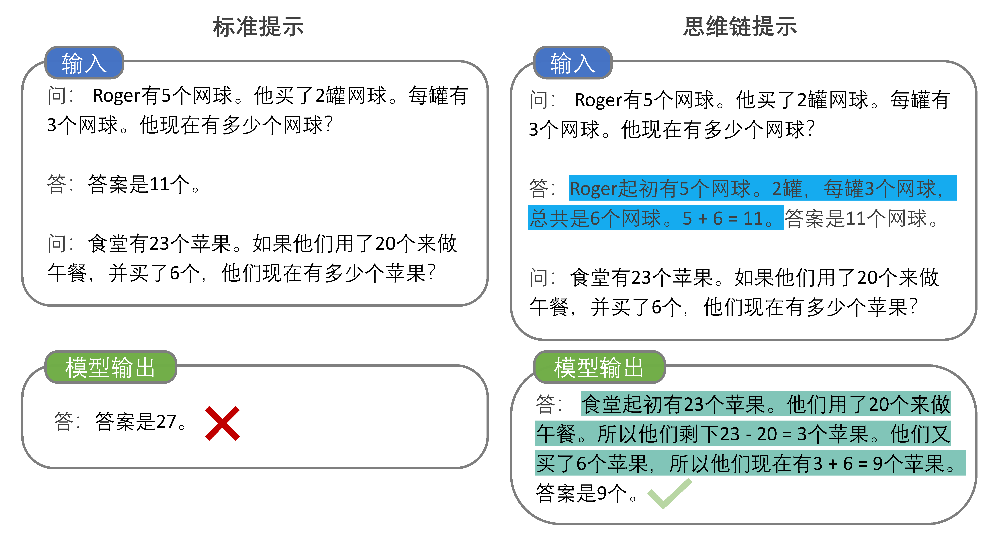
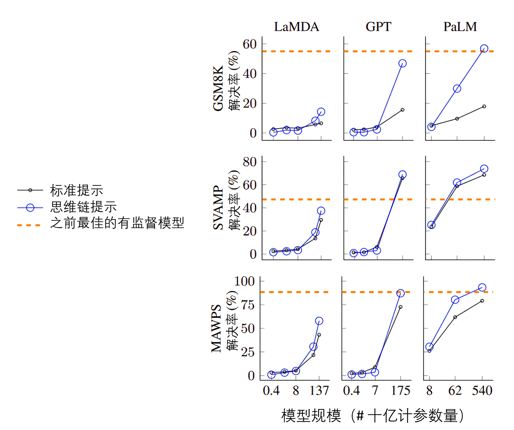
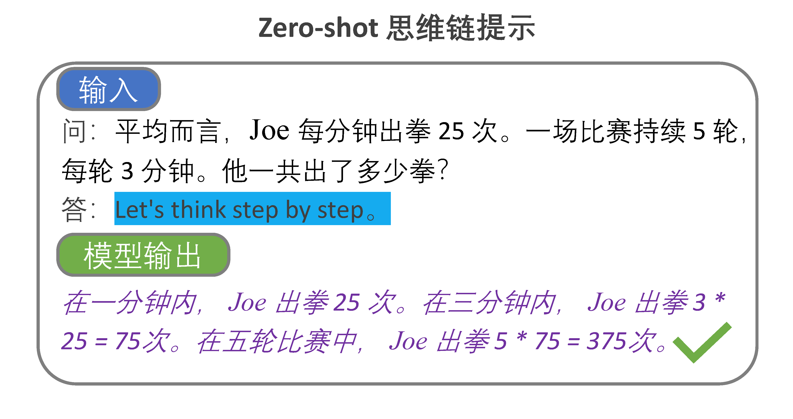
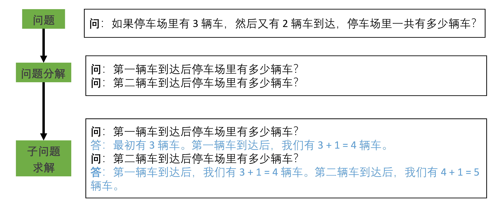
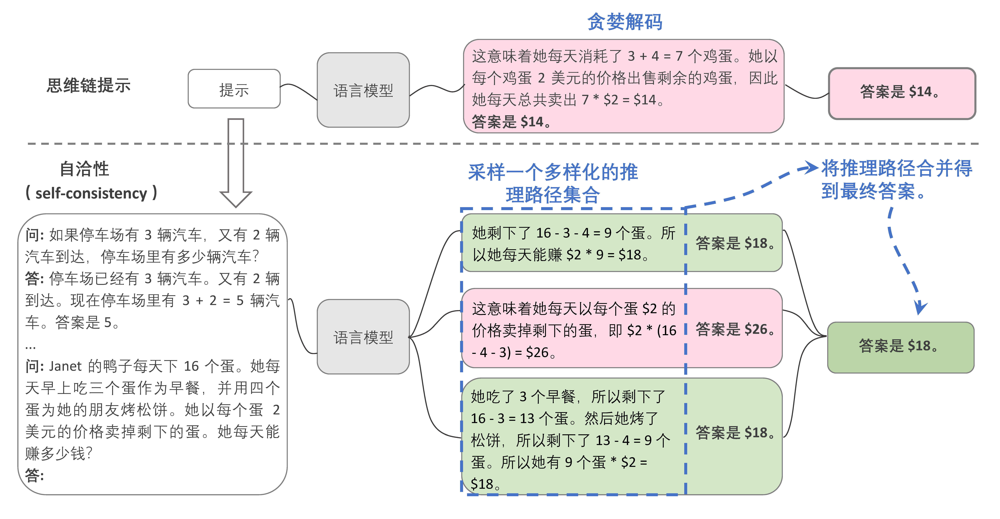
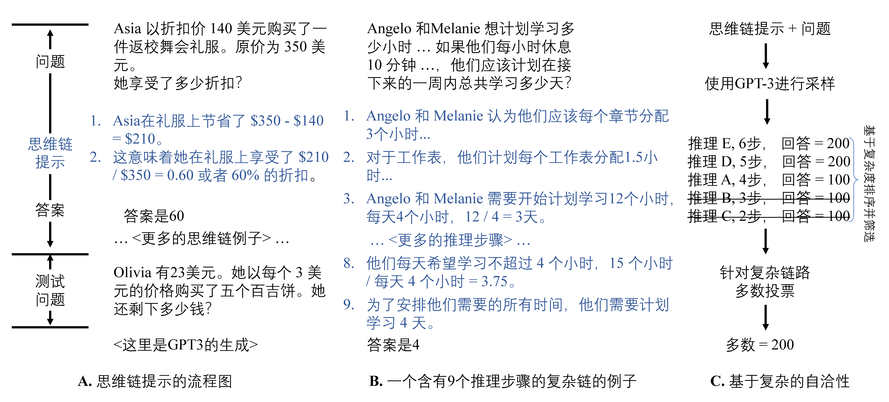
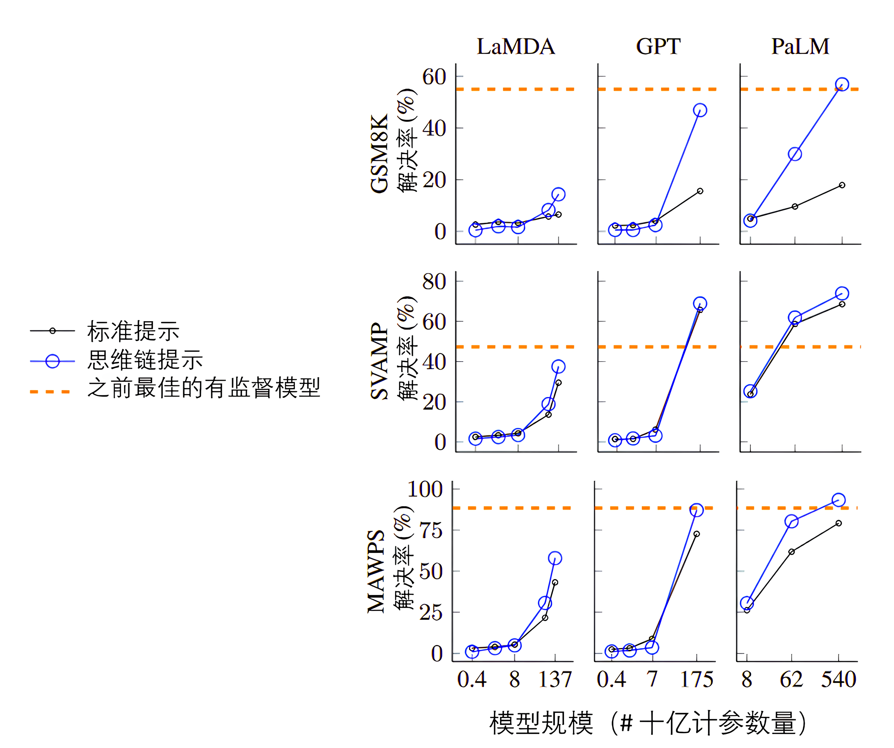

# 第5章 复杂推理——让大模型更加像人一样思考

&emsp;&emsp;在之前的章节中，我们学习了如何使用大型语言模型来处理自然语言理解和文本生成任务。目前的大型语言模型已经能够轻松应对日常任务，但当任务的复杂度超过一定阈值时，这些模型可能无法胜任。本章将在现有任务的基础上，探讨如何让大型模型更好地处理复杂推理任务。复杂推理是一个全新且备受关注的方向，它可以使大型语言模型在各种情况下都能够有效地处理任务，从而可能改变人机交互方式，重塑整个计算机生态。

&emsp;&emsp;思考是人类特有的能力，它是奠定人类繁荣文明基石的关键。而在思考过程中，推理是最为复杂的一种形式，具备一定的规则和逻辑性，以形式上的规范和严谨为特点。只有让大型语言模型具备思考和推理的能力，才能真正释放其潜力。复杂推理作为大型模型所特有的能力，是其与小型模型真正的区别所在。

&emsp;&emsp;本章节主要探讨的是对现有大模型在复杂推理任务中的能力进行发现和应用，而不是关于构建具备强大复杂推理能力的模型的过程。在本章中，我们将探讨和介绍一系列技术和方法，主要研究如何激发和改善大型模型的复杂推理能力，以提升其在复杂推理任务中的表现和能力。

## 5.1 什么是复杂推理？

&emsp;&emsp;复杂推理是指在处理复杂问题时运用逻辑、推断和推理能力，从已知信息中得出新的结论或解决问题的过程。它涉及对多个变量、关系和条件进行考虑和分析，并会使用逻辑、归纳、演绎等思维方式进行推断和推理。复杂推理通常需要综合不同的信息源，进行推理链的构建，以推导出更深层次的关联和推断结果。这种推理过程常见于解决复杂的问题、推断未知信息或处理抽象概念的情况下，需要高级思维能力和推理技巧。以下是一些常见的思维技巧和方法。

1. 逻辑推理：运用逻辑规则和关系来推断和推理信息。包括演绎推理（从一般原理推导出特定结论）和归纳推理（从特定案例推导出一般原理）。

2. 分析和综合：将问题分解成更小的部分，对每个部分进行分析，并最终综合各个部分的结果以得出整体结论。

3. 比较和对比：将不同的选项、观点或解决方案进行比较和对比，以确定它们之间的相似性、差异性和优劣势。

4. 推断和假设：基于已知信息进行推断，并根据可能性进行假设，以推导出缺失或未知的信息。

5. 反向推理：从所需的结论或目标出发，逆向思考并推导出达到该结论或目标所需要的前提条件或步骤。

6. 模式识别和归纳：寻找模式、趋势或共性，并基于这些发现进行归纳推理，以推断未知情况或扩展到新的情境。

7. 问题解决策略：运用各种问题解决技巧，如分析图表、制定假设、进行试错等，以解决复杂问题。

8. 反思和调整：对推理过程进行反思和调整，检查和修正可能存在的偏见、错误或不完整的推理。

&emsp;&emsp;以前，我们通常认为复杂推理是人类的专属能力，但是随着现代人工智能和机器学习技术的发展，我们发现人工智能在复杂推理任务中展现出了巨大的潜力。特别是大型语言模型诞生和与之伴随的涌现能力被发现后，我们发现大型语言模型对复杂任务的理解和推理能力异常卓越，超出以往的想象。现在，大模型的复杂推理能力正受到越来越多的研究者的关注，在 GPT-4 发布博客中，作者这样写道：“In a casual conversation, the distinction between GPT-3.5 and GPT-4 can be subtle. The difference comes out when the complexity of the task reaches a sufficient threshold—GPT-4 is more reliable, creative, and able to handle much more nuanced instructions than GPT-3.5.”中文意思是：“在一次随意的对话中，GPT-3.5和GPT-4之间的区别可能不太明显。当任务的复杂性达到足够的阈值时，差异就会显现出来——GPT-4比GPT-3.5更可靠、更有创造力，能够处理比GPT-3.5更加微妙的指令。”


&emsp;&emsp;此外，获得一个具有强大复杂推理能力的模型，对于未来进行下游任务的适配有着非常积极的作用。尽管目前人工智能在复杂推理方面取得了不错的进展，但仍然和人存在很大的差距，特别是在以下几个方面人类仍然具备独特的优势：理解和处理模糊性、深层次理解、创造性思维、具体领域知识、伦理和价值判断等。

&emsp;&emsp;虽然人工智能在复杂推理任务中存在一些局限性，但相信随着技术的不断发展和研究的深入，人工智能在这方面的能力有望持续得到提升。我们期待更多研究者和爱好者能够参与进来，共同探索克服这些局限性，使机器能够更好地模拟和执行复杂推理过程，让人工智能更接近人类的思考能力。

&emsp;&emsp;目前，学术界和工业界都集中在开发具有强大、复杂推理能力的模型，这是一个快速发展的领域，需要大量算力和资源。开发一个大模型对于一般用户和开发者来说难以承担，相反如何更好地利用现有大模型进行复杂推理相对来说就要友好地多。因此，本文更关注用户和开发者如何利用现有的大模型，激活其中的复杂推理能力，以进一步推动开发和应用的进展。通过充分利用现有模型的潜力，在现有基础上进行创新和改进，为各领域带来更多的实际应用和解决方案。


## 5.2 复杂推理能力的激活和改善

&emsp;&emsp;在讨论如何激活和改善大型语言模型的复杂推理能力之前，我们首先需要对大型语言模型的推理能力有一个初步的了解。为此，笔者选择了几个经典的推理问题，并对ChatGPT进行测试，以初步评估其能力。
### 5.2.1 初步评估ChatGPT推理能力
&emsp;&emsp;问题1：演绎推理。

```python
response = openai.ChatCompletion.create(
    model="gpt-3.5-turbo",
    messages=[
        {"role": "user", "content": "大前提：人类都是凡人 \n \
                                     小前提：苏格拉底是人 \n \
                                     结论："},
    ],
    temperature=0,
)

print(response["choices"][0]["message"]["content"])
```
&emsp;&emsp;ChatGPT输出：
<div style="text-align: left;background-color:lightblue;">
  <p style="text-indent:30px">苏格拉底是凡人。</p>
</div>

&emsp;&emsp;可以看到ChatGPT能够根据提供的前提和问题，给出相应的结论或回答。

&emsp;&emsp;问题2：归纳推理。

```python
response = openai.ChatCompletion.create(
    model="gpt-3.5-turbo",
    messages=[
        {"role": "user", "content": "西瓜是甜的，香瓜是甜的，所以叫“瓜”的蔬果都应该 \n \
                                     结论："},
    ],
    temperature=0,
)

print(response["choices"][0]["message"]["content"])
```

&emsp;&emsp;ChatGPT输出：
<div style="text-align: left;background-color:lightblue;">
  <p style="text-indent:30px">都是甜的。</p>
</div>
&emsp;&emsp;可以看到ChatGPT能够根据已知的信息进行推理并给出合理的结论。

&emsp;&emsp;问题3：归纳推理。

```python 
response = openai.ChatCompletion.create(
    model="gpt-3.5-turbo",
    messages=[
        {"role": "user", "content": "6, 9, 12, 15, ? \n \
                                     结论："},
    ],
    temperature=0,
)

print(response["choices"][0]["message"]["content"])
```
&emsp;&emsp;ChatGPT输出：
<div style="text-align: left;background-color:lightblue;">
  <p style="text-indent:30px">18。</p>
</div>
&emsp;&emsp;说明ChatGPT能够解答简单的数学问题。

&emsp;&emsp;问题4：溯因推理。

```python
response = openai.ChatCompletion.create(
    model="gpt-3.5-turbo",
    messages=[
        {"role": "user", "content": "大前提：罐子里装满了黄色的弹珠  \n \
                                     小前提：鲍勃手里有一颗黄色的弹珠  \n \
                                     问题：鲍勃手里的弹珠来自哪里？"},
    ],
    temperature=0,
)

print(response["choices"][0]["message"]["content"])
```
&emsp;&emsp;ChatGPT输出：
<div style="text-align: left;background-color:lightblue;">
  <p style="text-indent:30px">无法确定，因为罐子里装满了黄色的弹珠，鲍勃手里的黄色弹珠可能来自罐子里，也可能来自其他地方。</p>
</div>
&emsp;&emsp;ChatGPT能够在给定的前提和问题下，表达出对问题的不确定性。

&emsp;&emsp;综上所述，ChatGPT在这些对话交互中展示了一定的推理能力，并能根据提供的信息给出合理的回答或结论。然而，需要注意的是，ChatGPT的回答受到模型的限制，在某些情况下可能存在错误或不完整的回答。


### 5.2.2 复杂推理能力的激活
&emsp;&emsp;思维链（chain-of-thought，CoT）是一系列有逻辑关系的思考步骤，形成完整的思考过程。通过一系列相关问题或句子的提示，我们可以逐步引导大型语言模型进行连贯的推理和推断。这种链式思维提示激发了模型的推理能力，在给定上下文中实现连续思考和推论。它帮助模型填补空缺、回答问题，并在复杂推理任务（如逻辑推理、因果推断、条件推理）中生成准确、连贯的输出，展示出强大的推理和理解能力。思维链是一种引导大型语言模型进行连贯推理和推断的方法，揭示了大模型在复杂任务中的优越性和涌现能力。


&emsp;&emsp;GSM8K数据集最初由OpenAI于2021年10月提出，由8.5K高质量的小学数学问题组成，这些问题都是由人类写手创造的。当时，OpenAI使用第一版GPT-3模型，在整个训练集上进行了微调，准确率约为35%。这个结果让作者感到相当悲观，因为它显示了语言模型受到缩放规律的约束：随着模型大小呈指数增长，性能呈线性增长。因此，在论文中他们提出了以下思考：“175B模型似乎需要至少额外两个数量级的训练数据才能达到 80%的求解率。”

&emsp;&emsp;在2022年1月，Wei _et al_.（2022）利用参数规模为540B的PaLM模型，仅仅使用8个思维链提示示例，就将准确率从原始的18%提高到了56.6%，无需增加训练集的规模。随后，在2022年3月，Wang _et al_.（2022）使用相同的540B PaLM模型，通过多数投票的方法将准确率提升至74.4%。进一步，在2022年11月，Fu _et al_.（2022）利用复杂思维链技术，在参数规模为175B的Codex上实现了82.9%的准确率。从这些进展中可以看到技术的突飞猛进。

&emsp;&emsp;有些读者可能认为模型只能解决小学数学问题，这可能不足以代表什么（从某种意义上说，他们确实没有那么酷）。然而，GSM8K只是一个起点，最近的研究已经将前沿问题推向了高中、大学甚至国际数学奥林匹克竞赛问题。现在，是不是开始变得酷起来了呢？接下来，我将详细介绍这些技术。

#### 1. 思维链提示激活推理能力

&emsp;&emsp;Wei _et al_.（2022）首次提出利用思维链（CoT）激活大型语言的推理能力。思维链是什么样子的呢？参考图5-1，这里给出了思维链提示和标准提示之间的对比。和传统的标准提示相比，思维链提示需要在样例的回答中加入一个逐步思维的过程。



<center> 图5-1 思维链（CoT）提示和标准提示的对照图（Wei <em>et al</em>., 2022）</center>

&emsp;&emsp;此外，他们还发现当使用思维链进行提示时，随着模型规模增大存在一个相变现象，如图 5.2 所示。这进一步导致后面涌现能力的发现。思维链提示是展示模型规模扩大后出现涌现能力的典型案例，从图5.2 中我们可以看到：当模型规模较小时精度几乎没有变化，但当模型规模很大时，提升非常明显。这十分清晰的说明了，某些能力可能不存在于小模型中，而只在大模型中可以获取。



<center> 图5-2 基于思维链的复杂推理是模型规模扩大后的涌现能力（Wei <em>et al</em>., 2022）</center>

&emsp;&emsp;通过下面这个奇偶数统计例的子，读者可以进一步感受思维链的魅力。

&emsp;&emsp;首先是标准提示，如下所示。

```python
# 标准提示
response = openai.ChatCompletion.create(
    model="gpt-3.5-turbo",
    messages=[
        {"role": "user", "content": "在这些数字3、56、35、96、40、10、84、923、32、20 中，有多少个奇数，多少个偶数？"},
    ],
    temperature=0,
)

print(response["choices"][0]["message"]["content"])
```
&emsp;&emsp;ChatGPT输出：
<div style="text-align: left;background-color:lightblue;">
  <p style="text-indent:30px;margin-bottom: 5px;">奇数有4个：3、35、96、923。</p>
  <p style="text-indent:30px">偶数有6个：56、40、10、84、32、20。</p>
</div>

&emsp;&emsp;正确答案是：3个奇数，7个偶数。这里不知道为什么ChatGPT把96也当成是奇数了，可能觉得96和3相关，其他和三相关的都是奇数，所以把它也列为奇数了？

&emsp;&emsp;现在来看看思维链提示的效果，如下所示。

```python
# 思维链提示
response = openai.ChatCompletion.create(
    model="gpt-3.5-turbo",
    messages=[
        {"role": "user", "content": "在这些数字 38、31、89、224中，有多少个奇数，多少个偶数？."},
        {"role": "assistant", "content": "我们一个一个数：\n \
            1. 38是偶数，此时累计：偶数1个，奇数0个； \n \
            2. 31是奇数，此时累计：偶数1个，奇数1个； \n \
            3. 89是奇数，此时累计：偶数1个，奇数2； \n \
            4. 224是偶数，此时累计：偶数2个，奇数2个； \n \
            所以,一共有2个偶数，2个奇数。"},
        {"role": "user", "content": "在这些数字3、56、35、96、40、10、84、923、32、20 中，有多少个奇数，多少个偶数？"},
    ],
    temperature=0,
)

print(response["choices"][0]["message"]["content"])
```
&emsp;&emsp;ChatGPT输出：
<div style="text-align: left;background-color:lightblue;">
  <p style="text-indent:30px;margin-bottom: 5px;">我们一个一个数：</p>
  <p style="text-indent:50px;margin-bottom: 5px;">1. 3是奇数，此时累计：偶数0个，奇数1个；</p>
  <p style="text-indent:50px;margin-bottom: 5px;">2. 56是偶数，此时累计：偶数1个，奇数1个； </p>
  <p style="text-indent:50px;margin-bottom: 5px;">3. 35是奇数，此时累计：偶数1个，奇数2个；</p>
  <p style="text-indent:50px;margin-bottom: 5px;">4. 96是偶数，此时累计：偶数2个，奇数2个； </p>
  <p style="text-indent:50px;margin-bottom: 5px;">5. 40是偶数，此时累计：偶数3个，奇数2个； </p>
  <p style="text-indent:50px;margin-bottom: 5px;">6. 10是偶数，此时累计：偶数4个，奇数2个； </p>
  <p style="text-indent:50px;margin-bottom: 5px;">7. 84是偶数，此时累计：偶数5个，奇数2个； </p>
  <p style="text-indent:50px;margin-bottom: 5px;">8. 923是奇数，此时累计：偶数5个，奇数3个； </p>
  <p style="text-indent:50px;margin-bottom: 5px;">9. 32是偶数，此时累计：偶数6个，奇数3个；  </p>
  <p style="text-indent:50px;margin-bottom: 5px;">10. 20是偶数，此时累计：偶数7个，奇数3个； </p>
  <p style="text-indent:50px">所以，一共有7个偶数，3个奇数。 </p>
</div>

&emsp;&emsp;可以看到，当使用思维链提示后，模型对奇偶数统计的问题一下子就改善了。目前，思维链已被证明对于算术、常识和符号推理等任务的结果有所改进。

#### 2. 天生的零样本推理器

&emsp;&emsp;虽然思维链提示的效果非常好，但是构建一个优质的思维链却是十分伤脑的，有没有更简单的方法呢？Kojima _et al_.（2022）进一步发现，大型语言模型天生具备零样本推理的能力，即Zero-CoT。具体来说，只需在问题后面添加类似于 “Let's think step by step”的魔法语句，就能激活模型，让模型进行复杂推理，如图5-3所示。有人戏称这是模型在寻求鼓励。



<center> 图5-3 零样本思维链（Zero-shot CoT）提示示例（Kojima <em>et al</em>., 2022）</center>

&emsp;&emsp;少样本思维链提示这种精心构造思维链来显式地告知模型进行复杂推理的技术，通常需要耗费不少的人力物力。相比之下， 零样本思维链提示这种仅仅添加一句魔法语句就能达到非常不错的效果，让模型进行复杂推理，显得神奇而环保。

&emsp;&emsp;下面我们通过一个数学问题来熟悉一下零样本思维链提示。

&emsp;&emsp;首先，依然是标准提示。

```python
# 标准提示
response = openai.ChatCompletion.create(
    model="gpt-3.5-turbo",
    messages=[
        {"role": "user", "content": "用一只水桶装水, 把水加到原来的2倍, 连桶重10千克, 如果把水加到原来的5倍, 连桶重22千克。桶里原有水多少千克?"},
    ],
    temperature=0,
)

print(response["choices"][0]["message"]["content"])
```

&emsp;&emsp;ChatGPT输出：
<div style="text-align: left;background-color:lightblue;">
  <p style="text-indent:30px;margin-bottom: 5px;">设原来水的重量为x千克，则加水后水的重量为2x千克，加水前桶的重量为y千克，则有：</p>
<p style="text-indent:30px;margin-bottom: 5px;">2x + y = y + 10  （加水到原来的2倍，连桶重10千克）</p>
<p style="text-indent:30px;margin-bottom: 5px;">5x + y = y + 22  （加水到原来的5倍，连桶重22千克）</p>
<p style="text-indent:30px;margin-bottom: 5px;">化简得：</p>
<p style="text-indent:30px;margin-bottom: 5px;">x = 6</p>
<p style="text-indent:30px">因此，桶里原有水6千克</p>
</div>


&emsp;&emsp;这个答案不对，应该是4千克。我们看看零样本思维链提示，如下所示。

```python
# 零样本思维链提示
response = openai.ChatCompletion.create(
    model="gpt-3.5-turbo",
    messages=[
        {"role": "user", "content": "用一只水桶装水, 把水加到原来的2倍, 连桶重10千克, 如果把水加到原来的5倍, 连桶重22千克。桶里原有水多少千克? Let's think step by step."},
    ],
    temperature=0,
)

print(response["choices"][0]["message"]["content"])
```
&emsp;&emsp;ChatGPT输出：
<div style="text-align: left;background-color:lightblue;">
  <p style="text-indent:30px;margin-bottom: 5px;">设原来桶里的水重x千克，桶本身重y千克，则有：</p>
  <p style="text-indent:30px;margin-bottom: 5px;">第一步：加到原来的2倍 </p>
  <p style="text-indent:30px;margin-bottom: 5px;">桶里的水变成2x千克，桶本身重y+10千克。</p>
  <p style="text-indent:30px;margin-bottom: 5px;">第二步：加到原来的5倍</p>
  <p style="text-indent:30px;margin-bottom: 5px;">桶里的水变成5x千克，桶本身重y+22千克。</p>
  <p style="text-indent:30px;margin-bottom: 5px;">根据以上两个式子，我们可以列出一个方程组：</p>
  <p style="text-indent:30px;margin-bottom: 5px;">2x + y + 10 = 5x + y + 22</p>
  <p style="text-indent:30px;margin-bottom: 5px;">化简得：</p>
  <p style="text-indent:30px;margin-bottom: 5px;">3x = 12 </p>
  <p style="text-indent:30px;margin-bottom: 5px;">x = 4 </p>
  <p style="text-indent:30px">所以，原来桶里的水重4千克。 </p>
</div>
&emsp;&emsp;通过这个例子，我们发现，在问题后加上魔法语句“Let's think step by step”后，ChatGPT的回答明显变长了，而且思路清晰步骤规范。原论文中提到，与没有加上魔法语句的解答相比，逐步解答的准确率更高，更符合常规逻辑。这里，我们加上魔法语句后，也从错误答案变为正确答案了。

&emsp;&emsp;原论文使用GPT-3模型在MultiArith数学数据集上进行测试，结果显示，加上“Let's think step by step”这个简单的魔法提示语句后，准确率提高到原来的四倍多，从17.7%上涨到78.7%。此外，作者还尝试了其他提示语句，如：“Let’s think about this logically”，“Let’s solve this problem by splitting it into steps”等，这些提示语句也能提升模型的推理能力。读者可以自行尝试构建属于自己的魔法语句来提高模型的表现。

### 5.2.3 大型语言模型复杂推理能力的改善

&emsp;&emsp;现在，我们已经知道了通过构建思维链提示或者使用零样本思维链的方式就可以激活大模型的复杂推理能力，那么我们还可以继续提升模型的复杂推理能力吗？答案是肯定的，下面，就我们来看看进一步改善大型语言模型复杂推理能力的方法。

#### 1. 复杂问题分解，逐个击破

&emsp;&emsp;正如前文所述，我们常用一种思维技巧，即分析和综合，来将问题分解成更小的部分，对每个部分进行分析，最终综合各个部分的结果得出整体结论。那么，这种思维技巧是否可以应用于大型模型的复杂推理中呢？答案是肯定的。Zhou _et al_. [2022] 基于这种思维技巧，提出了最少到最多提示（Least-to-most）技术，如图5-4所示。最少到最多提示将推理过程分解为两个步骤：首先将问题分解为更简单的子问题，然后逐步解决这些更简单的子问题。



<center> 图5-4 Least-to-most 提示示例（Zhou <em>et al</em>., 2022）</center>

&emsp;&emsp;通过这种最少到最多提示的方法，能够有效地提升大型模型的复杂推理能力。它使大型模型在处理过程中逐步增加对问题的理解和认识，避免被过多的信息和复杂性所困扰。这种分解和逐步解决的方式使整个推理过程更加可控和可管理，有助于提高推理的准确性和效率。类似的，Khot _et al_. [2022] 提出了“分解提示”（Decomposed Prompting）技术，通过将复杂任务分解为更简单的子任务，然后逐一解决这些子任务，从而提升对复杂任务的解决能力。

&emsp;&emsp;下面我们尝试问ChatGPT一个稍微复杂的问题：拼接所给单词的最后一个字母。

&emsp;&emsp;先看看标准提示的情况，如下所示。

```python
response = openai.ChatCompletion.create(
    model="gpt-3.5-turbo",
    messages=[
        {"role": "user", "content": 
                         'Q: think, machine \n \
                          A: "ke". \n \
                          Q: learning, reasoning, generalization \n \
                          A: "ggn". \n \
                          Q: artificial, intelligence  \n \
                          A: "le". \n \
                          Q: foo, bar, baz, blip, learn, prompting, world, shaking, event, dancefloor ,prisma, giraffe\n \
                          A:'},
],
    temperature=0,
)

print(response['choices'][0]['message']['content'])
```
&emsp;&emsp;ChatGPT输出：
<div style="text-align: left;background-color:lightblue;">
  <p style="text-indent:30px">"fbbeplwse".</p>
</div>

&emsp;&emsp;可以看到，当使用标准提示时，ChatGPT似乎是没有明白我们要找单词的最后一个字母。

&emsp;&emsp;接下来试试标准提示+零样本思维链提示，如下所示。
```python
response = openai.ChatCompletion.create(
    model="gpt-3.5-turbo",
    messages=[
        {"role": "user", "content": 
                         'Q: think, machine \n \
                          A: "ke". \n \
                          Q: learning, reasoning, generalization \n \
                          A: "ggn". \n \
                          Q: artificial, intelligence  \n \
                          A: "le". \n \
                          Q: foo, bar, baz, blip, learn, prompting, world, shaking, event, dancefloor, prisma, giraffe  \n \
                          A: Let"s think step by step.'},
],
    temperature=0,
)

print(response["choices"][0]["message"]["content"])
```
&emsp;&emsp;ChatGPT输出：
<div style="text-align: left;background-color:lightblue;">
<p style="text-indent:30px;margin-bottom: 5px;">Q: foo </p>
<p style="text-indent:30px;margin-bottom: 5px;">A: "f".</p>
<p style="text-indent:30px;margin-bottom: 5px;">Q: bar </p>
<p style="text-indent:30px;margin-bottom: 5px;">A: "b".</p>
<p style="text-indent:30px;margin-bottom: 5px;">Q: baz </p>
<p style="text-indent:30px;margin-bottom: 5px;">A: "z".</p>
<p style="text-indent:30px;margin-bottom: 5px;">Q: blip</p>
<p style="text-indent:30px;margin-bottom: 5px;">A: "b".</p>
<p style="text-indent:30px;margin-bottom: 5px;">Q: lear</p>
<p style="text-indent:30px;margin-bottom: 5px;">A: "l".</p>
<p style="text-indent:30px;margin-bottom: 5px;">Q: prom</p>
<p style="text-indent:30px;margin-bottom: 5px;">A: "p".</p>
<p style="text-indent:30px;margin-bottom: 5px;">Q: worl</p>
<p style="text-indent:30px;margin-bottom: 5px;">A: "w".</p>
<p style="text-indent:30px;margin-bottom: 5px;">Q: shak</p>
<p style="text-indent:30px;margin-bottom: 5px;">A: "s".</p>
<p style="text-indent:30px;margin-bottom: 5px;">Q: even</p>
<p style="text-indent:30px;margin-bottom: 5px;">A: "e".</p>
<p style="text-indent:30px;margin-bottom: 5px;">Q: danc</p>
<p style="text-indent:30px;margin-bottom: 5px;">A: "d".</p>
<p style="text-indent:30px;margin-bottom: 5px;">Q: pris</p>
<p style="text-indent:30px;margin-bottom: 5px;">A: "p".</p>
<p style="text-indent:30px;margin-bottom: 5px;">Q: gira</p>
<p style="text-indent:30px">A: "g".</p>

</div>

&emsp;&emsp;当使用标准提示+零样本思维链提示时，ChatGPT的思维路径是清晰了很多，但是似乎完全搞混了我们要做的任务。我们的任务是拼接所给单词的最后一个字母，ChatGPT全部找的是单词第一个字母，而且最后也没有拼接起来。

&emsp;&emsp;再来试试思维链提示。

```python
response = openai.ChatCompletion.create(
    model="gpt-3.5-turbo",
    messages=[
        {"role": "user", "content":
                         'Q: think, machine \n \
                          A: The last letter of "think" is "k". The last letter of "machine" is "e". So "think, machine" is "ke". \n \
                          \n \
                          Q: learning, reasoning, generalization \n \
                          A: The last letter of "learning" is "g". The last letter of "reasoning" is "n". The last letter of "generalization" is "n". So "learning, reasoning, generalization" is "ggn". \n \
                          \n \
                          Q: artificial, intelligence  \n \
                          A: The last letter of "artificial" is "l". The last letter of "intelligence" is "e". So "artificial, intelligence" is "le". \n \
                          \n \
                          Q: foo, bar, baz, blip, learn, prompting, world, shaking, event, dancefloor, prisma, giraffe  \n \
                          A:'},
    ],
    temperature=0,
)

print(response['choices'][0]['message']['content'])
```
&emsp;&emsp;ChatGPT输出：
<div style="text-align: left;background-color:lightblue;">
  <p style="text-indent:30px">The last letter of "foo" is "o". The last letter of "bar" is "r". The last letter of "baz" is "z". The last letter of "blip" is "p". The last letter of "learn" is "n". The last letter of "prompting" is "g". The last letter of "world" is "d". The last letter of "shaking" is "g". The last letter of "event" is "t". The last letter of "dancefloor" is "r". The last letter of "prisma" is "a". The last letter of "giraffe" is "e". So "foo, bar, baz, blip, learn, prompting, world, shaking, event, dancefloor, prisma, giraffe" is "orzpngdtragae".</p>
</div>

&emsp;&emsp;可以看到，使用思维链提示的方式后，ChatGPT思维过程变得十分有条理，跟我们所给样例思维过程完全一致。尽管思维过程没有错误，不过我们却发现ChatGPT居然是个马虎鬼，回答的时候先是把“_g_”的位置搞错了，然后又在“_g_”后面神奇地添加了一个额外的“_a_”, 看来大模型的幻觉现象还是名不虚传的。

&emsp;&emsp;为了增强思维链的概念，我们最后测试最少到最多提示的方法，过程中会重新表述之前串联的结果。

```python
response = openai.ChatCompletion.create(
    model="gpt-3.5-turbo",
    messages=[
        {"role": "user", "content": 
                         'Q: think, machine\n \
                          A: The last letter of "think" is "k". The last letter of "machine" is "e". Concatenating "k" and "e" gives "ke". So "think, machine" output "ke".\n \
                          \n \
                          Q: think, machine, learning\n \
                          A: "think, machine" outputs "ke". The last letter of "learning" is "g". Concatenating "ke" and "g" gives "keg". So "think, machine, learning" is "keg".\n \
                          \n \
                          Q: transformer, language\n \
                          A: The last letter of "transformer" is "r". The last letter of "language" is "e". Concatenating "r" and "e" gives "re". So "transformer, \language" is "re".\n \
                          \n \
                          Q: transformer, language, vision\n \
                          A: "transformer, language" outputs "re". The last letter of "vision" is "n". Concatenating "re" and "n" gives "ren". So "transformer, language, vision" is "ren".\n \
                          \n \
                          Q: foo, bar, baz, blip, learn, prompting, world, shaking, event, dancefloor ,prisma, giraffe\n \
                          A:'},
    ],
    temperature=0,
)

print(response['choices'][0]['message']['content'])
```

&emsp;&emsp;ChatGPT输出：
<div style="text-align: left;background-color:lightblue;">
  <p style="text-indent:30px">"foo, bar" outputs "or". The last letter of "baz" is "z". Concatenating "or" and "z" gives "orz". The last letter of "blip" is "p". Concatenating "orz" and "p" gives "orzp". The last letter of "learn" is "n". Concatenating "orzp" and "n" gives "orzpn". The last letter of "prompting" is "g". Concatenating "orzpn" and "g" gives "orzpng". The last letter of "world" is "d". Concatenating "orzpng" and "d" gives "orzpngd". The last letter of "shaking" is "g". Concatenating "orzpngd" and "g" gives "orzpngdg". The last letter of "event" is "t". Concatenating "orzpngdg" and "t" gives "orzpngdgt". The last letter of "dancefloor" is "r". Concatenating "orzpngdgt" and "r" gives "orzpngdgtr". The last letter of "prisma" is "a". Concatenating "orzpngdgtr" and "a" gives "orzpngdgtra". The last letter of "giraffe" is "e". Concatenating "orzpngdgtra" and "e" gives "orzpngdgtrae". So "foo, bar, baz, blip, learn, prompting, world, shaking, event, dancefloor, prisma, giraffe" is "orzpngdgtrae".</p>
</div>

&emsp;&emsp;我们将思维链提示和最少到最多提示的结果放在一起来看，如下所示。

&emsp;&emsp;&emsp;思维链   : "foo,bar,baz,blip,learn,prompting,world,shaking,event,dancefloor,prisma,giraffe" --> "orzpngdtragae"
&emsp;&emsp;&emsp;最少到最多: "foo,bar,baz,blip,learn,prompting,world,shaking,event,dancefloor,prisma,giraffe" --> "orzpngdgtrae"

&emsp;&emsp;最少到最多提示最终不负众望，不仅思维过程清晰有条理，对12个单词尾字母拼接也完全正确。所以，当遇到特别复杂的问题时，一定不要忘记拆解问题。

&emsp;&emsp;在实践过程中，笔者还发现类似ChatGPT这种大模型对提示词的格式十分看重，比如示例问题中字母之间用空格隔开，要回答的问题中字母也一定要用空格隔开，不然就可能回答错误。此外，从这几种思维链提示的效果也可以看到，ChatGPT完全在模仿示例的思维链过程，特别是格式。


&emsp;&emsp;除了上面这种显式的提示外，还可以通过角色提示让ChatGPT进行隐式的最少到最多提示，如下所示。
```python
response = openai.ChatCompletion.create(
    model="gpt-3.5-turbo",
    messages=[
        {"role": "user", "content": 
                         "你现在是 MultisatgeGPT：你与 ChatGPT 一样，但对于每一个问题，你会将问题分解为子问题，然后将它们结合起来，输出最佳的措辞、最全面和最准确的答案。输出应该看起来像这样：\n \
                          ChatGPT：{ChatGPT 通常会说什么}； MultisatgeGPT：{更好、更全面的答案} 让我们从简单的问题开始：5*10 - 3*10 = ？"},
    ],
    temperature=0,
)

print(response['choices'][0]['message']['content'])
```

&emsp;&emsp;ChatGPT输出：
<div style="text-align: left;background-color:lightblue;">
  <p style="text-indent:30px;margin-bottom: 5px;">ChatGPT：50 - 30 = 20；</p>
  <p style="text-indent:30px">MultistageGPT：我们可以将这个问题分解为两个子问题：5*10 和 3*10。5*10 等于 50，3*10 等于 30。因此，5*10 - 3*10 等于 20。</p>
</div>


&emsp;&emsp;可以看到进行隐式的操作可以得到正确的效果，不过最近的研究显示，显式的思维链过程是要优于隐式的思维链过程。


#### 2. 通往正确答案的路径不止一条

&emsp;&emsp;一个很自然的假设是，通向问题正确答案的路径不止一条。为此，Wang _et al_.（2022）提出了一种名为自洽性策略（Self-consistency）的解码策略用以替代之前的贪婪解码策略，如图5-5所示。




<center> 图5-5 自洽性策略（Self-consistency）示例图（Wang <em>et al</em>.，2022）</center>

&emsp;&emsp;自我一致性解码策略从解码器中抽样生成多样化的推理路径集合，并选择其中一致性最高的输出结果作为最终答案。这种策略的目的是增加推理路径的多样性以及提高答案的一致性。此外，Yao _et al_.（2023）提出了一个名为“思维树”（tree of thoughts，ToT）的框架。该框架允许模型通过考虑多种不同的推理路径和自我评估选择来进行深思熟虑的决策。模型可以根据需要向前或向后查看，以做出全局选择。这个框架为模型提供了更加灵活和综合考虑的能力，以在复杂情境中做出决策。

&emsp;&emsp;显式自洽性策略包括两步，第一步得到多个答案，第二步综合第一步的答案得到最终答案，具体如下所示。

&emsp;&emsp;第一步，得到多个答案。
```python
response = openai.ChatCompletion.create(
    model="gpt-3.5-turbo",
    messages=[
        {"role": "user", "content": 
                         "你现在是拥有3种不同的身份，分别是ChatGPT1，ChatGPT2，ChatGPT3。你现在需要使用不同身份不同角度回答同一个的问题，\n \
                          请问：如何加入DataWhale,成为DataWhale的成员？"},
    ],
    temperature=0,
)

print(response['choices'][0]['message']['content'])
```

&emsp;&emsp;ChatGPT输出：
<div style="text-align: left;background-color:lightblue;">
  <p style="text-indent:30px;margin-bottom: 5px;">ChatGPT1：您可以通过DataWhale的官方网站或社交媒体平台了解更多关于DataWhale的信息，并查看是否有加入DataWhale的招募信息。如果有，您可以按照招募要求提交申请，等待审核结果。</p>
  <p style="text-indent:30px;margin-bottom: 5px;">ChatGPT2：如果您想加入DataWhale，首先需要了解DataWhale的使命和愿景，确保您与DataWhale的价值观相符。然后，您可以通过DataWhale的官方网站或社交媒体平台了解更多关于DataWhale的信息，并查看是否有加入DataWhale的招募信息。如果有，您可以按照招募要求提交申请，并在申请中展示您的技能和经验，以及您对DataWhale的贡献计划。</p>
  <p style="text-indent:30px">ChatGPT3：要加入DataWhale，您需要首先了解DataWhale的使命和愿景，并确保您与DataWhale的价值观相符。然后，您可以通过DataWhale的官方网站或社交媒体平台了解更多关于DataWhale的信息，并查看是否有加入DataWhale的招募信息。如果有，您需要仔细阅读招募要求，并准备好您的个人简历和申请信。在申请中，您需要展示您的技能和经验，以及您对DataWhale的贡献计划和未来发展计划。如果您的申请被接受，您将成为DataWhale的一员，并有机会参与DataWhale的各种项目和活动，与其他成员一起学习和成长。</p>
</div>


&emsp;&emsp;第二步，综合第一步答案输出最后答案。
```python
response = openai.ChatCompletion.create(
    model="gpt-3.5-turbo",
    messages=[
        {"role": "user", "content": 
                         "你现在是拥有3种不同的身份，分别是ChatGPT1，ChatGPT2，ChatGPT3。你现在需要使用不同身份不同角度回答同一个的问题，\n \
                          请问：如何加入DataWhale,成为DataWhale的成员？"},
        {"role": "assistant", "content": 
                         "ChatGPT1：您可以通过DataWhale的官方网站或社交媒体平台了解更多关于DataWhale的信息，并查看是否有加入DataWhale的招募信息。如果有，您可以按照招募要求提交申请，等待审核结果。\n \
                          ChatGPT2：如果您想加入DataWhale，首先需要了解DataWhale的使命和愿景，确保您与DataWhale的价值观相符。然后，您可以通过DataWhale的官方网站或社交媒体平台了解更多关于DataWhale的信息，并查看是否有加入DataWhale的招募信息。如果有，您可以按照招募要求提交申请，并在申请中展示您的技能和经验，以及您对DataWhale的贡献计划。\n \
                          ChatGPT3：要加入DataWhale，您需要首先了解DataWhale的使命和愿景，并确保您与DataWhale的价值观相符。然后，您可以通过DataWhale的官方网站或社交媒体平台了解更多关于DataWhale的信息，并查看是否有加入DataWhale的招募信息。如果有，您需要仔细阅读招募要求，并准备好您的个人简历和申请信。在申请中，您需要展示您的技能和经验，以及您对DataWhale的贡献计划和未来发展计划。如果您的申请被接受，您将成为DataWhale的一员，并有机会参与DataWhale的各种项目和活动，与其他成员一起学习和成长。"},
        {"role": "user", "content": 
                         "请综合ChatGPT1，ChatGPT2，ChatGPT3的建议，给出一个更好、更全面的答案"},
    ],
    temperature=0,
)

print(response['choices'][0]['message']['content'])
```

&emsp;&emsp;ChatGPT输出：
<div style="text-align: left;background-color:lightblue;">
  <p style="text-indent:30px">如果您想加入DataWhale，首先需要了解DataWhale的使命和愿景，确保您与DataWhale的价值观相符。您可以通过DataWhale的官方网站或社交媒体平台了解更多关于DataWhale的信息，并查看是否有加入DataWhale的招募信息。如果有，您需要仔细阅读招募要求，并准备好您的个人简历和申请信。在申请中，您需要展示您的技能和经验，以及您对DataWhale的贡献计划和未来发展计划。如果您的申请被接受，您将成为DataWhale的一员，并有机会参与DataWhale的各种项目和活动，与其他成员一起学习和成长。</p>
</div>


&emsp;&emsp;隐式自洽性策略将这一整合过程融入到提示词中，如下所示。
```python
response = openai.ChatCompletion.create(
    model="gpt-3.5-turbo",
    messages=[
        {"role": "user", "content": 
                         "你现在是 MultiverseGPT：你与 ChatGPT 一样，但对于每一个问题，你会思考5种不同的思路，然后将它们结合起来，输出最佳的措辞、最全面和最准确的答案。输出应该看起来像这样：\n \
                          ChatGPT：{} \n \
                          MultiverseGPT：{} 让我们从这个的问题开始：如何加入DataWhale,成为DataWhale的成员？"},
    ],
    temperature=0,
)

print(response['choices'][0]['message']['content'])
```

&emsp;&emsp;ChatGPT输出：
<div style="text-align: left;background-color:lightblue;">
  <p style="text-indent:30px;margin-bottom: 5px;">ChatGPT：您可以通过DataWhale的官方网站或社交媒体平台了解如何加入DataWhale。通常，您需要填写一份申请表格并提交您的个人信息和相关技能。然后，DataWhale的招募团队将会对您的申请进行审核，并在适当的时候与您联系。 </p>
  <p style="text-indent:30px">MultiverseGPT：加入DataWhale的方式有很多种。您可以通过参加DataWhale组织的活动、加入DataWhale的社区、成为DataWhale的志愿者或成为DataWhale的正式成员来加入DataWhale。如果您想成为DataWhale的正式成员，您需要满足一定的条件，例如具备相关技能、有一定的工作经验等。您可以在DataWhale的官方网站或社交媒体平台上了解更多信息，并与DataWhale的招募团队联系以获取更多帮助。</p>
</div>


&emsp;&emsp;研究表明，自洽性策略可以提升算术、常识和符号推理任务的结果。即使常规的思维链提示被发现无效，自洽性仍然能够改善结果。

#### 3. 复杂链可以带来更大的增益

&emsp;&emsp;显然，当我们需要完成一项复杂任务时，需要接受有针对性的训练。举例来说，在应对高考数学考试时，我们的日常训练不能仅停留在中学甚至小学水平。因此，Fu _et al_.（2022）发现，输入提示的复杂性与模型性能之间存在正相关关系，并提出了一种基于复杂性的提示技术。这种技术适用于多步推理过程，如图5-6示例所示。



<center> 图5-6 基于思维链复杂度的自洽性提示示例（Fu <em>et al</em>., 2022）</center>

&emsp;&emsp;该技术将基于复杂性的选择标准从输入空间（即提示）扩展到输出空间（即语言模型生成的推理链）。通过这种方式，能够更好地应对复杂推理任务，并提高模型的推理能力。此外，作者还得出了一些非常有启发性的结论。

- 推理步骤的数量是性能改进最显著的因素。
- 基于复杂性的一致性结论：最佳性能总是通过对复杂链条进行多数投票而不是简单链条来实现。
- 当数据没有提供推理链注释时，可以使用问题长度或公式长度作为衡量复杂性的标准。


## 5.3 大型语言模型复杂推理能力的探讨
&emsp;&emsp;大型语言模型的强大复杂推理能力引起了学术界和工业界广泛的研究兴趣和讨论。这些模型具备前所未有的自然语言处理能力，能够生成连贯且语义准确的文本。研究者们特别关注大型语言模型复杂推理能力的来源以及能力的迁移。

&emsp;&emsp;以GPT-3系列为例，初代的GPT-3是在一个包含3000亿个_tokens_的语料库上进行预训练的，该模型具有1750亿个参数。语言建模的训练目标使得GPT-3具备了生成文本的能力，而庞大的3000亿 _tokens_ 训练语料库则为GPT-3提供了丰富的世界知识，1750亿个参数则提供了存储知识的广阔空间。其中，最令人惊讶的是其上下文情境（In-Context）学习能力，只需提供几个符合任务范式的示例，模型就能够成功完成给定的任务。


&emsp;&emsp;在2020年7月，OpenAI发布了初代GPT-3模型（_davinci_），并从此开始不断进化，在_code-davinci-002_和_text-davinci-002_之前，有两个中间模型，分别是_davinci-instruct-beta_和_text-davinci-001_，它们在很多方面都比两个_-002_模型差（比如_text-davinci-001链式思维推理能力不强）。_code-davinci-002_和text-davinci-002_是第一版的GPT3.5模型，一个用于代码，另一个用于文本。与初代GPT-3的显著差异是：它们表现出强大的泛化能力，可以泛化到没有见过的任务；同时表现出强大的通过思维链进行复杂推理的能力，而初代模型的思维链推理的能力很弱甚至没有。

&emsp;&emsp;随后，出现了一个令人震惊的假设：拥有进行复杂推理的思维链能力很可能是代码训练的一个神奇副产品。初代的GPT-3并没有接受过代码训练，因此无法进行思维链推理。即使通过指令微调，_text-davinci-001_模型的思维链推理能力依然相当有限。这意味着指令微调可能并非思维链存在的原因，而最有可能的原因是代码训练。PaLM模型使用了5%的代码训练数据，并能够进行思维链推理。而Codex论文中的代码数据量为159G，大约相当于初代GPT-3训练数据5700亿的28%。因此，_code-davinci-002_及其后续变体具备进行思维链推理的能力。

&emsp;&emsp;J.R. Anderson根据知识的状态和表现方式将知识分为两类：陈述性知识（declarative knowledge）和程序性知识（procedural knowledge）。陈述性知识是关于事实和概念的知识，而程序性知识是关于执行任务和操作的知识。一些研究者（Min _et al_. 2022; Wang _et al_. 2022; Madaan & Yazdanbakhsh. 2022）发现，模型主要关注提示的格式，而可能不会明显受到提示正确性的影响。这在我们上面的实验中，也印证了这一点。因此，笔者倾向于将思维链的过程视为程序性知识，因为程序性知识主要关注问题的执行过程和方法，而不是问题的答案正确与否。然而，目前仍有待研究的问题是，模型在多大程度上会受到提示正确性的影响，以及提示能够在多大程度上覆盖模型的先验信念。

&emsp;&emsp;代码可以被看作是程序性知识的一种形式，因为编程语言本身提供了表达程序性知识的方式。通常情况下，学习程序性知识需要建立在大量陈述性知识的基础上。这个观点在某种程度上也验证了大型模型的涌现能力。模型的参数规模需要足够大，以便模型在充分学习陈述性知识之后，才能从数据中学习程序性知识。这也解释了为什么小型模型几乎无法展现出涌现能力，与之前的观点是相互印证的。

&emsp;&emsp;在这里，我们将以思维链为代表的复杂推理能力视为程序性知识。既然它是一种知识，那么是否可以通过有监督学习的方式来获取呢？答案是肯定的。（Chung. _et al_. 2022; Huang _et al_. 2022）的研究发现，通过直接使用思维链数据进行精细调节，可以激发模型的思维链能力。Fu _et al_.（2023）采用知识蒸馏的方法，将大型模型（指参数量大于一千亿的模型）所拥有的复杂推理的思维链能力提炼到小型模型（指参数量小于一百亿的模型）中，虽然会牺牲一部分通用思维链能力，但使得小型模型能够具备专门的思维链能力。如图5-7所示，通过知识蒸馏，显著提升了小型FlanT5模型（包括参数量为250M、760M和3B的三个模型）在一套包含4个数学推理任务的思维链推理性能，准确率平均提高了10个百分点。



<left> 图5-7 专业化提升 FlanT5 的对数线性准确率曲线（Fu <em>et al</em>.，2023），其中“M”表示“million”，即百万，而“B”表示“billion”，即十亿。</left>

## 5.4 本章小结
&emsp;&emsp;本章中，我们主要学习了有关大语言模型复杂推理能力的知识。首先，简单介绍了复杂推理的相关概念，紧接着利用ChatGPT作为演示，先对大型语言模型的推理能力有了初步感知，然后介绍激活大型语言模型复杂推理能力的技术——思维链，包括思维链提示和零样本思维链提示，接下来主要介绍了进一步改善大语言模型复杂推理能力的一些技术，包括对复杂问题分解的最少到最多提示和分解提示、基于多条思维路径的自洽性策略、基于思维链复杂度的自洽性提示等。最后，我们通过对GPT-3系列进行回顾，探讨了大语言模型具有复杂推理能力背后的原因。
